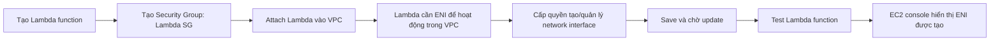

# 289. Lambda in VPC - Hands On

## 🎯 Giới thiệu
Bài thực hành này minh họa cách đưa một Lambda function vào trong VPC, gắn `Security Group`, cấp quyền cần thiết cho Lambda tạo `ENI`, và kiểm tra kết quả bằng cách chạy test. Mục tiêu chính là hiểu luồng triển khai Lambda trong VPC và lý do Lambda cần thêm quyền cũng như mạng nội bộ để hoạt động.

## 1. Tạo Lambda function và Security Group
- Tạo Lambda function từ đầu với:
  - Tên: `Lambda VPC`
  - Runtime: `Python 3.8`
- Tạo một `Security Group` mới trong EC2 console:
  - Tên: `Lambda SG`
  - Gắn vào VPC đang dùng
- Không cần cấu hình inbound rules hay outbound rules ở bước này vì mục đích chỉ là có một `Security Group` để attach cho Lambda.

## 2. Gắn Lambda vào VPC
- Vào phần `Configuration` của Lambda và chọn mục `VPC`.
- Chỉnh sửa để attach Lambda function vào VPC.
- Khi Lambda được connect vào VPC trong account:
  - Lambda không còn internet access mặc định
  - Nếu cần internet, Lambda phải nằm trong `private subnets` và outbound traffic phải đi qua `NAT Gateway` hoặc `NAT Instance` trong `public subnet`
- Trong demo này, Lambda không cần truy cập internet.
- Trường hợp sử dụng điển hình khi Lambda trong VPC:
  - Truy cập `RDS`
  - Truy cập `ElastiCache`
- Gắn `Lambda SG` vào Lambda function.

### Mermaid: Luồng triển khai Lambda trong VPC

## 3. Cấp quyền cho Lambda và xác minh hoạt động
- Sau khi attach VPC, Lambda báo lỗi vì chưa có quyền `create network interface` trên `EC2`.
- Nguyên nhân: khi Lambda chạy trong VPC, nó cần tạo các `network interfaces` để kết nối mạng trong VPC.
- Vào `Configuration` → `Permissions` → chọn `role`.
- Attach policy:
  - `Lambda ENI management access`
- Policy này cung cấp các quyền cần thiết như:
  - `create network interface`
  - `delete network interface`
  - `describe network interface`
  - và các quyền liên quan khác
- Sau đó:
  - `Save`
  - Chờ AWS update
  - Chạy `Test` Lambda function
- Kết quả:
  - Test thành công
  - Trong EC2 console, mục `Network Interfaces` xuất hiện các `ENI` được tạo cho Lambda
  - Các `ENI` này nằm ở các subnet khác nhau và giúp Lambda giao tiếp với VPC

## 📊 Bảng tóm tắt
| Tiêu chí | Mô tả |
|----------|------|
| Mục tiêu | Đưa Lambda vào VPC và cho phép nó hoạt động đúng trong môi trường mạng nội bộ |
| Security Group | Tạo `Lambda SG` để attach cho Lambda |
| VPC behavior | Lambda trong VPC không có internet access mặc định |
| Internet access | Nếu cần, phải dùng `private subnet` + `NAT Gateway` hoặc `NAT Instance` |
| Quyền cần thêm | `Lambda ENI management access` để quản lý `network interface` |
| Kết quả quan sát | EC2 console hiển thị các `ENI` do Lambda tạo ra |
| Use case | Giao tiếp với tài nguyên nội bộ như `RDS`, `ElastiCache` |

## 💡 Mẹo ghi nhớ cho kỳ thi AWS
- Lambda vào VPC thì nhớ ngay: cần `ENI`.
- Có `ENI` thì phải có quyền quản lý network interface.
- Lambda trong VPC không tự có internet access.
- Muốn ra internet từ VPC: `private subnet` + `NAT Gateway` hoặc `NAT Instance`.
- Câu hỏi thi thường xoay quanh lý do Lambda bị lỗi khi attach vào VPC: thiếu permission cho `EC2 network interface`.

## ✅ Kết luận
Lambda khi được triển khai trong VPC cần:
- một `Security Group`
- quyền tạo và quản lý `ENI`
- và hiểu rõ rằng nó không còn internet access mặc định

Sau khi cấp đúng quyền và lưu cấu hình, Lambda có thể chạy trong VPC và giao tiếp với tài nguyên nội bộ như `RDS` hoặc `ElastiCache`.
