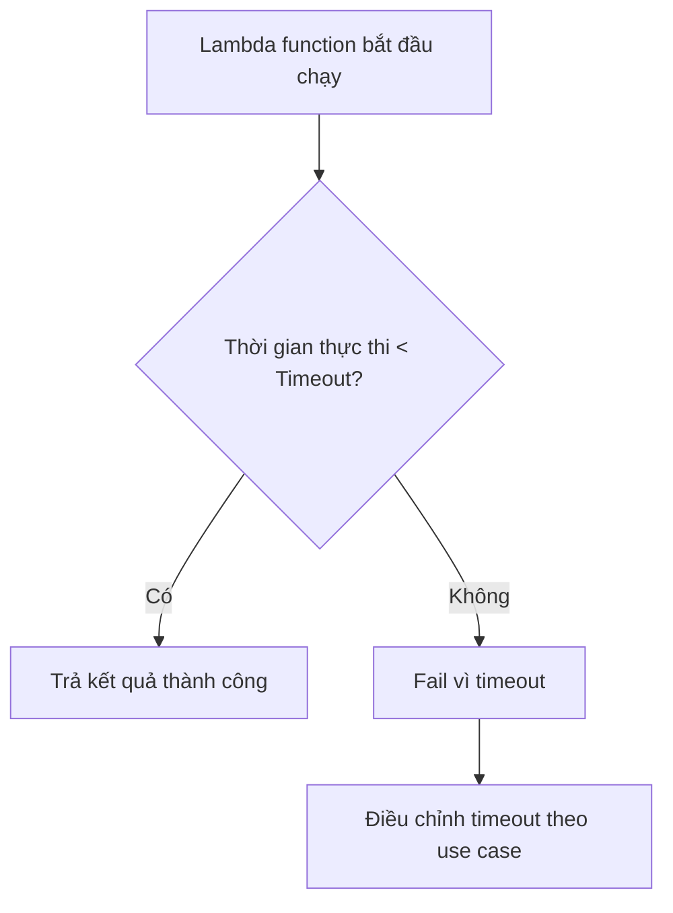
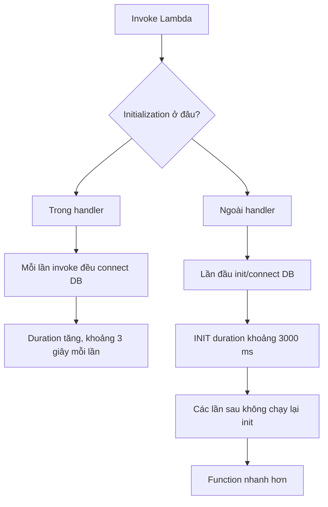

# 291. Lambda Function Performance - Hands On

## 🎯 Giới thiệu
Bài hands-on này tập trung vào các yếu tố ảnh hưởng đến hiệu năng của **Lambda function** trong `lambda-config-demo`, gồm:
- **Memory**
- **Timeout**
- **Cách đặt initialization / connection logic** của function

Mục tiêu là hiểu cách các cấu hình này tác động đến **CPU**, **thời gian chạy**, và **chi phí** khi ôn thi AWS.

## 1. Memory và CPU ⚙️
- Trong **General configuration**, có thể chỉnh **memory** của Lambda.
- Memory có thể từ **1 MB đến 10,240 MB**.
- **Memory càng cao thì CPU càng nhiều**.
- **CPU không thể chỉnh độc lập** với memory.
- Nếu cần **faster CPU** hoặc **more CPU cores**, cách làm là **tăng memory**.

### Ý nghĩa khi thi AWS
- Đây là câu hỏi rất hay gặp: muốn tăng CPU cho Lambda thì **không chỉnh CPU trực tiếp**, mà phải **modify memory**.
- Cần chọn memory hợp lý:
  - Đủ để function chạy tốt
  - Không quá cao để tránh bị tính phí nhiều hơn

## 2. Timeout và tác động khi function chạy quá lâu ⏱️
- **Timeout** là khoảng thời gian Lambda được phép chạy trước khi báo lỗi.
- Ví dụ trong transcript:
  - Timeout ban đầu là **3 seconds**
  - Function `sleep` **2 seconds** thì chạy thành công
  - Function `sleep` **5 seconds** thì bị fail vì **timeout**
- Khi tăng timeout lên **6 seconds**, function `sleep` 5 seconds sẽ chạy thành công.

### Bài học từ hands-on
- Timeout phải được đặt **phù hợp với use case**.
- Không nên đặt quá lớn một cách mặc định, vì:
  - Nếu function bị treo, bạn sẽ phải chờ quá lâu mới biết lỗi
  - Có thể làm chậm việc retry hoặc xử lý sự cố

### Flow minh họa

## 3. Đặt initialization bên ngoài handler 🚀
- Một điểm tối ưu hiệu năng quan trọng là **đặt phần initialization bên ngoài Lambda handler**.
- Transcript minh họa bằng việc giả lập `connect to DB` mất **3 seconds**.

### Trường hợp đặt trong handler
- Mỗi lần invoke, logic kết nối DB sẽ chạy lại.
- Kết quả:
  - Lần nào function cũng mất khoảng **3 seconds**
  - Tốn thời gian cho mỗi lần gọi

### Trường hợp đặt ngoài handler
- Đưa phần connect/init ra **trước Lambda handler**.
- Kết quả:
  - **Lần đầu** chạy sẽ có **INIT duration** khoảng **3000 ms**
  - Những lần sau chạy nhanh hơn nhiều, vì phần init không bị chạy lại

### Flow minh họa

## 📊 Bảng tóm tắt
| Tiêu chí | Mô tả |
|----------|------|
| Memory | Có thể chỉnh từ **1 MB đến 10,240 MB** |
| CPU | **Tăng theo memory**, không chỉnh riêng được |
| Timeout | Là thời gian Lambda được phép chạy trước khi fail |
| Timeout quá thấp | Function có thể fail nếu chạy lâu hơn giới hạn |
| Timeout quá cao | Có thể làm chậm việc phát hiện lỗi |
| Initialization | Nên đặt **ngoài handler** để tránh chạy lại mỗi lần invoke |
| INIT duration | Lần đầu có thể tốn thời gian init, nhưng các lần sau nhanh hơn |

## 💡 Mẹo ghi nhớ cho kỳ thi AWS
- **Muốn tăng CPU của Lambda?** -> **Tăng memory**
- **Lambda không cho chỉnh CPU riêng** -> nhớ điều này rất dễ ra đề
- **Timeout** phải cân bằng giữa:
  - Đủ để function hoàn thành
  - Không quá dài để chậm phát hiện lỗi
- **DB connection / initialization** nên đặt **outside handler**
- Nếu thấy đề nói function chạy chậm ở **mỗi lần invoke**, hãy nghĩ đến việc phần init đang nằm sai chỗ

## ✅ Kết luận
Hiệu năng của **Lambda function** trong bài này phụ thuộc chủ yếu vào:
- **Memory** để suy ra CPU
- **Timeout** để kiểm soát thời gian thực thi
- **Vị trí initialization** để giảm thời gian xử lý lặp lại

Điểm mấu chốt cho ôn thi là: **tăng memory để có thêm CPU, đặt timeout hợp lý, và đưa initialization ra ngoài handler để tối ưu tốc độ**.
