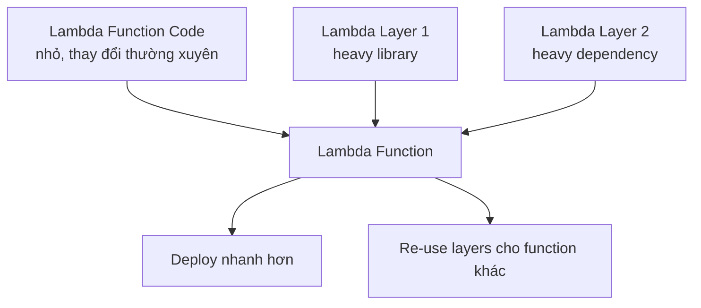

# 292. Lambda Layers

## 🎯 Giới thiệu
- **Lambda Layers** là một feature mới hơn của **Lambda**.
- Mục đích chính:
  - Tạo **custom runtimes** cho Lambda.
  - **Externalize dependencies** để tái sử dụng giữa nhiều Lambda functions.
- Một số ví dụ ngôn ngữ được hỗ trợ qua Layers theo transcript:
  - **C++**
  - **Rust**

## 1. Custom Runtime cho Lambda ⚙️
- Lambda Layers cho phép dùng những ngôn ngữ không phải lựa chọn ban đầu của Lambda.
- Community có thể hỗ trợ thêm runtime thông qua Layers.
- Ví dụ trong transcript:
  - **C++**
  - **Rust**

## 2. Externalize Dependencies để tái sử dụng 📦
- Thay vì để toàn bộ library lớn trong zip package của function, có thể tách chúng ra thành **layer**.
- Lý do:
  - Application package có thể rất lớn nếu chứa nhiều dependencies nặng.
  - Khi update function, nếu dependencies không đổi hoặc đổi rất chậm, không nên re-upload toàn bộ zip nhiều lần.
- Cách tổ chức:
  - **Application code**: nhỏ, thay đổi thường xuyên
  - **Layers**: chứa libraries/dependencies nặng, ít thay đổi

## 3. Lợi ích chính của Lambda Layers 🚀
- **Deploy nhanh hơn** vì không phải đóng gói lại toàn bộ dependencies mỗi lần.
- **Giảm kích thước package** của application code.
- **Reuse layers** cho nhiều Lambda functions khác nhau.
- Nhiều function/app khác nhau có thể tham chiếu cùng một bộ layers.
- Đây là cách tách phần code thay đổi nhanh khỏi phần dependencies thay đổi chậm.

## 📊 Bảng tóm tắt
| Tiêu chí | Mô tả |
|----------|------|
| Mục tiêu chính | Hỗ trợ custom runtimes và externalize dependencies |
| Ví dụ runtime | C++, Rust |
| Cách dùng phổ biến | Tách libraries nặng ra khỏi application package |
| Lợi ích | Deploy nhanh hơn, package nhỏ hơn, tái sử dụng giữa nhiều functions |
| Ý tưởng cốt lõi | Code thay đổi thường xuyên nằm trong function, dependencies nằm trong layers |

## 💡 Mẹo ghi nhớ cho kỳ thi AWS
- Nhớ 2 ý chính của **Lambda Layers**:
  - **Custom runtimes**
  - **Dependency reuse**
- Khi thấy scenario:
  - package quá lớn
  - re-upload nhiều lần không hiệu quả
  - nhiều Lambda functions dùng chung libraries  
  thì nghĩ đến **Layers**.
- Keyword cần nhớ: **externalize dependencies**, **reuse across Lambda functions**.

## ✅ Kết luận
- **Lambda Layers** giúp tách **application code** khỏi **dependencies nặng**.
- Đây là cách làm cho deployment gọn hơn, nhanh hơn, và dễ tái sử dụng hơn.
- Ngoài ra, Layers còn mở đường cho **custom runtimes** như **C++** và **Rust**.
