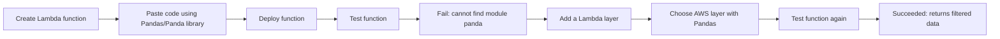

# 293. Lambda Layers - Hands On

## 🎯 Giới thiệu
Bài thực hành này minh họa cách dùng **Lambda layer** để chạy code phụ thuộc vào thư viện bên ngoài, cụ thể là **Pandas/Panda library** trong một hàm **AWS Lambda** viết bằng **Python**.

## 1. Tạo Lambda function
- Tạo một function mới tên **`Lambda-layer-demo`**.
- Chọn runtime **Python**, dùng phiên bản mới nhất, ví dụ **Python 3.13**.
- Deploy function sau khi dán code vào.

## 2. Gặp lỗi vì thiếu thư viện
- Code trong file **`layer-demo-panda.py`**:
  - import thư viện **Panda/Pandas**
  - tạo sample data
  - lọc dữ liệu bằng thư viện này
- Khi test lần đầu:
  - function **fail**
  - lỗi là **không tìm thấy module panda**
- Lý do: thư viện này chưa có sẵn trong Lambda function.

## 3. Gắn Lambda layer để sửa lỗi
- Vào mục **Layers** của Lambda function.
- Chọn **Add a layer**.
- Dùng **AWS layers** thay vì tự tạo layer custom.
- Chọn layer có **Pandas**, ví dụ:
  - **AWSSDK Pandas-Python313 Version 1**
- Sau khi thêm layer:
  - thư viện đã được package đúng để chạy trên Lambda
  - function test lại sẽ **succeeded**
  - kết quả trả về là các phần tử có **age > 30** theo code

## 📊 Bảng tóm tắt
| Tiêu chí | Mô tả |
|----------|------|
| Mục tiêu | Dùng **Lambda layer** để cung cấp thư viện cho Lambda function |
| Function | **Lambda-layer-demo** |
| Runtime | **Python**, ví dụ **3.13** |
| Thư viện cần dùng | **Pandas/Panda library** |
| Lỗi ban đầu | Không tìm thấy module **panda** |
| Cách xử lý | Thêm **AWS layer** có chứa Pandas |
| Kết quả | Function chạy thành công và trả về dữ liệu đã lọc |

## 💡 Mẹo ghi nhớ cho kỳ thi AWS
- Nếu Lambda **thiếu thư viện**, nghĩ ngay đến **Lambda layers**.
- **Layer** giúp tách thư viện ra khỏi code chính của function.
- Trong demo này, thêm layer chứa **Pandas** đã làm function chạy được.
- Khi test Lambda:
  - **Fail trước**
  - **Add layer sau**
  - **Test lại để confirm success**

## ✅ Kết luận
Lambda layers là cách đơn giản để đưa thư viện như **Pandas** vào Lambda function mà không cần đóng gói trực tiếp trong code. Trong demo này, việc thêm layer đã giải quyết lỗi thiếu module và giúp function chạy thành công.
