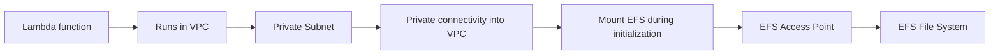

# 294. Lambda File Systems Mounting

## 🎯 Giới thiệu
- Lambda có thể truy cập **EFS file system** nếu function đang chạy trong **VPC**.
- Cách làm là cấu hình Lambda để **mount EFS vào local directory** trong lúc **initialization**.
- Để hoạt động đúng, cần dùng **EFS Access Points**.
- Nếu Lambda được deploy trong **Private Subnet** có private connectivity vào VPC thì có thể dùng được.
- Điểm cần nhớ: mỗi Lambda instance khởi tạo thêm một connection vào EFS, nên phải tránh chạm **EFS connection limits** và **connection burst limits**.

## 1. Lambda mounting với EFS
- Lambda có thể mount **EFS** như một **local directory**.
- Yêu cầu:
  - Lambda phải chạy trong **VPC**
  - Dùng **EFS Access Point**
  - Có **Private Subnet** với private connectivity vào VPC
- Hạn chế:
  - Mỗi Lambda instance tạo thêm connection tới EFS
  - Có thể gặp:
    - **EFS connection limits**
    - **Connection burst limits**

## 2. So sánh các storage options cho Lambda
### `/tmp` Ephemeral Storage
- Max size: **10 GB**
- **Ephemeral**: instance bị destroy thì mất dữ liệu
- **Dynamic**: có thể sửa đổi tùy ý
- Là **file system**, hỗ trợ các file system operation
- Miễn phí đến **512 MB**, sau đó trả thêm nếu dùng nhiều hơn
- Chỉ function đó truy cập được
- **Nhanh nhất** để retrieve data
- Không shared giữa các Lambda invocations

### Lambda Layers
- Tối đa **5 layers per function**
- Tổng size tối đa **250 MB**
- **Durable** vì **immutable**
- Dạng **archive**, **static**
- Được tính trong **Lambda function pricing**
- Cần **proper IAM permissions** để truy cập
- **Nhanh** để access data vì được attach như storage của Lambda
- Shared across all Lambda invocations
- Không thể modify data trong Layer

### Amazon S3
- Có thể lớn tùy ý
- **Durable** và **dynamic**
- Dạng **Object**
- Truy cập bằng **S3 API**
- Có **Atomic Operations** như `get`, `put`, `post`, và versioning
- Tính phí theo **S3 pricing**:
  - storage
  - requests
  - data transfer
- Là **network based storage**
- Có fast access nhờ **dedicated AWS bandwidth**, nhưng **không phải nhanh nhất**
- Shared across all Lambda invocations

### Amazon EFS
- **Elastic**
- **Durable** và **dynamic**
- Dạng **file systems**
- Truy cập bằng các **file system operations**
- Tính phí theo:
  - storage
  - data transfer
  - throughput
- Là **network file system** được mount vào Lambda
- Có **very fast access**
- Shared across all Lambda invocations

## 3. Bảng so sánh nhanh
| Tiêu chí | `/tmp` | Lambda Layers | S3 | EFS |
|----------|--------|---------------|----|-----|
| Loại storage | File system | Archive / static | Object | File system |
| Tính bền vững | Ephemeral | Durable | Durable | Durable |
| Có thể thay đổi dữ liệu | Có | Không | Có | Có |
| Chia sẻ giữa invocations | Không | Có | Có | Có |
| Truy cập | File system operations | Attach as Lambda storage | S3 API | File system operations |
| Tốc độ | Nhanh nhất | Rất nhanh | Nhanh nhưng không nhanh nhất | Rất nhanh |
| Giới hạn nổi bật | 10 GB, free đến 512 MB | 5 layers, 250 MB | Không nêu giới hạn size | Cần chú ý connection limits |

## 📊 Bảng tóm tắt
| Tiêu chí | Mô tả |
|----------|------|
| Lambda + EFS | Chỉ dùng được khi Lambda chạy trong **VPC**, mount qua **EFS Access Point** |
| `/tmp` | Tạm thời, nhanh nhất, không shared, tối đa **10 GB** |
| Lambda Layers | Immutable, shared, tối đa **5 layers** và **250 MB** |
| S3 | Object storage, durable, dynamic, dùng **S3 API** |
| EFS | File system network-mounted, durable, dynamic, shared |

## 💡 Mẹo ghi nhớ cho kỳ thi AWS
- Nhớ thứ tự này khi so sánh storage cho Lambda:
  - **/tmp** = nhanh nhất nhưng **ephemeral**
  - **Layers** = **static**, **immutable**, dùng cho code/share assets
  - **S3** = **object storage**, truy cập qua **S3 API**
  - **EFS** = **file system** thật sự, mount vào Lambda
- Nếu đề bài nói về Lambda truy cập file system trong VPC, nghĩ ngay đến:
  - **EFS**
  - **EFS Access Point**
  - **Private Subnet**
- Nếu hỏi về dữ liệu dùng chung giữa các invocations:
  - **Layers**, **S3**, **EFS** đều shared
  - `/tmp` thì không
- Nếu hỏi giới hạn đặc trưng:
  - `/tmp`: **10 GB**, free đến **512 MB**
  - Layers: **5 layers**, **250 MB**
  - EFS: cần tránh **connection limits** và **burst limits**

## ✅ Kết luận
- Lambda có thể dùng nhiều kiểu storage khác nhau tùy mục đích.
- **EFS** phù hợp khi cần file system thật sự và mount vào Lambda trong **VPC**.
- **/tmp**, **Layers**, **S3**, và **EFS** khác nhau rõ về tính bền vững, khả năng chia sẻ, cách truy cập và giới hạn sử dụng.
