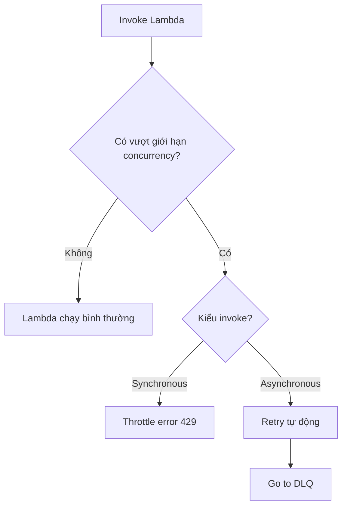

# 295. Lambda Concurrency

## 🎯 Giới thiệu
- Bài này nói về **Lambda concurrency**, **throttling**, **cold start** và **provisioned concurrency**.
- Ý chính: Lambda scale rất nhanh, nhưng nếu không kiểm soát concurrency tốt thì có thể làm một function chiếm hết tài nguyên và khiến các function khác bị throttle.

## 1. Lambda Concurrency và Reserved Concurrency
- Khi số lần invoke tăng, số **concurrent executions** của Lambda cũng tăng theo.
- Lambda có thể scale rất nhanh, có thể lên tới khoảng **1000 concurrent executions** theo transcript.
- Có thể giới hạn concurrency ở **function level** bằng **reserved concurrency**.
- Ví dụ: đặt một Lambda chỉ được chạy tối đa **50 concurrent executions**.
- Nếu vượt giới hạn:
  - **Synchronous invocation**: trả về lỗi **throttle 429**.
  - **Asynchronous invocation**: Lambda tự retry rồi chuyển sang **DLQ**.

## 2. Ảnh hưởng đến các function khác trong account
- **Concurrency limit áp dụng cho tất cả các function trong account**.
- Nếu một function dùng quá nhiều concurrency, các function khác có thể bị throttle.
- Tình huống trong transcript:
  - Một app qua **Application Load Balancer** làm bùng nổ traffic.
  - App khác dùng **API Gateway** gọi Lambda.
  - App khác nữa dùng **SDK/CLI** gọi Lambda.
- Khi app đầu tiên chiếm hết concurrency:
  - Lambda phía **API Gateway** bị throttle.
  - Lambda phía **SDK/CLI** cũng bị throttle.
- Bài học thi:
  - Không set reserved concurrency cẩn thận có thể làm ảnh hưởng toàn account.

## 3. Asynchronous invocations, Cold Start và Provisioned Concurrency
- Với **asynchronous invocation** như **S3 event notifications**:
  - Upload nhiều file vào S3 có thể tạo rất nhiều Lambda executions.
  - Nếu Lambda không đủ concurrency, request sẽ bị throttle.
  - Với lỗi throttle hoặc hệ thống (**429**, **500-series**), Lambda đưa event trở lại **internal event queue**.
  - Lambda retry trong tối đa **6 hours**.
  - Retry interval tăng theo kiểu **exponential backoff**, từ **1 second** đến tối đa **every 5 minutes**.
- **Cold start**:
  - Xảy ra khi Lambda tạo instance mới.
  - Code phải được load và phần init ngoài handler phải chạy.
  - Nếu init nặng, request đầu tiên có latency cao hơn.
- **Provisioned concurrency**:
  - Pre-allocate concurrency trước khi function được invoke.
  - Mục tiêu là tránh cold start và giảm latency.
  - Có thể quản lý bằng **Application Auto Scaling**.
  - Transcript nêu ví dụ dùng **schedule** hoặc **target position**.
- Transcript cũng nhắc:
  - AWS đã có blog vào **October/November 2019** nói về cải tiến giảm cold start cho Lambda trong **VPC**.
  - Nếu dùng Lambda trong VPC, cold start hiện có ảnh hưởng tối thiểu hơn trước.

## 📊 Bảng tóm tắt
| Tiêu chí | Mô tả |
|----------|------|
| Lambda Concurrency | Số lượng Lambda executions chạy đồng thời khi traffic tăng. |
| Reserved Concurrency | Giới hạn concurrency ở mức **function level**. |
| Throttle | Xảy ra khi vượt giới hạn concurrency. |
| Synchronous invocation | Bị trả lỗi **429** khi throttle. |
| Asynchronous invocation | Lambda retry tự động, rồi đưa vào **DLQ** nếu cần. |
| Account-wide impact | Một function dùng quá nhiều concurrency có thể làm function khác bị throttle. |
| Async retry | Retry tối đa **6 hours**, backoff từ **1 second** đến **5 minutes**. |
| Cold start | Request đầu tiên của instance mới có latency cao hơn do phải init. |
| Provisioned concurrency | Pre-allocate concurrency để tránh cold start. |

## 💡 Mẹo ghi nhớ cho kỳ thi AWS
- **Reserved concurrency** = giới hạn riêng cho một Lambda function.
- **Concurrency là tài nguyên chung của account** nên một function có thể làm ảnh hưởng function khác.
- **Sync throttle = 429**.
- **Async throttle = retry + DLQ**.
- **Provisioned concurrency** dùng để giảm **cold start**.
- Với async, nhớ mốc **6 hours retry** và backoff tăng dần đến **5 minutes**.

## ✅ Kết luận
- Lambda scale rất mạnh, nhưng concurrency cần được kiểm soát.
- **Reserved concurrency** giúp bảo vệ function và tránh một function chiếm hết tài nguyên account.
- Với **asynchronous invocations**, Lambda có cơ chế retry dài hơn và đẩy lỗi sang **DLQ**.
- Để giảm **cold start**, dùng **provisioned concurrency** và có thể quản lý bằng **Application Auto Scaling**.
