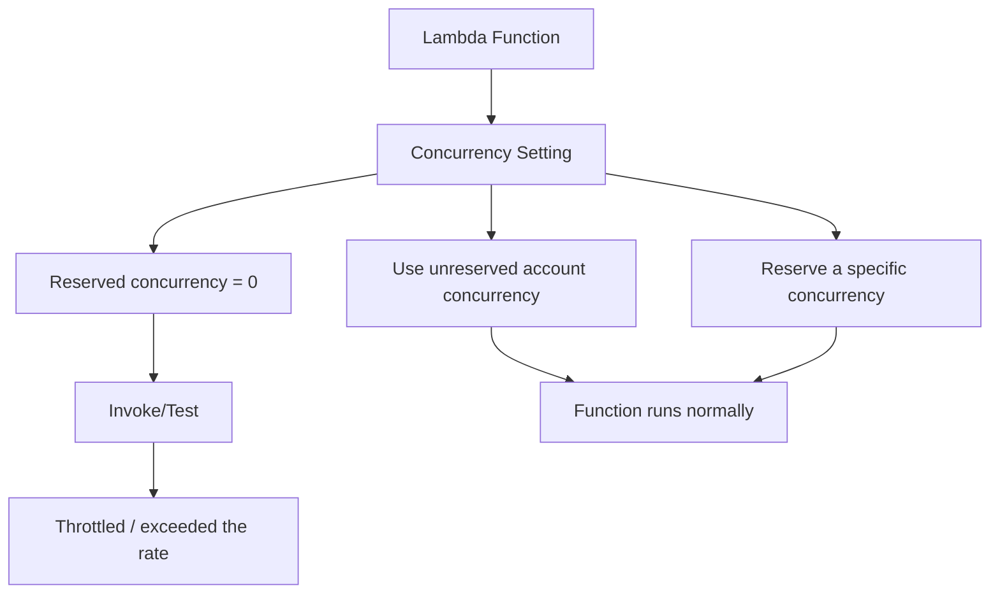

# 296. Lambda Concurrency Hands On

## 🎯 Giới thiệu
Bài này giới thiệu nhanh các thiết lập **concurrency** trong **Lambda** và cách chúng ảnh hưởng đến việc chạy hàm, throttle, cũng như **cold starts**.

## 1. Lambda Concurrency là gì?
- Trong tab **Concurrency** của Lambda, bạn có thể xem và chỉnh:
  - **Unreserved account concurrency**
  - **Reserved concurrency**
  - **Provisioned concurrency**
- Theo transcript:
  - Account có **1000 unreserved account concurrency**
  - Số này được **chia sẻ giữa tất cả Lambda functions** trong account
- Nếu bạn reserve concurrency cho một function:
  - Ví dụ reserve **20**
  - Function đó giữ riêng **20 reserved concurrency**
  - Phần còn lại là **980 unreserved account concurrency** cho các function khác

## 2. Test throttle và Reserved Concurrency
- Một cách test tình huống throttle là đặt **reserved concurrency = 0**
- Khi đó function sẽ **luôn bị throttled**
- Nếu bấm **Test / invoke API**, bạn sẽ gặp lỗi kiểu:
  - **"exceeded the rate"**
  - tức là đã vượt quá mức concurrency được cho phép
- Muốn fix:
  - quay lại dùng **unreserved account concurrency**
  - hoặc reserve một mức concurrency phù hợp cho function

## 3. Provisioned Concurrency và Cold Starts
- **Provisioned concurrency** được dùng để **giảm cold starts**
- Ý tưởng là giữ sẵn một **warm pool** của function để giảm thời gian khởi tạo ban đầu
- Setting này nằm trong **Provisioned Concurrency Configuration**
- Provisioned concurrency có thể gán cho:
  - **alias**
  - **version**
- Transcript lưu ý:
  - **latest** không dùng được cho provisioned concurrency
  - cần **publish a version**
- Provisioned concurrency **không miễn phí**
  - khi cấu hình số lượng provisioned concurrency, sẽ có **cost** đi kèm
  - cần chọn số lượng hợp lý

## 📊 Bảng tóm tắt
| Tiêu chí | Mô tả |
|----------|------|
| Unreserved account concurrency | 1000 concurrency dùng chung cho toàn bộ Lambda functions trong account |
| Reserved concurrency | Dành riêng concurrency cho một Lambda function cụ thể |
| Reserve = 0 | Function bị throttled liên tục, test được tình huống vượt rate |
| Lỗi khi vượt mức | Invoke/Test có thể fail với thông báo kiểu “exceeded the rate” |
| Cách sửa | Dùng unreserved account concurrency hoặc reserve một mức phù hợp |
| Provisioned concurrency | Giảm cold starts bằng cách giữ warm pool sẵn |
| Áp dụng cho | **alias** hoặc **version** |
| Không áp dụng cho | **latest** |
| Chi phí | Provisioned concurrency **không free** |

## 💡 Mẹo ghi nhớ cho kỳ thi AWS
- **Reserved concurrency** = khóa riêng tài nguyên cho một function
- **Reserve = 0** = cách nhanh để test **throttling**
- **Provisioned concurrency** = giảm **cold starts**
- Nhớ rằng **provisioned concurrency cần alias/version**, không dùng trực tiếp cho **latest**
- Nếu đề bài nhắc đến **cost** và **warm pool**, rất có thể đang nói về **Provisioned Concurrency**

## ✅ Kết luận
Lambda có 2 ý chính trong bài này:
- **Reserved concurrency** để kiểm soát và giới hạn concurrency của từng function
- **Provisioned concurrency** để giảm **cold starts**, nhưng có **chi phí** và cần cấu hình đúng qua **alias/version**
