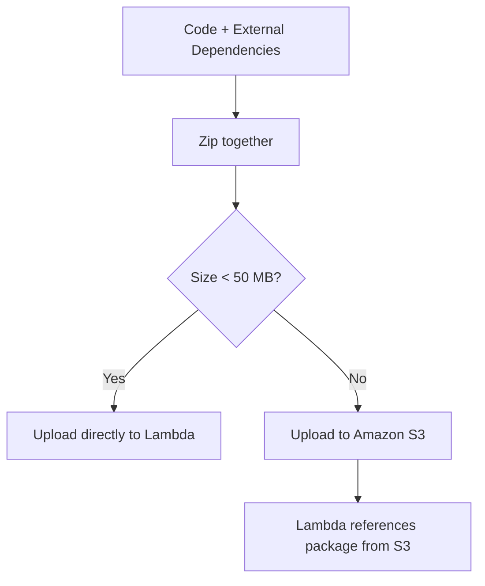

# 297. Lambda External Dependencies

## 🎯 Giới thiệu
Bài này nói về cách **đóng gói external dependencies** cho **Lambda** khi code không chỉ gồm logic đơn thuần mà còn phụ thuộc vào thư viện bên ngoài như **X-Ray SDK**, **Database Clients**, v.v.

Mục tiêu chính:
- Biết cách package dependency theo từng ngôn ngữ
- Hiểu luồng upload khi deploy Lambda
- Nắm các điểm đặc biệt về **native libraries** và **AWS SDK**

## 1. Đóng gói external dependencies 📦
Khi Lambda function cần thư viện ngoài, bạn phải:
- Cài đặt các package cùng với code
- Đóng gói **code + dependencies** vào cùng một file **zip**
- Upload file zip đó lên Lambda

Cách làm theo ngôn ngữ:
- **JS**: dùng `NPM` và `node_modules`
- **Python**: dùng `PIP`
- **Java**: dùng các file `.jar`

Điểm cần nhớ:
- Mỗi ngôn ngữ có cách quản lý dependency riêng
- Nhưng nguyên tắc chung là **zip tất cả lại với nhau**

## 2. Luồng upload vào Lambda 🚀
Sau khi zip xong, có 2 trường hợp:

- Nếu file zip **nhỏ hơn 50 MB**:
  - Upload **trực tiếp** vào Lambda
- Nếu file zip **lớn hơn 50 MB**:
  - Upload trước lên **Amazon S3**
  - Sau đó Lambda sẽ tham chiếu đến package từ S3

## 3. Native libraries và AWS SDK 🧩
### Native libraries
- Nếu dùng **native libraries**, chúng phải được **compile trên Amazon Linux**
- Chỉ khi đó chúng mới hoạt động đúng trong Lambda

### AWS SDK
- **AWS SDK có sẵn mặc định trong mọi Lambda function**
- Vì vậy, nếu chỉ dùng **AWS SDK** thì **không cần package kèm theo code**

## 📊 Bảng tóm tắt
| Tiêu chí | Mô tả |
|----------|------|
| External dependencies | Cần cài thư viện ngoài rồi zip chung với code |
| JS | Dùng `NPM` và `node_modules` |
| Python | Dùng `PIP` |
| Java | Dùng file `.jar` |
| Upload nhỏ hơn 50 MB | Upload trực tiếp vào Lambda |
| Upload lớn hơn 50 MB | Upload lên `Amazon S3` rồi reference từ Lambda |
| Native libraries | Phải compile trên `Amazon Linux` |
| AWS SDK | Có sẵn mặc định trong Lambda |

## 💡 Mẹo ghi nhớ cho kỳ thi AWS
- Nhớ quy tắc: **code + dependencies = zip chung**
- Nhớ mốc **50 MB**:
  - nhỏ hơn thì upload trực tiếp
  - lớn hơn thì dùng **S3**
- **AWS SDK** đã có sẵn trong Lambda, không cần đóng gói thêm
- **Native libraries** phải được build trên **Amazon Linux**

## ✅ Kết luận
Lambda khi dùng thư viện ngoài cần được đóng gói cùng code trong một file zip. Cách package phụ thuộc vào ngôn ngữ, nhưng nguyên tắc chung là zip chung tất cả. Nếu package quá lớn thì dùng **S3**. Riêng **AWS SDK** đã có sẵn mặc định, còn **native libraries** phải compile trên **Amazon Linux**.
