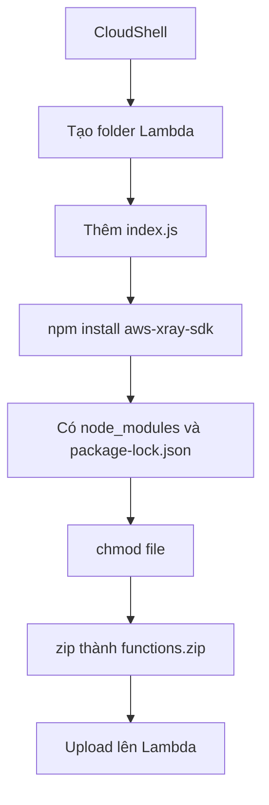

# 298. Lambda External Dependencies - Hands On

## 🎯 Giới thiệu
Bài hands-on này minh họa cách:
- Tạo một Lambda function có **external dependencies**
- Đóng gói code và package dependency để upload lên Lambda
- Cấu hình **IAM permissions** để Lambda truy cập **S3**
- Bật **X-Ray** để theo dõi luồng gọi và debug lỗi

## 1. Chuẩn bị môi trường và code
- Sử dụng **CloudShell** vì đã có sẵn terminal kết nối trực tiếp vào AWS account và có **NPM**.
- Tạo thư mục `Lambda`, sau đó thêm file `index.js`.
- Dùng `nano` để tạo và dán code vào file.
- File `index.js` trong bài có:
  - `require` tới **aws-xray-sdk-core**
  - logic gọi **Amazon S3**
  - thao tác **ListBuckets**

## 2. Cài dependency và đóng gói
- Chạy `npm install aws-xray-sdk` để cài dependency cục bộ.
- Sau đó sẽ có:
  - `index.js`
  - `node_modules`
  - `package-lock.json`
- Cần chỉnh quyền file bằng `chmod`.
- Nén toàn bộ thành file `functions.zip`.
- Có thể upload zip vào Lambda bằng:
  - upload thủ công
  - hoặc dùng **CLI**
  - hoặc upload từ **Amazon S3**

## 3. Tạo IAM role và kiểm tra Lambda
- Tạo **IAM role** cho Lambda service.
- Gắn policy:
  - **Lambda basic execution role**
- Khi deploy xong, Lambda function được tạo thành công với tên:
  - `lambda-xray-with-dependencies`
- Lúc test lần đầu:
  - bị lỗi **Access Denied**
  - nguyên nhân là Lambda đang cố gọi **S3 ListBuckets** nhưng chưa có quyền
- Bật **Monitoring / Active tracing** để enable **X-Ray**
- Gắn thêm policy:
  - **Amazon S3 read only access**
- Test lại:
  - ban đầu vẫn có thể chưa phản ánh ngay
  - sau đó test thành công và trả về danh sách buckets

## 4. X-Ray và quan sát luồng thực thi
- Trong **X-Ray service map**, có thể thấy:
  - client gọi Lambda
  - Lambda gọi tiếp **Amazon S3**
- X-Ray hiển thị:
  - các request thành công màu xanh
  - các request lỗi khi chưa đủ quyền
- Khi xem trace chi tiết:
  - trace lỗi cho thấy **403**
  - operation là **ListBuckets**
  - exception là **Access Denied**
- Trace thành công cho thấy thời gian thực hiện **ListBuckets** và nhận response

## 📊 Bảng tóm tắt
| Tiêu chí | Mô tả |
|----------|------|
| Mục tiêu | Đóng gói Lambda có dependency và deploy lên AWS |
| Công cụ | **CloudShell**, **NPM**, `nano`, `zip`, **CLI** |
| Dependency | **aws-xray-sdk** |
| File quan trọng | `index.js`, `node_modules`, `package-lock.json` |
| IAM role | **Lambda basic execution role** |
| Quyền bổ sung | **Amazon S3 read only access** |
| Kết quả test | Ban đầu lỗi **Access Denied**, sau đó thành công |
| Quan sát | **X-Ray** service map và traces |
| API được gọi | **S3 ListBuckets** |

## 💡 Mẹo ghi nhớ cho kỳ thi AWS
- **Lambda có dependency thì phải bundle kèm** `node_modules` và `package-lock.json`.
- **CloudShell** tiện cho việc chuẩn bị package vì có sẵn **NPM**.
- Nếu Lambda gọi **S3** mà bị **Access Denied**, hãy kiểm tra **IAM policy** trước.
- Bật **X-Ray** để nhìn rõ:
  - client → Lambda → S3
  - request lỗi
  - trace chi tiết với mã lỗi như **403**
- Khi thay đổi quyền IAM, có thể cần đợi một chút trước khi test lại thấy hiệu lực.

## ✅ Kết luận
Bài hands-on cho thấy quy trình hoàn chỉnh để:
- đóng gói Lambda với dependency,
- deploy bằng zip/CLI,
- gán đúng **IAM permissions**,
- và dùng **X-Ray** để debug request flow cũng như lỗi quyền truy cập.
