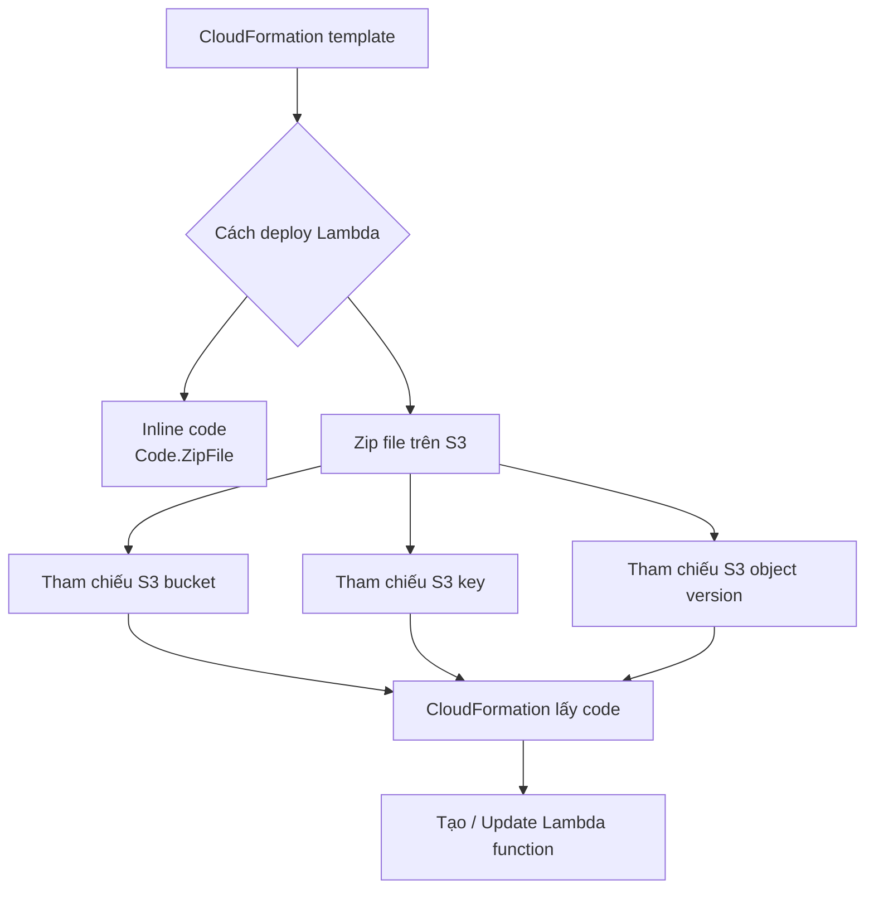

# 299. Lambda and CloudFormation

## 🎯 Giới thiệu
CloudFormation có thể dùng để deploy `Lambda function` theo 2 cách chính:
- **Inline**: viết code trực tiếp trong CloudFormation template.
- **Zip file qua S3**: lưu package Lambda trong `Amazon S3` rồi tham chiếu từ template.

Mục tiêu chính trong bài này là hiểu cách CloudFormation lấy code Lambda, khi nào dùng từng cách, và cách triển khai trong nhiều account.

## 1. Deploy Lambda bằng inline code
- Dùng property `Code.ZipFile`.
- Code Lambda được đặt **trực tiếp** trong CloudFormation template.
- Phù hợp với **function rất đơn giản**.
- **Hạn chế lớn**: không thể include dependencies của function.
- Vì vậy chỉ nên dùng khi code nhỏ, không phụ thuộc thư viện ngoài.

## 2. Deploy Lambda bằng zip file trên S3
- Đây là cách phổ biến hơn.
- Cần upload file `.zip` của Lambda lên `Amazon S3`.
- Trong CloudFormation template, phải chỉ rõ vị trí S3 của package:
  - `S3 bucket`
  - `S3 key`
  - `S3 object version` nếu bucket có versioning
- Nếu code trên S3 thay đổi nhưng template không đổi `bucket`, `key`, hoặc `version` thì CloudFormation **không update** Lambda.
- `S3 object version` được khuyến nghị vì giúp CloudFormation nhận ra thay đổi khi file bị overwrite.

## 3. Deploy Lambda qua CloudFormation trong nhiều account
- Tình huống:
  - `Account 1` chứa S3 bucket lưu Lambda code.
  - Muốn deploy cùng code đó sang `Account 2` và `Account 3`.
- Cách làm:
  - Chạy CloudFormation ở `Account 2` hoặc `Account 3`.
  - S3 bucket ở `Account 1` phải cho phép CloudFormation truy cập code bằng **bucket policy**.
  - CloudFormation ở account đích cần có **execution role** để `get` và `list` object trong S3 bucket ở `Account 1`.
- Khi kết hợp:
  - **bucket policy** ở `Account 1`
  - **execution role** ở account đích
- CloudFormation sẽ đọc được Lambda code từ S3 và tạo function thành công.

## 📊 Bảng tóm tắt
| Tiêu chí | Mô tả |
|----------|------|
| Inline Lambda | Dùng `Code.ZipFile`, code nằm ngay trong template |
| Phù hợp | Chỉ cho function rất đơn giản |
| Hạn chế của inline | Không include được dependencies |
| Zip trên S3 | Upload `.zip` lên `Amazon S3` rồi tham chiếu trong template |
| Thành phần S3 cần có | `S3 bucket`, `S3 key`, và có thể `S3 object version` |
| Cập nhật code | Nên dùng versioning để CloudFormation nhận ra thay đổi |
| Multi-account deployment | Cần `bucket policy` và `execution role` để CloudFormation truy cập S3 code |

## 💡 Mẹo ghi nhớ cho kỳ thi AWS
- `Code.ZipFile` = **inline**, chỉ hợp cho code nhỏ, không dependencies.
- Nếu dùng `.zip` trên `S3`, nhớ 3 thứ: `bucket`, `key`, `version`.
- `S3 object version` rất quan trọng khi file bị overwrite.
- Deploy cross-account cần nhớ 2 lớp quyền:
  - `bucket policy` cho bucket chứa code
  - `execution role` cho CloudFormation ở account đích
- Nếu template không đổi tham chiếu S3, CloudFormation sẽ **không** tự update Lambda.

## ✅ Kết luận
CloudFormation có thể deploy Lambda theo 2 cách: inline hoặc dùng zip từ `S3`. Inline chỉ phù hợp cho function rất đơn giản, còn zip trên S3 là cách linh hoạt hơn và hỗ trợ deploy cross-account. Trong thực tế, cần chú ý `S3 object version`, `bucket policy`, và `execution role` để đảm bảo CloudFormation cập nhật và truy cập được Lambda code đúng cách.
