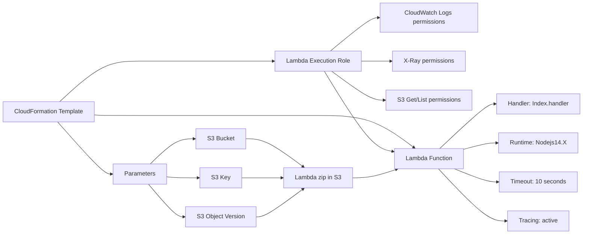

# 300. Lambda and CloudFormation - Hands On

## 🎯 Giới thiệu
- Bài này hướng dẫn dùng **CloudFormation template** để tạo một **Lambda function** tự động.
- Template được dùng để lấy file zip của function từ **Amazon S3** và cấu hình luôn:
  - **IAM execution role**
  - **runtime**
  - **timeout**
  - **X-Ray tracing**
- Mục tiêu chính là thấy toàn bộ quá trình **deploy Lambda bằng CloudFormation**.

## 1. CloudFormation template được cấu hình như thế nào
- Template có 3 **parameters**:
  - `S3 Bucket`
  - `S3 Key`
  - `S3 object version`
- Các parameter này dùng để chỉ cho CloudFormation biết:
  - file zip của Lambda nằm ở đâu trong **S3**
  - dùng đúng **version** của object
- Template tạo ra 2 resource chính:
  - **Lambda execution role** là một **IAM role**
  - **Lambda function** `Lambda with x-ray`

### IAM execution role
- Có policy document cho phép Lambda assume role này.
- Policy gồm các nhóm quyền:
  - quyền với **CloudWatch Logs**
  - quyền với **X-Ray** để gửi traces
  - quyền với **S3** như `Get*`, `List*` để đọc file zip từ S3

### Lambda function
- Handler: `Index.handler`
- Role: lấy từ **Lambda execution role ARN** bằng `get attributes`
- Code: lấy từ 3 input parameter:
  - S3 bucket
  - S3 key
  - S3 object version
- Runtime: **Nodejs14.X**
- Timeout: **10 seconds**
- Bật **X-Ray** bằng `tracing config mode active`

## 2. Các bước triển khai thực tế
- Tạo một **S3 bucket** mới trong cùng region với Lambda.
- Bật **bucket versioning** để có **object version** cho file zip.
- Upload `function.zip` lên bucket.
- Vào **CloudFormation Console** và tạo stack mới.
- Chọn file template `lambda-xray.yaml`.
- Nhập:
  - stack name: `demo LambdaCF`
  - bucket name
  - `function.zip` làm key
  - object version của file zip
- Xác nhận CloudFormation sẽ tạo **IAM role** cần thiết cho Lambda.
- Tạo stack và chờ hoàn tất.

## 3. Kết quả sau khi stack hoàn tất
- Stack tạo xong thì **Lambda function** xuất hiện trong Lambda console.
- Lambda console nhận biết function này được quản lý bởi **CloudFormation**.
- File zip được upload và function có thể được test bình thường.
- Function có đủ quyền để chạy và trả về **list of the buckets**.
- Trong **X-Ray console**, có thể thấy traces được tạo ra.
- Trong phần **configuration**, **active tracing** được bật cho function.
- Khi cần dọn dẹp, chỉ cần xóa stack để xóa luôn:
  - Lambda function
  - Lambda role

## 📊 Bảng tóm tắt
| Tiêu chí | Mô tả |
|----------|------|
| Mục tiêu | Dùng CloudFormation để tạo Lambda function |
| Nguồn code | File `function.zip` lưu trong Amazon S3 |
| Tham số quan trọng | `S3 Bucket`, `S3 Key`, `S3 object version` |
| IAM role | Lambda execution role với quyền CloudWatch Logs, X-Ray, S3 |
| Cấu hình Lambda | `Index.handler`, `Nodejs14.X`, timeout 10 seconds |
| Quan sát | Bật **X-Ray** để xem traces |
| Quản lý triển khai | Tạo stack trong CloudFormation, xóa stack để clean up |

## 💡 Mẹo ghi nhớ cho kỳ thi AWS
- **CloudFormation** có thể tạo toàn bộ Lambda setup, không chỉ function mà còn cả **IAM role**.
- Nếu Lambda code nằm trong **S3**, nhớ đến 3 thứ:
  - bucket
  - key
  - object version
- Khi thấy **X-Ray**, hãy nhớ phải bật **tracing** trong cấu hình Lambda.
- **Versioning** của S3 bucket giúp dùng được **object version** khi deploy bằng CloudFormation.
- Lambda console có thể nhận ra function được tạo bởi **CloudFormation**.

## ✅ Kết luận
- Bài học này cho thấy cách dùng **CloudFormation** để triển khai **Lambda function** từ file zip trong **S3**.
- Toàn bộ cấu hình quan trọng như **IAM role**, **runtime**, **timeout**, và **X-Ray** đều được định nghĩa trong template.
- Sau khi stack hoàn tất, Lambda được tạo thành công và có thể test, đồng thời traces xuất hiện trong **X-Ray**.
