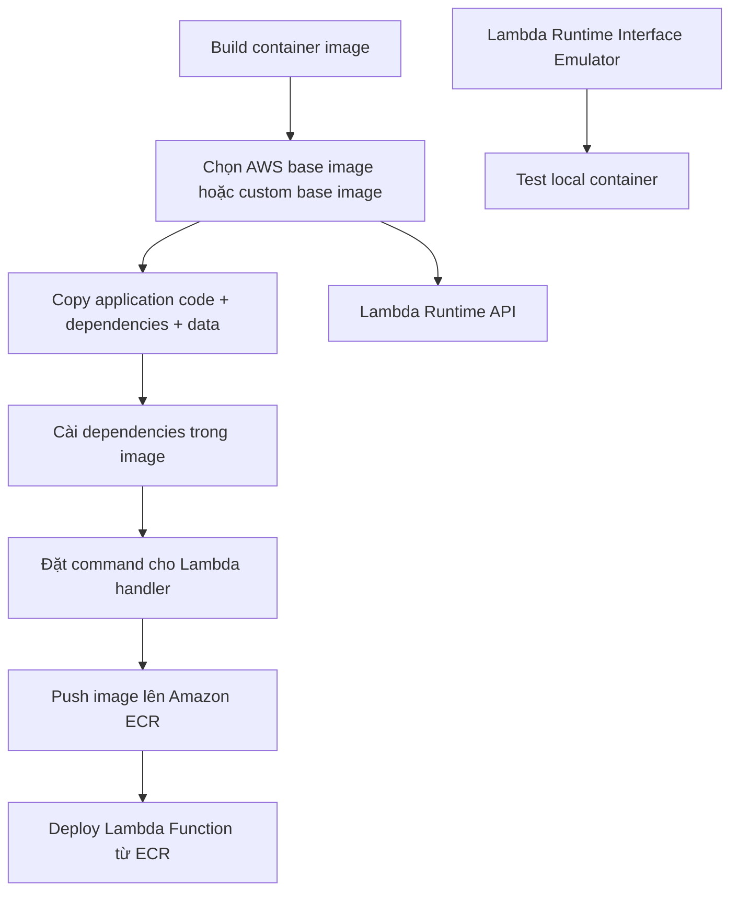

# 301. Lambda Container Images

## 🎯 Giới thiệu
- Lambda hỗ trợ deploy function dưới dạng **container images** như một tính năng mới.
- Container image có thể lên tới **10 GB** từ **ECR**, phù hợp khi cần:
  - dependency phức tạp
  - dependency lớn
  - package code + dependencies + data set trong cùng một image
- Điểm cốt lõi: **base image phải implement Lambda Runtime API**.
- Đây là một cách thay thế tốt cho việc phải tự quản lý **Lambda layers** khi ứng dụng quá lớn hoặc phức tạp.

## 1. Lambda Container Images là gì?
- AWS cho phép chạy Lambda Function từ một **Docker image** thay vì chỉ từ source code truyền thống.
- Không phải mọi Docker container đều chạy được trên Lambda:
  - image phải dựa trên **base image** phù hợp
  - base image đó phải hỗ trợ **Lambda Runtime API**
- AWS cung cấp base images cho nhiều ngôn ngữ:
  - **Python**
  - **Node.js**
  - **Java**
  - **.NET**
  - **Go**
  - **Ruby**
- Bạn cũng có thể tự tạo base image riêng, miễn là implement đúng **Lambda Runtime API**.

## 2. Flow triển khai và cấu trúc image
- Quy trình điển hình:
  1. Chọn **AWS base image** phù hợp
  2. Copy application code vào image
  3. Cài dependencies trong container
  4. Khai báo function sẽ được chạy khi Lambda invoke
- Ví dụ trong transcript:
  - dùng base image `amazon/aws-lambda-nodejs:12`
  - copy `app.js`, `package.json` và dữ liệu cần thiết
  - chạy `npm install`
  - set command `app.lambdaHandler`
- Ý nghĩa:
  - image này sẽ chạy được trên Lambda vì nó được xây từ base image đúng chuẩn
  - giúp đóng gói code và dependencies rõ ràng hơn

## 3. Best practices và use case
- **Optimize container images** để Lambda pull ít dữ liệu hơn.
- Nên dùng:
  - **AWS provided base images**
  - vì chúng được build trên **Amazon Linux 2**
  - và đã được **Lambda service cache** sẵn một phần
- Nên dùng **multi-stage builds**:
  - build phức tạp ở stage trung gian
  - stage cuối chỉ copy artifacts cần thiết
  - kết quả là image nhỏ hơn và gọn hơn
- Nên sắp xếp layers theo hướng:
  - **stable layers** ở đầu
  - **frequently changing layers** ở cuối
- Nên dùng **single repository** cho các function có **large layers**:
  - giúp **ECR** so sánh layers hiệu quả hơn
  - tránh upload và lưu trùng lặp
- Use case nổi bật:
  - khi cần deploy Lambda Function rất lớn, tối đa **10 GB**

## 📊 Bảng tóm tắt
| Tiêu chí | Mô tả |
|----------|------|
| Mô hình triển khai | Lambda Function chạy từ **container images** |
| Kích thước tối đa | Up to **10 GB** từ **ECR** |
| Điều kiện bắt buộc | **Base image** phải implement **Lambda Runtime API** |
| Ngôn ngữ hỗ trợ | Python, Node.js, Java, .NET, Go, Ruby |
| Lợi ích chính | Gói code, dependencies, data set trong cùng image |
| Local test | Dùng **Lambda Runtime Interface Emulator** |
| Best practice | AWS base images, multi-stage builds, layer ordering, single repo cho large layers |

## 💡 Mẹo ghi nhớ cho kỳ thi AWS
- Nhớ 3 từ khóa: **ECR - Base Image - Lambda Runtime API**.
- **Không phải Docker image nào cũng chạy được trên Lambda**.
- Nếu đề bài nhắc tới:
  - dependency lớn
  - app phức tạp
  - image lên tới 10 GB  
  thì nghĩ ngay tới **Lambda container images**.
- **AWS provided base images** là lựa chọn ưu tiên vì đã được Lambda cache và tối ưu hơn.
- **Multi-stage build** thường là đáp án đúng khi cần giảm size image.
- **Lambda Runtime Interface Emulator** dùng để test local container.

## ✅ Kết luận
- Lambda container images cho phép deploy function dưới dạng **Docker image** từ **ECR**.
- Yêu cầu quan trọng nhất là image phải dựa trên base image có **Lambda Runtime API**.
- Đây là lựa chọn phù hợp khi cần đóng gói ứng dụng lớn, nhiều dependency, hoặc muốn workflow build/publish thống nhất cho cả **ECS** và **Lambda**.
