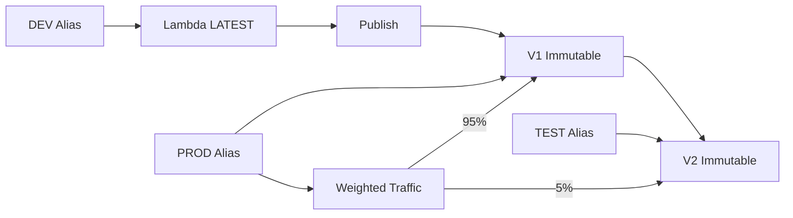

# 302. Lambda Versions and Aliases

## 🎯 Giới thiệu
Trong bài này, trọng tâm là cách **Lambda Version** và **Lambda Aliases** giúp quản lý trạng thái của Lambda function khi triển khai và sử dụng trong thực tế.  
Điểm chính cần nhớ là:

- `LATEST` là trạng thái có thể chỉnh sửa.
- Khi **publish** thì Lambda tạo ra một **version** mới như `V1`, `V2`.
- **Version** là **immutable**.
- **Alias** là một **pointer** trỏ đến một Lambda version và có thể thay đổi.

## 1. Lambda Version
- Khi bạn làm việc với Lambda function, ban đầu thường dùng `LATEST`.
- Khi đã hài lòng với code state, bạn có thể **publish** function để tạo version mới.
- Khi publish, version đầu tiên sẽ là `V1`, sau đó có thể là `V2`, `V3`, ...
- Mỗi version là **immutable**:
  - Không thể đổi code.
  - Không thể đổi environment variables.
  - Không thể thay đổi bất kỳ thứ gì sau khi đã publish.
- Mỗi version là **independent** và có **ARN** riêng.
- Mỗi version chứa cả:
  - code
  - configuration

## 2. Lambda Aliases
- **Alias** là một pointer trỏ đến một Lambda function version.
- Có thể tạo các alias như:
  - `DEV`
  - `TEST`
  - `PROD`
- Alias là **mutable**, tức là có thể thay đổi version mà nó trỏ tới.
- Mục đích của alias:
  - Tạo endpoint ổn định cho người dùng hoặc trigger.
  - Backend có thể đổi sang version khác mà phía gọi vẫn dùng cùng một alias.
- Ví dụ trong transcript:
  - `DEV Alias` có thể trỏ tới `LATEST`
  - `TEST Alias` có thể trỏ tới `V2`
  - `PROD Alias` có thể trỏ tới `V1` ổn định

## 3. Canary Deployment với Aliases
- Alias hỗ trợ **canary deployments** bằng cách gán **weights** cho các version mà nó trỏ tới.
- Ví dụ khi muốn chuyển từ `V1` sang `V2` trong `PROD`:
  - 95% traffic đi tới `V1`
  - 5% traffic đi tới `V2`
- Mục đích:
  - Test `V2` trong `PROD`
  - Đảm bảo hoạt động ổn trước khi chuyển hoàn toàn sang `V2`
- Sau khi kiểm tra xong, có thể chuyển 100% traffic sang `V2`.

## 📊 Bảng tóm tắt
| Tiêu chí | Mô tả |
|----------|------|
| `LATEST` | Bản có thể chỉnh sửa khi đang phát triển |
| Lambda Version | Được tạo khi `publish`, ví dụ `V1`, `V2` |
| Tính chất version | **Immutable**, không thể sửa code hay environment variables |
| ARN | Mỗi version có ARN riêng |
| Lambda Alias | Pointer trỏ tới một version |
| Tính chất alias | **Mutable**, có thể đổi version được trỏ tới |
| Mục đích alias | Tạo endpoint ổn định cho trigger hoặc user |
| Canary deployment | Dùng weights để chia traffic giữa các version |
| Lưu ý quan trọng | Alias **không thể reference alias khác**, chỉ reference version |

## 💡 Mẹo ghi nhớ cho kỳ thi AWS
- Nhớ câu: **Version = immutable, Alias = mutable**.
- `LATEST` dùng để phát triển, còn **publish** để khóa thành version cố định.
- **Alias** giúp giữ endpoint ổn định dù backend version thay đổi.
- Nếu đề bài nói về **chuyển traffic dần dần** hoặc **test version mới trong production**, nghĩ ngay đến **Alias + weights**.
- Bẫy hay gặp: **Alias không trỏ tới Alias khác**.

## ✅ Kết luận
Lambda **Version** dùng để đóng băng trạng thái function sau khi publish, còn **Alias** dùng để tạo điểm truy cập ổn định và linh hoạt trỏ tới version mong muốn.  
Điểm thi cần nhớ nhất là: **version là immutable, alias là mutable, và alias hỗ trợ weighted traffic cho canary deployment**.
