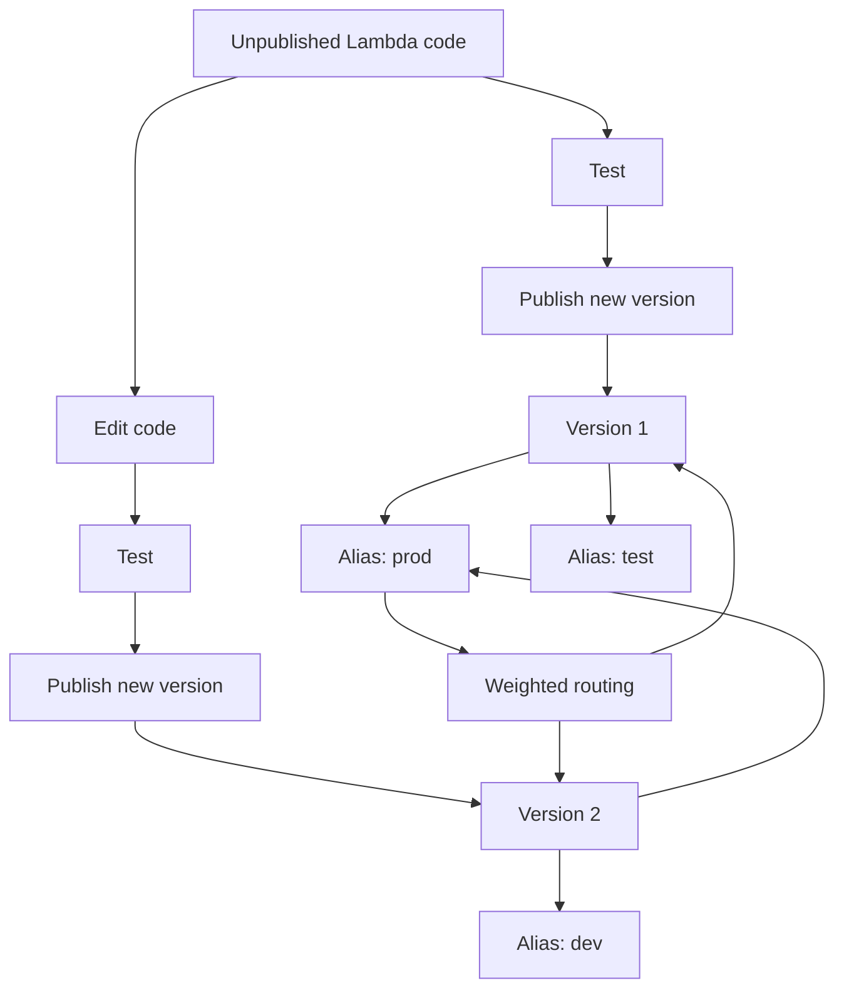

# 303. Lambda Versions and Aliases - Hands On

## 🎯 Giới thiệu
Bài học này thực hành cách làm việc với **Lambda versions** và **aliases** để quản lý code theo thời gian, tách biệt giữa bản đang chỉnh sửa và bản đã publish, đồng thời điều hướng traffic giữa nhiều version.

## 1. Lambda Versions
- Tạo function `lambda-version-demo` bằng Python 3.8.
- Code ban đầu trả về: `this is version one.`
- Sau khi `deploy` và `test`, có thể `publish new version` để chốt thành **version 1**.
- Khi đã publish:
  - Lambda version trở thành bản cố định.
  - Không thể sửa code trực tiếp trên version đó.
  - Có thể test lại version đã publish và nhận đúng kết quả từ version tương ứng.
- Tiếp tục chỉnh code thành `this is version two.`
- `deploy`, `test`, rồi `publish` tiếp để tạo **version 2**.

## 2. Lambda Aliases
- Sau khi có nhiều versions, tạo **aliases** để trỏ tới version mong muốn.
- Các alias được tạo trong bài:
  - `dev` alias: trỏ tới **latest unpublished version** để luôn bám theo code mới nhất.
  - `test` alias: trỏ tới **latest published version**, trong bài là **version 2**.
  - `prod` alias: trỏ tới version ổn định hơn, ban đầu là **version 1**.
- Test alias sẽ trả về đúng response của version mà alias đang trỏ tới.

## 3. Weighted Alias
- Alias có thể cấu hình **weight** để chia traffic giữa 2 versions.
- Ví dụ với `prod`:
  - 50% traffic tới **version 1**
  - 50% traffic tới **version 2**
- Kết quả test có thể luân phiên giữa:
  - `this is version one.`
  - `this is version two.`
- Khi đã sẵn sàng, có thể bỏ weighted alias và chuyển toàn bộ traffic của `prod` sang **version 2**.

## 📊 Bảng tóm tắt
| Tiêu chí | Mô tả |
|----------|------|
| Lambda Version | Bản code đã publish, cố định và không sửa trực tiếp được |
| Unpublished code | Bản đang chỉnh sửa trên `latest` |
| `dev` alias | Trỏ tới latest unpublished version |
| `test` alias | Trỏ tới latest published version |
| `prod` alias | Trỏ tới version ổn định để dùng production |
| Weighted alias | Chia traffic giữa 2 versions theo tỷ lệ như 50:50 |

## 💡 Mẹo ghi nhớ cho kỳ thi AWS
- `Version` = bản đã chốt, không sửa trực tiếp.
- `Alias` = tên trỏ tới một version cụ thể.
- `dev` thường gắn với code mới nhất, `prod` thường gắn với bản ổn định.
- Weighted alias cho phép chia traffic giữa 2 versions để thử nghiệm rollout.
- Khi cần chuyển hẳn sang version mới, chỉ cần đổi alias sang version đó.

## ✅ Kết luận
Lambda versions giúp cố định trạng thái code theo từng mốc, còn aliases giúp trỏ linh hoạt tới version phù hợp cho `dev`, `test`, `prod`. Điểm quan trọng nhất là aliases có thể dùng để **route traffic** giữa nhiều versions trước khi chuyển hẳn sang version mới.
