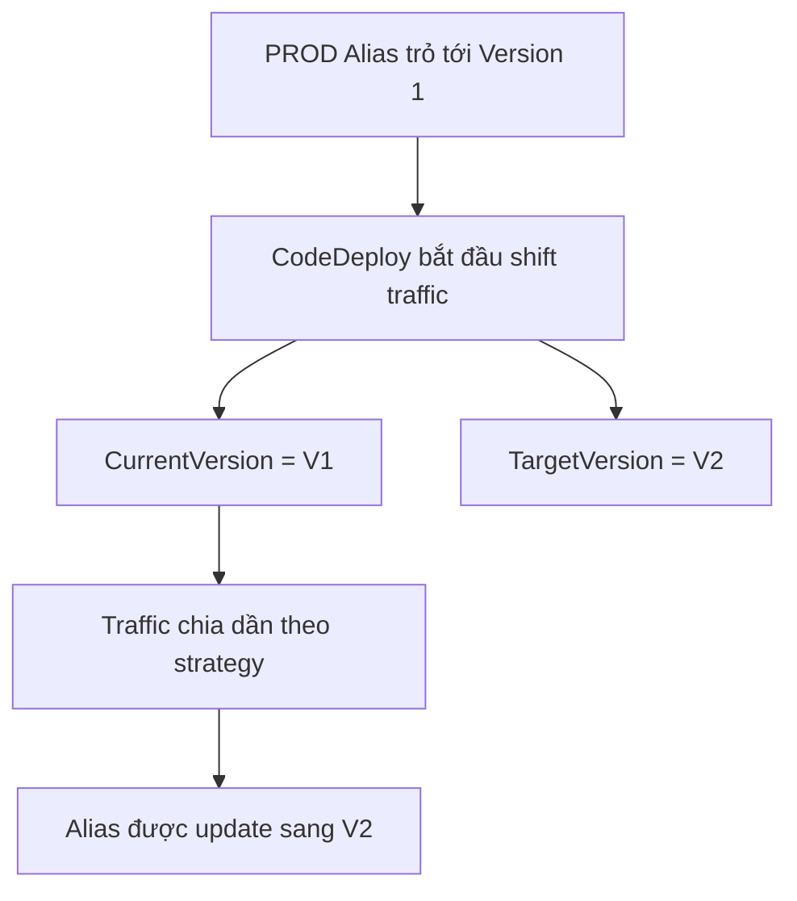
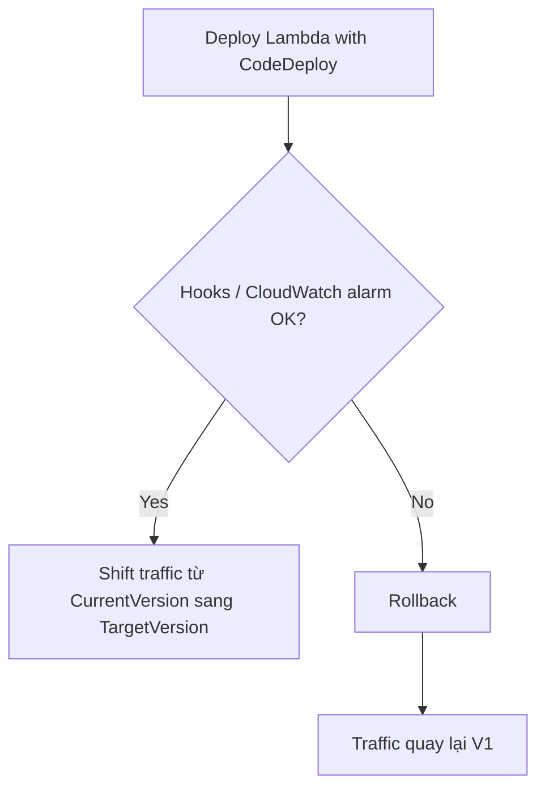

# 304. Lambda and CodeDeploy

## 🎯 Giới thiệu
- Bài này nói về **integration giữa Lambda và CodeDeploy**.
- Mục tiêu chính của CodeDeploy là **tự động shift traffic** cho **Lambda aliases** khi deploy version mới.
- Cơ chế này dựa trên **versions** và **aliases** của Lambda.
- Nội dung thực hành không làm ngay trong lecture này, mà sẽ được thực hành khi học **SAM (Serverless Application Model)**.

## 1. 🔄 Luồng deploy traffic cho Lambda alias
- Giả sử có một **PROD Alias** đang trỏ tới **Lambda Version 1**.
- Khi upgrade sang **Version 2**, CodeDeploy sẽ chuyển traffic **từ V1 sang V2 theo thời gian**.
- Traffic không nhảy ngay lập tức mà có thể tăng dần theo từng giai đoạn:
  - 100% V1, 0% V2
  - 90% V1, 10% V2
  - 50% V1, 50% V2
  - 0% V1, 100% V2
- CodeDeploy sẽ cập nhật alias từ **CurrentVersion** sang **TargetVersion** theo thời gian.

## 2. ⚙️ Các chiến lược shift traffic
CodeDeploy có 3 chiến lược chính:

- **Linear**
  - Tăng traffic **mỗi N phút** cho đến khi đạt 100%.
  - Ví dụ:
    - `Linear10PercentEvery3Minutes`
    - `Linear10PercentEvery10Minutes`

- **Canary**
  - Cho một tỷ lệ traffic nhỏ chạy thử trước, sau đó chuyển hẳn lên 100%.
  - Ví dụ:
    - `Canary10Percent5Minutes`
    - `Canary10PercentEvery30Minutes`
  - Nghĩa là:
    - ban đầu chỉ có 10% traffic vào V2 trong một khoảng thời gian
    - sau đó chuyển toàn bộ sang V2

- **AllAtOnce**
  - Chuyển traffic **ngay lập tức** từ V1 sang V2.
  - Đây là cách **nhanh nhất** nhưng cũng **nguy hiểm nhất** nếu V2 chưa được test kỹ.

## 3. 🛑 Rollback, hooks và AppSpec.yml
- Có thể tạo **pre-traffic hooks** và **post-traffic hooks** để kiểm tra health của Lambda.
- Nếu có vấn đề:
  - hooks bị fail, hoặc
  - **CloudWatch alarm** bị fail
- CodeDeploy sẽ nhận biết có lỗi và thực hiện **rollback**.
- Khi rollback, traffic sẽ được đưa trở lại **100% V1**.

### Các tham số quan trọng trong `AppSpec.yml`
- **Name**: tên của function cần deploy
- **Alias**: tên alias của Lambda function, **bắt buộc**
- **CurrentVersion**: version hiện tại mà traffic đang trỏ tới
- **TargetVersion**: version đích mà traffic sẽ được chuyển sang

## 📊 Bảng tóm tắt
| Tiêu chí | Mô tả |
|----------|------|
| Mục tiêu của integration | CodeDeploy tự động shift traffic cho Lambda aliases |
| Đối tượng chính | Lambda Versions và Aliases |
| Strategy 1 | **Linear**: tăng traffic theo từng bước mỗi N phút |
| Strategy 2 | **Canary**: thử một tỷ lệ nhỏ rồi chuyển toàn bộ |
| Strategy 3 | **AllAtOnce**: chuyển ngay lập tức |
| Cơ chế an toàn | pre-traffic hooks, post-traffic hooks, CloudWatch alarm |
| Khi lỗi xảy ra | CodeDeploy rollback về **V1** |
| File liên quan | `AppSpec.yml` |
| Tham số quan trọng | `Name`, `Alias`, `CurrentVersion`, `TargetVersion` |

## 💡 Mẹo ghi nhớ cho kỳ thi AWS
- Nhớ rằng **CodeDeploy + Lambda** dùng để **traffic shifting**, không chỉ là deploy thông thường.
- **Alias** là điểm rất quan trọng vì CodeDeploy update alias từ **CurrentVersion** sang **TargetVersion**.
- **Linear = tăng dần**, **Canary = thử trước rồi chuyển hẳn**, **AllAtOnce = chuyển ngay**.
- Nếu thấy câu hỏi về **rollback**, hãy nghĩ tới:
  - **hooks**
  - **CloudWatch alarm**
  - quay lại **V1**
- Trong bài thi, nếu nhắc tới **SAM**, có thể liên quan đến **CodeDeploy deployment cho Lambda**.

## ✅ Kết luận
- **Lambda + CodeDeploy** giúp tự động hóa việc **shift traffic** giữa các Lambda versions thông qua alias.
- Có 3 strategy chính: **Linear**, **Canary**, và **AllAtOnce**.
- Hệ thống có thể **rollback** khi hooks hoặc CloudWatch alarm báo lỗi.
- Trong `AppSpec.yml`, các trường cần nhớ là **Name**, **Alias**, **CurrentVersion**, và **TargetVersion**.
