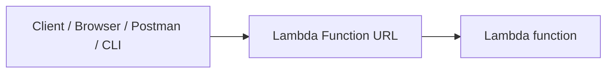
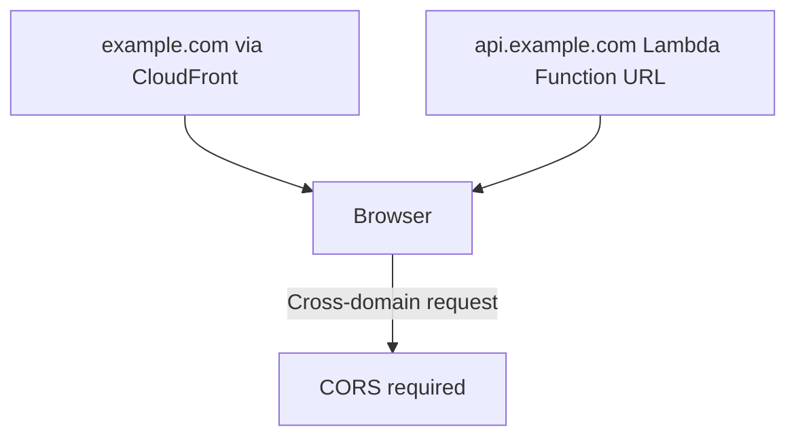
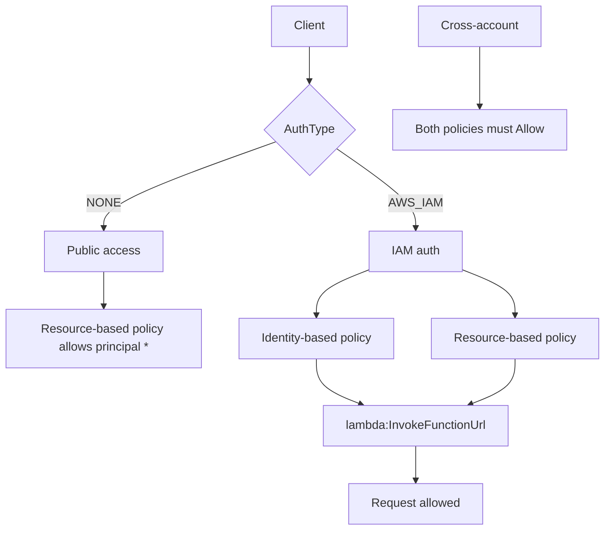

# 305. Lambda Function URL

## 🎯 Giới thiệu
Lambda Function URL cho phép expose một Lambda function như một HTTP endpoint mà không cần đi qua **API Gateway** hoặc **Application Load Balancer**.

- Tạo ra một **unique URL endpoint** cho Lambda function và URL này **không đổi**.
- Hỗ trợ **IPv4** và **IPv6**.
- Có thể gọi bằng:
  - Web browser
  - Command line
  - Postman
  - Bất kỳ HTTP client nào
- Chỉ truy cập được qua **public internet**.
- Nếu gọi từ domain khác, có thể cần cấu hình **CORS**.

## 1. Cách hoạt động của Lambda Function URL
Lambda Function URL là một cách đơn giản để đưa Lambda ra ngoài dưới dạng endpoint HTTP/HTTPS.

- Dùng được cho truy cập HTTPS.
- Không hỗ trợ URL private theo mô tả trong transcript.
- Có thể tạo và cấu hình bằng:
  - **Console**
  - **API**
- Nếu cần giới hạn mức chạy của Lambda, có thể dùng **reserved concurrency** để kiểm soát số lượng invocation.

## 2. Bảo mật và CORS
Vì Function URL có thể bị gọi từ domain khác, **CORS** là phần cần chú ý.

- Transcript so sánh với cách dùng CORS trong **Amazon S3**.
- Ví dụ:
  - S3 bucket được front bởi **CloudFront** với domain `example.com`
  - API được host bằng **Lambda function URL** với domain `api.example.com`
- Vì domain khác nhau, cần bật và cấu hình **CORS** để hoạt động đúng.

## 3. AuthType và Resource-based Policy
Bảo mật của Lambda Function URL dựa trên **resource-based policies** gắn vào Lambda function.

### AuthType = NONE
- Cho phép **public** và **unauthenticated access**.
- Khi dùng kiểu này, resource-based policy phải cho phép public access.
- Ví dụ trong transcript:
  - `Principal: *`
  - Action: `lambda:InvokeFunctionUrl`

### AuthType = AWS_IAM
- Dùng **IAM** để authenticate và authorize request.
- Lúc này cần đánh giá cả:
  - **identity-based policy**
  - **resource-based policy**
- Cần có quyền **`lambda:InvokeFunctionUrl`** giữa hai policy này.

### Luồng theo account
- **Trong cùng account**:
  - Chỉ cần một trong hai policy cho phép thì có thể gọi.
- **Cross-account**:
  - Cần **cả identity-based policy và resource-based policy** đều `Allow`.

## 📊 Bảng tóm tắt
| Tiêu chí | Mô tả |
|----------|------|
| Mục đích | Expose Lambda như HTTP endpoint |
| Dịch vụ thay thế | Không cần **API Gateway** hoặc **ALB** |
| URL | Unique và không đổi |
| Giao thức | HTTPS |
| Hỗ trợ địa chỉ | IPv4, IPv6 |
| Phạm vi truy cập | Chỉ qua public internet |
| Cross-domain | Cần **CORS** |
| Bảo mật | **resource-based policy** |
| AuthType `NONE` | Public, unauthenticated access |
| AuthType `AWS_IAM` | Dùng IAM để authenticate/authorize |
| Quyền quan trọng | `lambda:InvokeFunctionUrl` |
| Giới hạn chạy | **reserved concurrency** |
| Tạo/cấu hình | Console hoặc API |

## 💡 Mẹo ghi nhớ cho kỳ thi AWS
- **Function URL = cách nhanh nhất** để biến Lambda thành HTTP endpoint.
- Nhớ 3 từ khóa chính:
  - **Public internet only**
  - **CORS for different domains**
  - **Resource-based policy**
- Phân biệt rõ:
  - `NONE` = public access
  - `AWS_IAM` = cần IAM + policy evaluation
- Với **cross-account**, hãy nhớ:
  - **identity-based policy** và **resource-based policy** đều phải `Allow`
- Quyền cần nhớ cho URL là **`lambda:InvokeFunctionUrl`**.

## ✅ Kết luận
Lambda Function URL là một cách đơn giản để public Lambda như HTTP endpoint với URL cố định, hỗ trợ IPv4/IPv6 và truy cập qua HTTPS. Bảo mật dựa trên **resource-based policies**, với hai chế độ chính là **AuthType NONE** và **AuthType AWS_IAM**. Khi làm bài thi, cần đặc biệt nhớ **CORS**, **`lambda:InvokeFunctionUrl`**, và sự khác nhau giữa **same account** và **cross-account**.
