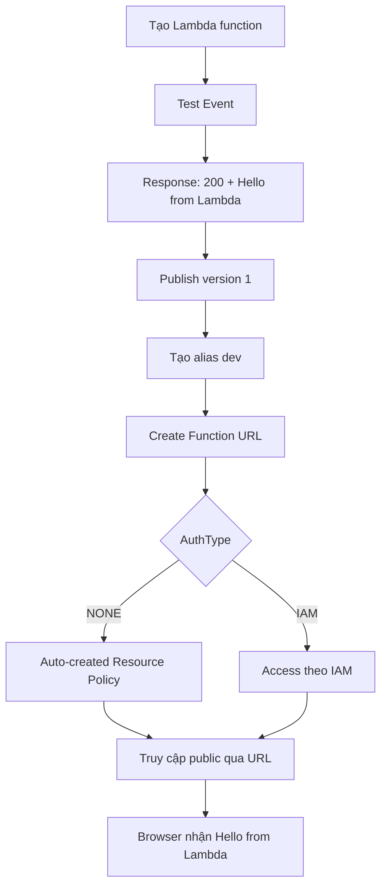

# 306. Lambda Function URL - Hands On

## 🎯 Giới thiệu
Bài thực hành này cho thấy cách tạo **Lambda Function URL** để truy cập Lambda qua **HTTP-like response** từ trình duyệt, thay vì chỉ test nội bộ trong Lambda console.  
Luồng chính gồm: tạo function, test response, publish version, tạo alias, rồi gắn **Function URL** vào alias hoặc phiên bản unpublished/latest.

## 1. Tạo Lambda function và test
- Tạo Lambda function tên `lambda-demo-url`
- Chọn runtime **Python 3.9**
- Tạo **Test Event** tên `test`
- Khi test, function trả về:
  - `status code 200`
  - body: `Hello from Lambda`
- Kết quả này xác nhận Lambda đang trả về response kiểu HTTP

## 2. Publish version và tạo alias
- Publish function thành **version 1**
- Tạo **alias** tên `dev`
- Alias `dev` trỏ tới **version 1**
- Đây là cách để Function URL gắn với một mốc ổn định, không đổi theo từng lần cập nhật

## 3. Tạo Function URL và truy cập public
- Ở mục **Function URL**, chọn **Create Function URL**
- **Authentication type** có 2 lựa chọn:
  - `IAM`
  - `NONE`
- Trong bài này chọn `NONE`
- Khi chọn `NONE`, AWS tự tạo **resource policy** để cho phép mọi người truy cập Lambda Function URL
- Có thể cấu hình **CORS** để chỉ định:
  - allowed origins
  - exposed headers
  - các thiết lập liên quan khác
- Sau khi tạo, **Function URL** sẽ giữ nguyên cho alias `dev`
- Mở URL trong browser sẽ nhận lại `Hello from Lambda`
- Lưu ý:
  - **Function URL** chỉ gắn được với **unpublished function version** hoặc **alias**
  - Không gắn trực tiếp vào published version
  - Có thể tạo Function URL cho `latest` nếu muốn người dùng truy cập version chưa publish

## 🔁 Mermaid Flow

## 📊 Bảng tóm tắt
| Tiêu chí | Mô tả |
|----------|------|
| Mục tiêu | Truy cập Lambda qua URL public |
| Kết quả test | `200` với body `Hello from Lambda` |
| Phiên bản | Publish thành `version 1` |
| Alias | Tạo `dev` trỏ tới `version 1` |
| Authentication type | `IAM` hoặc `NONE` |
| Khi chọn `NONE` | AWS tự tạo **resource policy** cho phép truy cập |
| CORS | Có thể cấu hình nếu cần |
| Phạm vi áp dụng | Gắn với **alias** hoặc **unpublished version/latest** |

## 💡 Mẹo ghi nhớ cho kỳ thi AWS
- **Function URL** = cách expose Lambda qua URL trực tiếp
- Nhớ rằng **Function URL** gắn với **alias** hoặc **unpublished version**, không phải published version
- Nếu chọn `NONE`, cần nhớ có **resource policy** tự tạo để cho phép truy cập
- **IAM** và `NONE` là 2 **authentication type** quan trọng
- `dev -> version 1` là pattern quen thuộc để giữ endpoint ổn định

## ✅ Kết luận
Lambda Function URL cho phép truy cập Lambda trực tiếp qua URL, trả về response kiểu HTTP. Trong bài này, function được test thành công, publish thành **version 1**, tạo alias `dev`, rồi gắn **Function URL** với `AuthType = NONE` để truy cập public từ browser.
