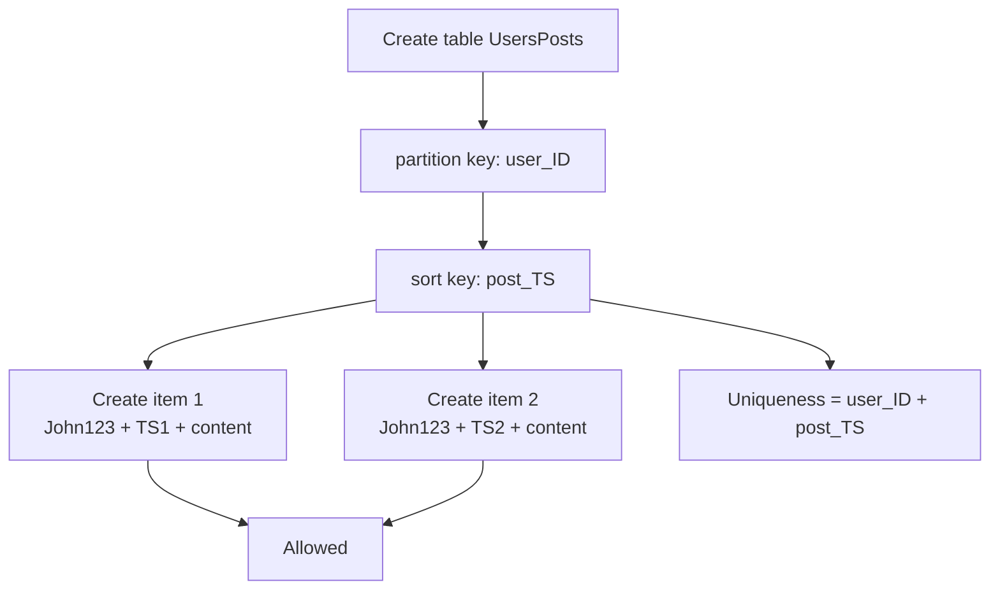

# 311. DynamoDB Basics - Hands On

## 🎯 Giới thiệu
DynamoDB là một **serverless service** cho phép tạo **tables** thay vì tạo database theo kiểu truyền thống. Trong bài này, trọng tâm là cách tạo table, cấu hình key, thêm item và hiểu vì sao **partition key** và **sort key** rất quan trọng khi làm việc với DynamoDB.

## 1. Tạo table trong DynamoDB
- Khi tạo table, cần đặt **table name**.
- Table đầu tiên được tạo là `Users`.
- Bắt buộc phải khai báo:
  - **partition key**: `user_ID`
  - **sort key**: có thể để trống nếu chưa dùng
- Kiểu dữ liệu của key có thể là:
  - `binary`
  - `number`
  - `string`
- Lúc đầu có thể bỏ qua **sort key** và chỉ dùng **partition key**.

## 2. Cấu hình table
- Có thể chọn:
  - **Quick start**: dùng cấu hình mặc định
  - **Custom settings**: tự chỉnh từng phần
- **Table class**:
  - `DynamoDB standard`: mặc định, phù hợp đa số use case
  - `DynamoDB standard IA`: phù hợp dữ liệu ít truy cập, giúp tối ưu chi phí
- **Capacity mode**:
  - `on-demand`
  - `provisioned`
- Trong bài, dùng **provisioned** vì nằm trong **free tier**.
- Tắt **auto scaling** cho cả read và write.
- Thiết lập:
  - **read capacity**: 2
  - **write capacity**: 2
- Không tạo **secondary index** ở bước này.
- Hệ thống hiển thị chi phí ước tính là **$1.32/month**, nhưng có thể bỏ qua vì đang trong free tier.
- Dữ liệu được **encrypt at rest** bằng **DynamoDB key**.

## 3. Thêm item và hiểu key
- Sau khi tạo table, có thể vào **View Items** để xem dữ liệu.
- Thay vì scan hoặc query ngay, bài thực hành tập trung vào **create item**.
- Với table `Users`:
  - Thêm item có `user_ID = John123`
  - Thêm attributes như:
    - `first_name = John`
    - `last_name = Doe`
- Có thể thêm nhiều attributes khác nhau.
- DynamoDB cho phép:
  - cùng một table nhưng các item có thể có **attributes khác nhau**
  - attributes mới có thể được thêm dần theo thời gian
- Ví dụ:
  - Item 1: có `first_name`, `last_name`
  - Item 2: cùng table nhưng có `first_name`, `age`
- Điều này có nghĩa là:
  - `last_name` có thể `null` ở item này
  - `age` có thể `null` ở item khác
- Chỉ có **partition key** là bắt buộc không được null.

## 4. Table thứ hai với sort key
- Tạo table mới: `UsersPosts` hoặc `UserPosts`
- Cấu hình:
  - **partition key**: `user_ID`
  - **sort key**: `post_TS`
- Table này dùng để lưu bài đăng của user.
- Khi thêm item:
  - `user_ID = John123`
  - `post_TS = 2021...`
  - `content = "Hello world, this is my first blog."`
- Thêm item thứ hai:
  - vẫn `user_ID = John123`
  - nhưng `post_TS` khác
  - `content = "Second post yay!"`
- Kết quả:
  - Cùng `user_ID` nhưng khác `post_TS` vẫn thêm được
  - **Uniqueness** là theo **combination** của `user_ID` + `post_TS`
- Nhờ đó:
  - dữ liệu được **partitioned by user_ID**
  - có thể **sort by post_TS**
- Đây là lý do sort key rất hữu ích khi muốn lưu nhiều bản ghi cho cùng một user.

## 📊 Bảng tóm tắt
| Tiêu chí | Mô tả |
|----------|------|
| Loại dịch vụ | DynamoDB là **serverless** và tạo **tables** |
| Key chính | **partition key** bắt buộc, **sort key** là tùy chọn |
| Kiểu key | `binary`, `number`, `string` |
| Table class | `DynamoDB standard` hoặc `DynamoDB standard IA` |
| Capacity mode | `on-demand` hoặc `provisioned` |
| Dữ liệu | Có thể có item với **attributes** khác nhau |
| Điểm quan trọng | Chỉ **partition key** không được null |
| Table có sort key | Uniqueness theo tổ hợp `partition key + sort key` |
| Ví dụ bài học | `Users`, `UserPosts` |

## 💡 Mẹo ghi nhớ cho kỳ thi AWS
- DynamoDB là **serverless**, nên bạn **tạo table**, không tạo database theo kiểu truyền thống.
- **partition key** là bắt buộc; không có nó thì item không hợp lệ.
- Nếu chỉ có **partition key**, giá trị key phải **unique**.
- Nếu có thêm **sort key**, uniqueness là theo **cặp key**.
- DynamoDB cho phép **schema linh hoạt**:
  - item có thể có các attributes khác nhau
  - giá trị thiếu sẽ là `null`
- `DynamoDB standard` là lựa chọn mặc định trong bài.
- `DynamoDB standard IA` phù hợp dữ liệu ít truy cập trong thời gian dài.
- Với dữ liệu nhiều bài viết của cùng một user, chọn **partition key** cẩn thận để tránh dữ liệu bị skew về một key duy nhất.

## ✅ Kết luận
Bài này cho thấy cách tạo table trong DynamoDB, cấu hình capacity, thêm item và hiểu rõ vai trò của **partition key** và **sort key**. Điểm cốt lõi để ôn thi là: DynamoDB linh hoạt về schema, nhưng key design phải đúng để lưu và truy xuất dữ liệu hiệu quả.
