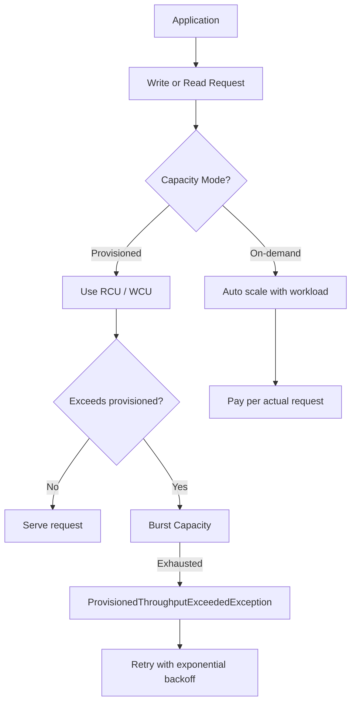

# 312. DynamoDB WCU & RCU - Throughput

## 🎯 Giới thiệu
- DynamoDB cho phép cấu hình **read/write throughput** trước để kiểm soát capacity của table.
- Có 2 **capacity modes** chính:
  - **Provisioned mode**: phải khai báo trước **RCU** và **WCU**, trả tiền cho lượng đã provision.
  - **On-demand mode**: tự động scale reads/writes theo workload, không cần capacity planning, trả tiền theo usage thực tế.
- Có thể chuyển giữa **provisioned** và **on-demand** tối đa **mỗi 24 giờ một lần**.

## 1. ⚙️ Provisioned Mode, WCU và Burst Capacity
- **WCU (Write Capacity Unit)**:
  - 1 WCU = **1 write/second** cho item tối đa **1 KB**.
  - Item lớn hơn 1 KB sẽ tiêu tốn nhiều WCU hơn.
  - Khi tính toán, **làm tròn lên** đến **KB gần nhất cao hơn**.
- Ví dụ WCU:
  - 10 items/second, item 2 KB → **20 WCU**
  - 6 items/second, item 4.5 KB → làm tròn lên 5 KB → **30 WCU**
  - 120 items/minute, item 2 KB → đổi ra 2 items/second → **4 WCU**
- Có thể dùng **auto-scaling** để DynamoDB tự điều chỉnh throughput theo target usage.
- Nếu dùng vượt mức provisioned:
  - Có thể tạm thời dùng **burst capacity**
  - Nếu burst capacity cũng hết, sẽ gặp lỗi **`ProvisionedThroughputExceededException`**
  - Cách xử lý retry: dùng **exponential backoff retry strategy**

## 2. 📖 RCU, Strongly Consistent Read và Eventually Consistent Read
- DynamoDB có 2 kiểu đọc:
  - **Strongly consistent read**
  - **Eventually consistent read** (default)
- Ý nghĩa:
  - **Eventually consistent read**: đọc ngay sau write có thể gặp **stale data** nếu replication chưa hoàn tất
  - **Strongly consistent read**: đảm bảo đọc được dữ liệu mới vừa ghi
- Để bật strongly consistent read:
  - đặt tham số **`ConsistentRead=True`**
  - áp dụng cho **GetItem, BatchGetItem, Query, Scan**
- Trade-off của strongly consistent read:
  - tốn **2x RCU**
  - có thể có **latency cao hơn**
- **RCU (Read Capacity Unit)**:
  - 1 RCU = **1 strongly consistent read/second**
  - hoặc **2 eventually consistent reads/second**
  - cho item tối đa **4 KB**
  - item lớn hơn 4 KB sẽ tiêu tốn nhiều RCU hơn
  - cũng phải **làm tròn lên** theo bội số 4 KB gần nhất cao hơn
- Ví dụ RCU:
  - 10 strongly consistent reads/second, item 4 KB → **10 RCU**
  - 16 eventually consistent reads/second, item 12 KB → **24 RCU**
  - 10 strongly consistent reads/second, item 6 KB → làm tròn lên 8 KB → **20 RCU**
- Chọn kiểu read:
  - dùng **eventually consistent** nếu chấp nhận độ trễ ngắn và muốn tiết kiệm
  - dùng **strongly consistent** nếu cần dữ liệu đúng ngay sau write

### 🧭 Flow request trong DynamoDB

## 3. 🧩 Partitions, Throttling và On-demand Mode
- DynamoDB table được chia thành **partitions**.
- Khi write, data đi qua **hashing algorithm** dựa trên **partition key** để xác định partition đích.
- Ý quan trọng:
  - cùng một partition key có thể luôn đi vào cùng một partition
  - nếu một key bị truy cập quá nhiều, có thể tạo ra **hot partition**
- Khi provisioned throughput được chia cho partitions:
  - **RCU/WCU được spread evenly across partitions**
  - ví dụ: 10 partitions và provision 10 WCU + 10 RCU → mỗi partition nhận **1 WCU + 1 RCU**
- **Throttling** có thể xảy ra ở mức partition nếu vượt RCU/WCU.
- Nguyên nhân được nhắc đến trong transcript:
  - **hot key**
  - **hot partition**
  - **very large items**
- Cách xử lý `ProvisionedThroughputExceededException`:
  - dùng **exponential backoff**
  - **distribute partition keys** tốt hơn
  - nếu là vấn đề đọc nặng một partition, cân nhắc **DynamoDB Accelerator (DAX)**
- **On-demand mode**:
  - tự động chấp nhận reads/writes
  - scale up/down theo workload
  - không cần provision RCU/WCU
  - transcript mô tả là **unlimited** và **no throttling**
  - trả theo **read request units (RRUs)** và **write request units (WRUs)**
  - khoảng **2.5x more expensive** so với provisioned capacity
  - phù hợp cho:
    - **unknown workloads**
    - **unpredictable application traffic**

## 📊 Bảng tóm tắt
| Tiêu chí | Mô tả |
|----------|------|
| Provisioned mode | Phải cấu hình trước **RCU/WCU**, trả tiền cho capacity đã provision |
| On-demand mode | Tự scale theo workload, không cần capacity planning, trả theo request thực tế |
| WCU | 1 write/second cho item tối đa 1 KB; item lớn hơn thì tính thêm và làm tròn lên |
| RCU | 1 strongly consistent read/second hoặc 2 eventually consistent reads/second cho item tối đa 4 KB |
| Strongly consistent read | Đọc đúng dữ liệu mới nhất, dùng `ConsistentRead=True`, tốn 2x RCU |
| Eventually consistent read | Default mode, có thể đọc stale data ngay sau write |
| Burst capacity | Cho phép vượt tạm thời provisioned throughput trước khi bị throttling |
| Exception | Vượt burst/provisioned limit sẽ gặp `ProvisionedThroughputExceededException` |
| Partition | Data được phân phối bằng hash của **partition key** |
| DAX | Được nhắc như giải pháp khi vấn đề là đọc nặng ở một partition |
| On-demand pricing | Dùng **RRUs/WRUs**, đắt hơn khoảng **2.5x** so với provisioned |

## 💡 Mẹo ghi nhớ cho kỳ thi AWS
- **WCU = write theo KB**
  - nhớ mốc **1 KB**
  - luôn **round up**
- **RCU = read theo KB**
  - nhớ mốc **4 KB**
  - **strongly consistent** = 1 read/second
  - **eventually consistent** = 2 reads/second
- **Strongly consistent read**:
  - cần `ConsistentRead=True`
  - tốn **2x RCU**
- **Provisioned**:
  - phải plan trước
  - có **burst capacity**
  - có thể bị `ProvisionedThroughputExceededException`
- **On-demand**:
  - không cần plan
  - scale tự động
  - đắt hơn, phù hợp traffic **unpredictable**
- **Hot partition / hot key** là dấu hiệu quan trọng khi throughput bị nghẽn
- Khi gặp throttling, nhớ 3 hướng:
  - **exponential backoff**
  - **distribute partition keys**
  - **DAX** nếu bài toán là read-heavy

## ✅ Kết luận
- DynamoDB throughput xoay quanh 2 chế độ: **provisioned** và **on-demand**.
- **WCU** và **RCU** là nền tảng để tính capacity, với quy tắc:
  - WCU theo **1 KB**
  - RCU theo **4 KB**
- Hiểu rõ **strongly consistent read**, **eventually consistent read**, **burst capacity**, **partition key hashing**, và **throttling** là đủ để xử lý phần lớn câu hỏi thi về chủ đề này.
