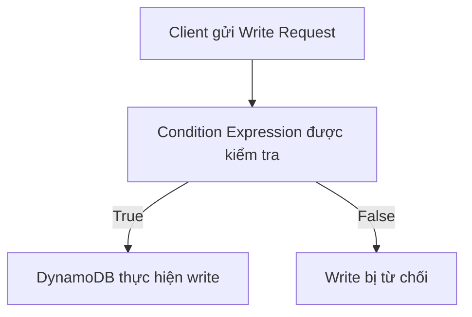

# 316. DynamoDB - Conditional Writes

## 🎯 Giới thiệu
DynamoDB **Conditional Writes** cho phép gắn một **condition expression** vào các thao tác ghi như:

- `PutItem`
- `UpdateItem`
- `DeleteItem`
- `TransactWriteItems`

Mục tiêu là để DynamoDB chỉ thực hiện write khi điều kiện đúng, giúp kiểm soát việc cập nhật dữ liệu một cách an toàn và có chủ đích.

## 1. Conditional Writes là gì
- Đây là cơ chế để quyết định **item nào được phép bị modify**.
- Condition expression chỉ áp dụng cho **write operations**.
- Nếu điều kiện sai, DynamoDB **không thực hiện** thay đổi dữ liệu.
- Mục đích chính:
  - tránh overwrite dữ liệu không mong muốn
  - kiểm tra trạng thái item trước khi sửa/xóa
  - đảm bảo logic ghi dữ liệu nhất quán

## 2. Các loại condition expression quan trọng
### ✅ Kiểm tra tồn tại
- `attribute_exists`
- `attribute_not_exists`
- `attribute_type`

Ý nghĩa:
- `attribute_exists`: chỉ đúng khi attribute tồn tại
- `attribute_not_exists`: chỉ đúng khi attribute chưa tồn tại
- `attribute_type`: kiểm tra attribute có đúng kiểu hay không

### ✅ So sánh chuỗi
- `contains`
- `begins_with`

Ví dụ:
- kiểm tra chuỗi bắt đầu bằng `http://`
- kiểm tra một giá trị có chứa chuỗi con nào đó

### ✅ Kiểm tra tập giá trị
- `IN`

Ví dụ:
- `ProductCategory` thuộc một trong nhiều category

### ✅ Kiểm tra khoảng giá trị
- `between`
- so sánh lớn hơn / nhỏ hơn

Ví dụ:
- `Price between :low and :high`
- `Price > ...`
- `Price < ...`

### ✅ Kiểm tra độ dài
- `size`

Dùng để kiểm tra độ dài của string.

## 3. Ví dụ và ý nghĩa thực tế
### UpdateItem có điều kiện
- Table: `ProductCatalog`
- Update: giảm `price` theo `discount`
- Chỉ thực hiện nếu `price` lớn hơn một ngưỡng `limit`

Kết quả:
- Nếu `price = 650` và `limit = 500` thì update thành công
- Nếu chạy lại cùng command, điều kiện sai vì `price` đã không còn lớn hơn `limit`, nên update thất bại

### DeleteItem có điều kiện
- Có thể xóa item chỉ khi:
  - `attribute_not_exists(price)`
  - hoặc `attribute_exists(ProductReviews.OneStar)`

Ý nghĩa:
- `attribute_not_exists(price)`: chỉ xóa khi item không có `price`
- `attribute_exists(ProductReviews.OneStar)`: chỉ xóa khi review 1 sao tồn tại

### Tránh overwrite dữ liệu
- Nếu dùng `attribute_not_exists` với `partition_key`
- Hoặc với cả `partition_key` và `sort_key`

thì chỉ ghi khi item chưa tồn tại, từ đó **không ghi đè dữ liệu cũ**.

### Kết hợp nhiều điều kiện
- Có thể kiểm tra:
  - `ProductCategory IN (...)`
  - `Price between 500 and 600`

Nếu một phần đúng nhưng phần khác sai, toàn bộ điều kiện là **false** và write sẽ không xảy ra.

## 📊 Bảng tóm tắt
| Tiêu chí | Mô tả |
|----------|------|
| Phạm vi áp dụng | `PutItem`, `UpdateItem`, `DeleteItem`, `TransactWriteItems` |
| Mục đích | Chỉ cho phép write khi điều kiện đúng |
| Khác với filter expression | Filter expression dùng cho read query, condition expression dùng cho write |
| Kiểm tra tồn tại | `attribute_exists`, `attribute_not_exists`, `attribute_type` |
| So sánh chuỗi | `contains`, `begins_with` |
| Kiểm tra nhiều giá trị | `IN` |
| Kiểm tra khoảng | `between`, `>`, `<` |
| Kiểm tra độ dài | `size` |
| Hiệu ứng khi false | DynamoDB không thực hiện write |

## 💡 Mẹo ghi nhớ cho kỳ thi AWS
- `Condition Expression` = **write guard**
- `Filter Expression` = **read filter**
- Muốn tránh overwrite dữ liệu, nhớ đến `attribute_not_exists` với `partition_key` hoặc cả `partition_key` + `sort_key`
- `begins_with` và `contains` là dấu hiệu kiểm tra chuỗi
- `between` và `IN` thường xuất hiện trong câu hỏi về điều kiện lọc logic trước khi write
- Nếu điều kiện sai, DynamoDB **không ghi** thay đổi

## ✅ Kết luận
Conditional Writes trong DynamoDB là cơ chế cho phép bạn gắn điều kiện vào các thao tác ghi để DynamoDB chỉ thực hiện khi logic mong muốn thỏa mãn. Đây là chủ đề quan trọng trong ôn thi AWS vì nó giúp kiểm soát overwrite, validate trạng thái item, và đảm bảo write an toàn.
