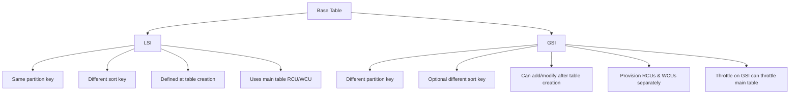

# 317. DynamoDB Indexes (GSI + LSI)

## 🎯 Giới thiệu
- DynamoDB có 2 loại index cần nắm:
  - **LSI (Local Secondary Index)**
  - **GSI (Global Secondary Index)**
- Mục tiêu chính của index là giúp **query** hiệu quả hơn, thay vì phải dùng **scan** rồi lọc ở service side/client side.
- Điểm mấu chốt khi học AWS exam: **hãy thiết kế index dựa trên cách bạn sẽ query data**.

## 1. LSI (Local Secondary Index)
- **LSI** cung cấp **alternative sort key** cho table.
- **Giữ nguyên partition key** của base table.
- Thêm một **sort key khác** để query theo chiều khác.
- Sort key của LSI là **scalar attribute**:
  - `string`
  - `number`
  - `binary`
- Mỗi table có thể có tối đa **5 LSIs**.
- **Phải tạo tại thời điểm tạo table**:
  - Không thể tạo sau khi table đã được tạo.
- Có thể chọn project **một phần hoặc toàn bộ attributes** từ main table vào LSI.

### Ví dụ trong transcript
- Base table có: `user ID`, `game ID`, `game timestamp`, `score`, `results`
- Có thể query theo `user ID` và `game ID`
- Nhưng nếu muốn query theo `user ID` và `game timestamp`:
  - cần tạo **LSI**
  - dùng `game timestamp` làm **sort key** cho LSI
- Khi đó có thể query các game của một user trong một khoảng thời gian.

## 2. GSI (Global Secondary Index)
- **GSI** cung cấp **alternative primary key**.
- Có thể có:
  - **different partition key**
  - hoặc **different partition key + sort key**
- Hữu ích khi muốn tăng tốc query trên các **non-key attributes** trong table.
- Có thể chọn attributes để **project** vào index.
- GSI được mô tả như một **new table** riêng.
- Với GSI, bạn phải **provision RCUs & WCUs** riêng.
- **Có thể thêm hoặc sửa sau khi table đã được tạo**.

### Ví dụ trong transcript
- Base table có: `user ID`, `game ID`, `game timestamp`
- Ban đầu chỉ query được theo `user ID`
- Không query tốt theo `game ID` nếu phải scan rồi filter
- Tạo **GSI** để query theo `game ID`
  - `partition key` của GSI = `game ID`
  - `sort key` có thể là `game timestamp`
  - project thêm `user ID`
- Kết quả: tạo ra **new queries** với primary key mới.

## 3. ⚠️ Điểm khác biệt quan trọng khi đi thi
- **LSI**
  - dùng **RCU/WCU của main table**
  - không có lưu ý throttling đặc biệt như GSI
- **GSI**
  - nếu **write bị throttled trên GSI** thì **main table cũng bị throttled**
  - đây là **caveat rất quan trọng trong exam**
  - dù main table còn WCUs, GSI throttle vẫn ảnh hưởng toàn bộ
- Vì vậy:
  - chọn **GSI partition key** cẩn thận
  - cấp **WCU capacity** cẩn thận cho GSI

## 📊 Bảng tóm tắt
| Tiêu chí | Mô tả |
|----------|------|
| LSI | Alternative sort key, giữ nguyên partition key |
| GSI | Alternative primary key, có thể đổi partition key và sort key |
| Thời điểm tạo | LSI phải tạo lúc tạo table; GSI có thể thêm/sửa sau |
| Số lượng | Tối đa 5 LSIs per table |
| Projection | Cả LSI và GSI đều có thể chọn attributes để project |
| Capacity | LSI dùng capacity của main table; GSI phải provision riêng RCUs/WCUs |
| Throttling | GSI throttle có thể làm main table throttle; LSI không có lưu ý đặc biệt này |
| Mục đích chính | Tối ưu query, tránh scan và filter |

## 💡 Mẹo ghi nhớ cho kỳ thi AWS
- **L**SI = **L**ocal = **l**ưu cùng partition key, đổi **sort key**
- **G**SI = **G**lobal = **g**ần như bảng mới, đổi **primary key**
- Nhớ câu hỏi thi:
  - muốn query theo **alternative sort key** nhưng giữ partition key -> **LSI**
  - muốn query theo **different key pattern** hoặc non-key attribute -> **GSI**
- **LSI phải thiết kế từ đầu**
- **GSI throttle = danger** vì có thể kéo theo throttle của main table
- Nếu đề bài nhấn mạnh **query pattern** thì hãy nghĩ tới index trước, không phải scan

## ✅ Kết luận
- **LSI** dùng khi cần **alternative sort key** trên cùng partition key và phải định nghĩa ngay từ đầu.
- **GSI** dùng khi cần **alternative primary key**, có thể tạo/sửa sau, nhưng phải quản lý **RCU/WCU** riêng.
- Trong AWS exam, điểm dễ nhầm nhất là:
  - **LSI gắn với main table**
  - **GSI có throttling impact ngược lại lên main table**
