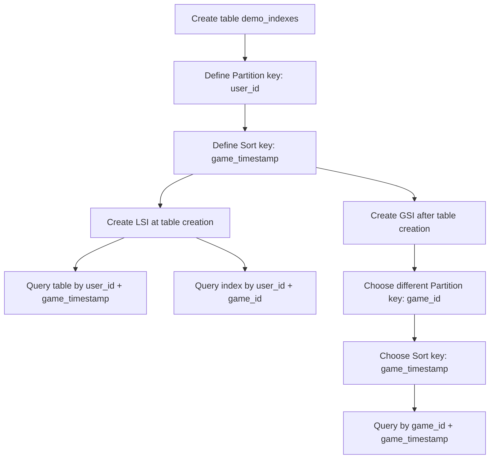

# 318. DynamoDB Indexes (GSI + LSI) - Hands On

## 🎯 Giới thiệu
Bài học này cho thấy cách tạo và sử dụng **DynamoDB Secondary Indexes** để query dữ liệu linh hoạt hơn trong một table.

- Tạo table `demo_indexes`
- **Partition key**: `user_id`
- **Sort key**: `game_timestamp`
- Cấu hình **Provisioned capacity**: `1 RCU` và `1 WCU`
- Sau đó tạo:
  - **LSI (Local Secondary Index)** ngay lúc tạo table
  - **GSI (Global Secondary Index)** sau khi table đã được tạo

## 1. 🧩 Local Secondary Index (LSI)
LSI được tạo ngay trong lúc tạo table.

- **Chỉ có thể tạo tại table creation time**
- **Không thể** chọn Partition key mới
- LSI vẫn dùng **cùng Partition key** với table gốc
- Chỉ được chọn **Sort key khác**
- Có thể chọn **project attributes**:
  - `All`
  - `Only the keys`
  - `Include specific attributes`

Ví dụ trong bài:
- Table dùng `user_id` + `game_timestamp`
- LSI dùng:
  - **Partition key**: vẫn là `user_id`
  - **Sort key**: `game_id`
  - **Index name**: `game_id_index`
  - **Projection**: `All`

## 2. 🌐 Global Secondary Index (GSI)
GSI có tính linh hoạt cao hơn LSI.

- **Có thể tạo sau khi table đã tồn tại**
- Có thể chọn:
  - **Partition key khác**
  - **Sort key khác** hoặc không cần
- Cũng cần chọn cách **project attributes**
- GSI có **read/write capacity riêng**
  - Có thể `copy from base table`
  - Hoặc `customize settings`
  - Có thể bật/tắt `Auto scaling`

Ví dụ trong bài:
- GSI được tạo với:
  - **Partition key**: `game_id`
  - **Sort key**: `game_timestamp`
  - Capacity: copy từ base table với `1 RCU` và `1 WCU`

## 3. 🔍 Query và cách hoạt động
Sau khi tạo index, DynamoDB cho phép query theo **table** hoặc theo **index**.

- Query table:
  - `user_id`
  - `game_timestamp`
- Query LSI:
  - `user_id`
  - `game_id`
- Query GSI:
  - `game_id`
  - `game_timestamp`

Điểm nhấn trong bài:
- LSI giúp query theo **Sort key khác** nhưng vẫn giữ nguyên **Partition key**
- GSI cho phép đổi cả **Partition key** và **Sort key**
- Khi query nhiều trên **GSI**, writes có thể bị throttled, và writes trên main table cũng bị ảnh hưởng
- LSI thì dùng chung **RCU/WCU** của main table

## 📊 Bảng tóm tắt
| Tiêu chí | Mô tả |
|----------|------|
| LSI | Tạo ngay lúc tạo table |
| GSI | Tạo sau khi table đã được tạo |
| Partition key | LSI dùng chung với table; GSI có thể khác |
| Sort key | LSI có thể khác; GSI có thể khác |
| Capacity | LSI dùng chung với main table; GSI có capacity riêng |
| Projection | Cả LSI và GSI đều có thể chọn `All`, `Only the keys`, hoặc `Include` |
| Query linh hoạt | LSI linh hoạt hơn ở Sort key; GSI linh hoạt hơn ở cả Partition key và Sort key |

## 💡 Mẹo ghi nhớ cho kỳ thi AWS
- **LSI = Local = cùng Partition key**
- **LSI phải tạo lúc tạo table**
- **GSI = Global = linh hoạt hơn, có thể đổi Partition key**
- **LSI dùng chung capacity với table**
- **GSI có capacity riêng**
- Khi làm bài thi, nếu thấy câu hỏi về:
  - tạo index sau khi table đã tồn tại -> nghĩ tới **GSI**
  - giữ nguyên Partition key nhưng đổi Sort key -> nghĩ tới **LSI**

## ✅ Kết luận
Bài này tập trung vào cách dùng **LSI** và **GSI** trong DynamoDB để query theo nhiều kiểu khác nhau.

- **LSI**: tạo cùng lúc với table, giữ nguyên Partition key
- **GSI**: tạo sau table, có thể đổi Partition key và Sort key
- Hai loại index giúp query linh hoạt hơn, nhưng khác nhau rõ về **thời điểm tạo** và **capacity model**
