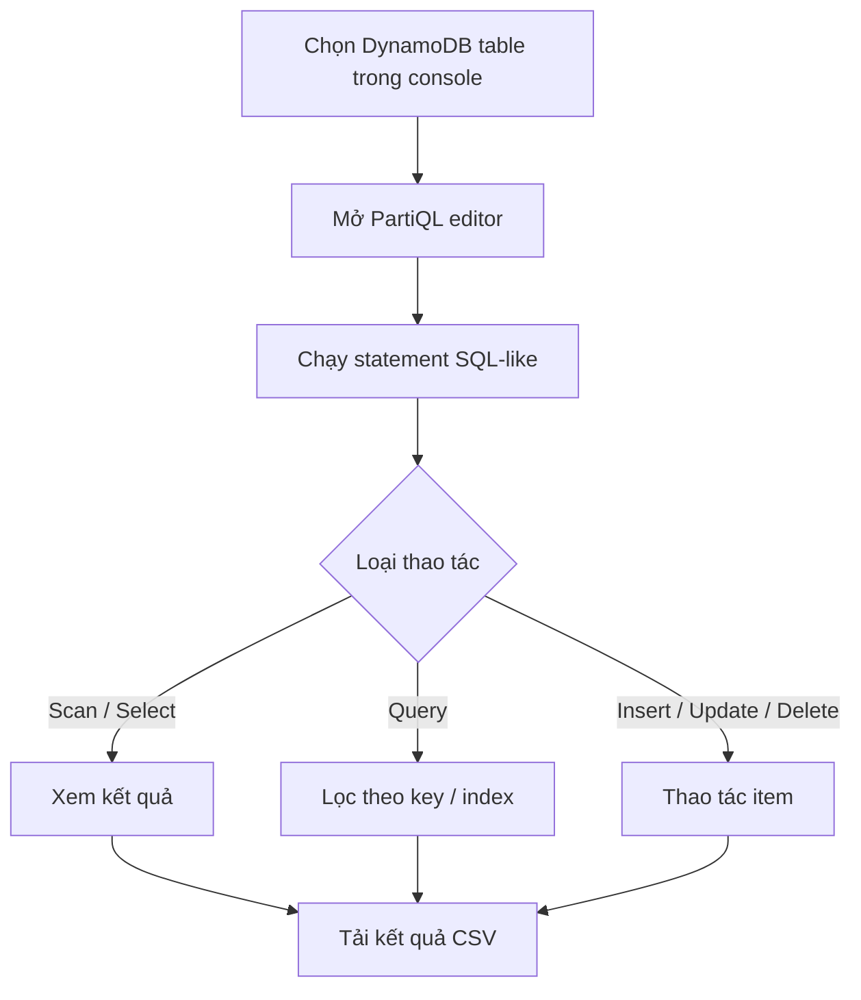

# 319. DynamoDB PartiQL

## 🎯 Giới thiệu
PartiQL cho DynamoDB là cách dùng cú pháp giống SQL để thao tác với DynamoDB table. Mục tiêu của nó là giúp những người quen SQL vẫn có thể làm việc với DynamoDB một cách dễ hơn.

## 1. PartiQL dùng để làm gì
- Hỗ trợ các câu lệnh kiểu SQL để thao tác dữ liệu trong DynamoDB.
- Có thể dùng để:
  - `INSERT`
  - `UPDATE`
  - `SELECT`
  - `DELETE`
- Hỗ trợ cả `Batch operations` khi cần.

## 2. Cách hoạt động trong console
- Bên trái trong console có `PartiQL editor`.
- Có thể chọn table và chạy các câu lệnh trực tiếp.
- Ví dụ trong transcript:
  - Thêm item vào `users`
  - Thêm item vào `users post`
  - Thêm item vào `demo indexes`
- Khi chạy `scan table`, console tạo ra câu lệnh kiểu SQL như `select * from ...`.
- Kết quả có thể:
  - xem trong `adjacent view`
  - tải xuống dưới dạng `CSV`

## 3. Query, index và các thao tác nâng cao
- Với bảng phức tạp hơn, có thể `query` theo điều kiện.
- Transcript nêu ví dụ câu lệnh tạo ra từ `query`:
  - lọc theo `user_id`
  - có thể kèm `Sort key value` nhưng phần này là tùy chọn
- Nếu bảng có `index`, có thể dùng index đó để truy vấn thay vì chỉ scan.
- Có thể:
  - `insert` statement
  - `set` item để update một item cụ thể
  - `delete from` statement để xóa item
- Một điểm được nhấn mạnh: editor này chủ yếu dành cho người muốn dùng SQL với DynamoDB.

## 📊 Bảng tóm tắt
| Tiêu chí | Mô tả |
|----------|------|
| Mục đích | Dùng cú pháp giống SQL để làm việc với DynamoDB |
| Lệnh hỗ trợ | `INSERT`, `UPDATE`, `SELECT`, `DELETE` |
| Batch operations | Có hỗ trợ |
| Console | Có `PartiQL editor` để chạy lệnh trực tiếp |
| Query/Scan | Có thể scan table hoặc query theo điều kiện |
| Index | Có thể dùng `index` để truy vấn |
| Xuất dữ liệu | Có thể tải kết quả xuống `CSV` |

## 💡 Mẹo ghi nhớ cho kỳ thi AWS
- PartiQL = cách nói chuyện với DynamoDB bằng cú pháp giống SQL.
- Nhớ 4 thao tác chính: `INSERT`, `UPDATE`, `SELECT`, `DELETE`.
- `Scan` và `Query` đều có thể được dùng trong PartiQL, nhưng `Query` có thể gắn với điều kiện và `index`.
- Trong console, PartiQL editor giúp tạo và chạy statement nhanh, nhất là khi muốn thao tác trực tiếp trên table.
- Nếu đề thi nhắc đến người dùng quen SQL nhưng cần làm việc với DynamoDB, rất dễ liên quan đến PartiQL.

## ✅ Kết luận
PartiQL là lớp giao tiếp SQL-like cho DynamoDB, giúp thao tác bảng và item bằng các statement quen thuộc. Trong console, nó hỗ trợ scan, query, insert, update, delete, dùng index, và có thể xuất kết quả CSV.
