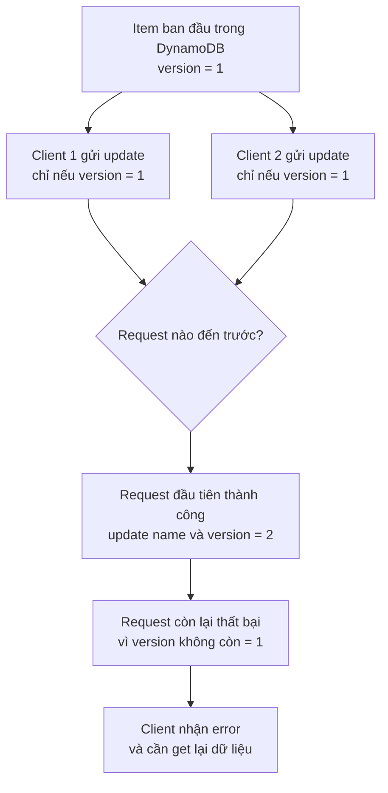

# 320. DynamoDB Optimistic Locking

## 🎯 Giới thiệu
- **Optimistic Locking** trong DynamoDB là cách dùng **Conditional Writes** để đảm bảo một item **chưa bị thay đổi** trước khi thực hiện **update** hoặc **delete**.
- Ý chính: chỉ ghi dữ liệu nếu **một điều kiện** được thỏa mãn.
- Thường dùng một attribute làm **version number** để kiểm tra trạng thái của item.

## 1. Cách hoạt động
- Mỗi item có một attribute, ví dụ `version`.
- Khi cập nhật, client sẽ yêu cầu kiểu:
  - chỉ update nếu `version = 1`
- DynamoDB sẽ kiểm tra điều kiện này trước khi ghi.
- Nếu điều kiện đúng, update được thực hiện và `version` có thể được tăng lên.

## 2. Ví dụ trong transcript
- Một DynamoDB table có item gồm:
  - `user ID`
  - `first name`
  - `version = 1`
- Hai client cùng lúc muốn sửa `first name`:
  - Client 1: đổi thành `John`, chỉ khi `version = 1`
  - Client 2: đổi thành `Lisa`
- Request nào đến DynamoDB trước sẽ thắng:
  - ví dụ client 2 update trước, đổi `first name` thành `Lisa`
  - đồng thời `version` được cập nhật thành `2`
- Sau đó client 1 thất bại vì điều kiện `version = 1` không còn đúng nữa.
- Client 1 sẽ nhận error và cần **get lại dữ liệu** trước khi thử update tiếp.

## 3. Ý nghĩa cho kỳ thi AWS
- Đây là chủ đề exam có thể hỏi trực tiếp.
- Cần nhớ:
  - **Conditional Writes** = chỉ ghi khi điều kiện đúng
  - **Optimistic Locking** = dùng điều kiện trên **version number**
  - Mục tiêu là tránh ghi đè lên dữ liệu đã bị thay đổi bởi request khác

## 📊 Bảng tóm tắt
| Tiêu chí | Mô tả |
|----------|------|
| Tên cơ chế | Optimistic Locking |
| Cơ chế cốt lõi | Dùng **Conditional Writes** |
| Mục tiêu | Đảm bảo item chưa thay đổi trước khi update/delete |
| Dữ liệu kiểm tra | Một attribute làm **version number** |
| Kết quả khi version khớp | Update thành công |
| Kết quả khi version không khớp | Request thất bại và trả error |
| Điểm cần nhớ cho exam | Đây là một feature mà AWS exam có thể hỏi |

## 💡 Mẹo ghi nhớ cho kỳ thi AWS
- Nhớ theo công thức:
  - **version check = Optimistic Locking**
  - **condition đúng thì mới write**
- Khi thấy câu hỏi về:
  - nhiều client cùng sửa một item
  - tránh update đè nhau
  - kiểm tra item trước khi ghi
- Hãy nghĩ ngay đến **Conditional Writes** và **Optimistic Locking**.

## ✅ Kết luận
- **DynamoDB Optimistic Locking** là cách dùng **Conditional Writes** với **version attribute** để đảm bảo dữ liệu chưa bị thay đổi trước khi update hoặc delete.
- Nếu version không khớp, DynamoDB sẽ từ chối ghi và trả error, buộc client phải lấy lại dữ liệu rồi thử lại.
