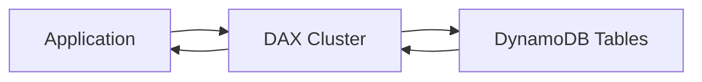

# 321. DynamoDB DAX

## 🎯 Giới thiệu
- **DynamoDB Accelerator (DAX)** là một **fully-managed**, **highly available** và **seamless in-memory cache** cho **DynamoDB**.
- Mục tiêu của DAX là **cache các data phổ biến nhất** để đạt **microsecond latency** cho các **cached reads** và **queries**.
- DAX **không yêu cầu thay đổi application logic** và **compatible với existing DynamoDB APIs**.
- Chỉ cần **create a DAX cluster** là có thể sử dụng.

## 1. DAX giải quyết vấn đề gì?
- DAX giúp xử lý **hot key problems**.
- Khi một key hoặc item cụ thể bị đọc quá nhiều lần, DynamoDB có thể bị **throttling on RCUs**.
- Nếu dữ liệu đó được **cache by DAX**, vấn đề này sẽ được giảm thiểu.

## 2. Cách DAX hoạt động
- Kiến trúc cơ bản:
  - Application không truy cập trực tiếp DynamoDB trong luồng đọc phổ biến.
  - Application **directly interact** với **DAX cluster**.
  - DAX cluster sẽ lấy data từ **DynamoDB tables** và cache lại.
- DAX cluster:
  - Được tạo từ các **cache nodes**.
  - Phải **provision in advance**.
  - Có thể có **up to 10 nodes**.
  - Nên triển khai theo **Multi-AZ**.
  - Trong production, nên có **at least three nodes** và đặt **one in each AZ**.
- Cache behavior:
  - Data cache mặc định có **TTL = 5 minutes**.
  - Nghĩa là mỗi cache data sống trong DAX cluster **5 phút**.

## 3. DAX vs ElastiCache
- **DAX** phù hợp cho:
  - **Individual objects**
  - **Queries**
  - **Scans**
- Đây là các trường hợp truy vấn tương đối đơn giản, nhiều lần, cần cache kết quả đọc từ DynamoDB.
- **ElastiCache** phù hợp khi application cần:
  - Thực hiện thêm **application logic**
  - Ví dụ: scan rồi **sum**, rồi **filter out** data
  - Không muốn lặp lại các bước tính toán tốn kém này mỗi lần
- Mô hình kết hợp:
  - Dùng **DAX** để cache dữ liệu/query từ DynamoDB
  - Dùng **ElastiCache** để lưu **kết quả xử lý sau cùng** của application
  - Tránh phải re-query DAX và re-perform aggregation ở client side

## 📊 Bảng tóm tắt
| Tiêu chí | Mô tả |
|----------|------|
| Loại dịch vụ | **Fully-managed in-memory cache** cho **DynamoDB** |
| Mục tiêu | Tăng tốc **reads** và **queries** với **microsecond latency** |
| Tương thích | Không cần đổi **application logic**, dùng được với **existing DynamoDB APIs** |
| Vấn đề giải quyết | **Hot key problems**, giảm nguy cơ **RCU throttling** |
| Cache TTL | **5 minutes** mặc định |
| Triển khai | **Provision in advance**, tối đa **10 nodes**, nên dùng **Multi-AZ** |
| Bảo mật | **Encrypted at rest**, hỗ trợ **IAM**, **VPC security**, **CloudTrail integration** |
| So với ElastiCache | DAX cho cache truy vấn/object DynamoDB; ElastiCache cho kết quả xử lý logic phức tạp của application |

## 💡 Mẹo ghi nhớ cho kỳ thi AWS
- Nhớ rằng **DAX = DynamoDB cache**, không phải cache chung cho mọi loại workload.
- Nếu đề bài nói:
  - **DynamoDB reads/query quá nhiều**
  - **hot key**
  - **RCU throttling**
  - **microsecond latency**
  - **không muốn sửa application code**
  
  thì nghĩ ngay đến **DAX**.
- Nếu bài toán cần cache **kết quả đã xử lý** sau nhiều bước logic như **sum/filter/aggregation**, hãy nghĩ đến **ElastiCache**.
- Mẹo nhớ ngắn:
  - **DAX = cache cho DynamoDB**
  - **ElastiCache = cache cho kết quả xử lý của application**

## ✅ Kết luận
- **DAX** là giải pháp cache in-memory, managed, highly available cho **DynamoDB**.
- Nó giúp tăng tốc đọc dữ liệu phổ biến, giảm **hot key pressure** và hạn chế **RCU throttling**.
- Trong kiến trúc thực tế, có thể kết hợp **DAX** và **ElastiCache** để tối ưu cả truy vấn DynamoDB lẫn kết quả xử lý của application.
