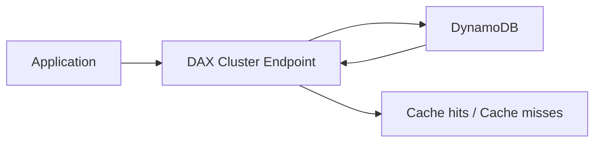

# 322. DynamoDB DAX - Hands On

## 🎯 Giới thiệu
- Bài thực hành này minh họa cách tạo và cấu hình **DynamoDB DAX cluster** trong DynamoDB console.
- **DAX** không thuộc **Free Tier**, nên việc tạo cluster sẽ phát sinh chi phí.
- Điểm quan trọng nhất: ứng dụng sẽ dùng **cluster endpoint** của DAX để tận dụng cache.

## 1. Tạo DAX Cluster
- Trong DynamoDB console, chọn **DAX** ở thanh bên trái.
- Tạo cluster, ví dụ: `DemoDAX`.
- Chọn **node family**:
  - **t-types**: phù hợp với **bursting**
  - **r-types**: phù hợp với **memory**
- Có thể chọn node type cụ thể như:
  - `r5.large`, `r5.4xlarge`
  - `t2.small`
- Chọn **cluster size**:
  - Có thể từ **1 đến 11 nodes**
  - **3 nodes** sẽ cho **multi-AZ setup**
  - **1 node** phù hợp cho development hoặc 1 AZ
  - Ít node hơn có thể làm giảm **availability**

## 2. Cấu hình mạng và bảo mật
- Chọn **subnet group** và đặt cluster trong **VPC**.
- Subnet group phải thuộc một **specific subnet group**.
- Có thể chọn nhiều subnet:
  - **3 subnets** tương ứng với **3 nodes**
  - Hỗ trợ cấu hình **highly available**
- **Access control**:
  - DAX cần **security group**
  - Mở port **8111**
  - Mở port **9111** nếu dùng **in-transit encryption**
- Trong ví dụ, dùng **default security group** để đơn giản.
- **AZ allocation**:
  - Có thể để **automatic**
  - Hoặc phân bố node **manually**

## 3. IAM, mã hóa và parameter group
- DAX cần một **IAM Service role** để truy cập **DynamoDB**.
- Ví dụ role: `DAXtoDynamoDB`
- Policy được tạo để cấp:
  - **read/write rights**
  - truy cập **all tables**
- Có thể giới hạn theo table nếu cần.
- DAX hỗ trợ:
  - **encryption in transit**
  - **encryption at rest**
- **Parameter group**:
  - Cho phép điều chỉnh thêm các tham số
  - Ví dụ: thời gian cache cho item và query thông qua **TTL**
  - Mặc định **1.0** cung cấp **5 minutes TTL** cho cả **item time** và **query time**
- **Maintenance window**:
  - DAX có thể được patch và upgrade định kỳ
  - Có thể chọn **no preference** hoặc chỉ định khung giờ
- Có thể thêm **tags** rồi tạo cluster.

## 4. Sau khi tạo cluster
- Sau khi cluster được tạo, cần chú ý:
  - **cluster endpoint** là endpoint mà application phải dùng để tận dụng DAX
- Có thể xem:
  - **nodes**
  - **node type**
  - **vCPU per node**
  - **memory**
- Có thể **add nodes** theo thời gian.
- Không thể đổi **node types** của cluster hiện tại:
  - Nếu muốn đổi type, phải tạo **new DAX cluster**
- Có phần **monitoring**:
  - **cache hits**
  - **cache misses**
  - **items and queries**
  - **CPU utilization**
- Có phần **events** để theo dõi sự kiện của database.
- Có thể chỉnh **settings** như:
  - **parameter group**
  - **network configuration**
  - **security configuration**
  - **maintenance window**
  - **tags**
- Cuối cùng có thể **delete cluster** và cả **CloudWatch alarms**.

## Mermaid

## 📊 Bảng tóm tắt
| Tiêu chí | Mô tả |
|----------|------|
| DAX | Dịch vụ cache cho DynamoDB, tạo cluster trong console |
| Chi phí | Không thuộc Free Tier |
| Node family | `t-types` cho bursting, `r-types` cho memory |
| Cluster size | 1 đến 11 nodes, 3 nodes hỗ trợ multi-AZ |
| Network | Chạy trong VPC, gắn với subnet group và security group |
| Port | `8111`, hoặc `9111` nếu dùng in-transit encryption |
| IAM | Cần IAM Service role để DAX truy cập DynamoDB |
| Encryption | Hỗ trợ encryption in transit và at rest |
| Parameter group | Điều chỉnh TTL cho item/query |
| Monitoring | Cache hits, cache misses, CPU utilization, events |
| Endpoint | Application phải dùng cluster endpoint của DAX |
| Node type | Không đổi được trên cluster hiện tại, phải tạo cluster mới nếu muốn đổi |

## 💡 Mẹo ghi nhớ cho kỳ thi AWS
- **DAX = cache layer cho DynamoDB**, nhớ rằng app dùng **DAX endpoint**, không phải endpoint DynamoDB trực tiếp.
- **DAX không free tier** nên dễ bị hỏi trong tình huống chi phí.
- **3 nodes = multi-AZ** là chi tiết quan trọng.
- **Security group + port 8111/9111** rất dễ xuất hiện trong câu hỏi cấu hình.
- **IAM Service role** là bắt buộc để DAX truy cập DynamoDB.
- **Node type không đổi được sau khi tạo** là điểm hay bị kiểm tra.
- **TTL trong parameter group** liên quan đến thời gian cache item và query.

## ✅ Kết luận
- DAX cluster được tạo từ DynamoDB console, gắn với **VPC**, **subnet group**, **security group**, và **IAM role**.
- Sau khi tạo, ứng dụng dùng **cluster endpoint** để hưởng lợi từ cache.
- Các điểm cần nhớ nhất: **node family**, **cluster size**, **IAM role**, **encryption**, **parameter group TTL**, và **monitoring**.
