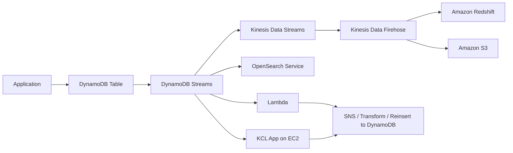
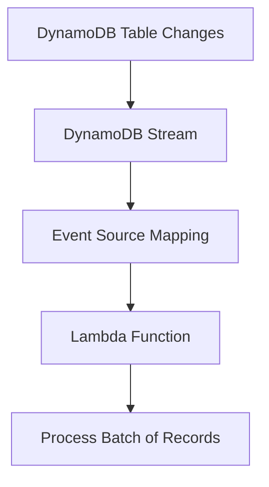

# 323. DynamoDB Streams

## 🎯 Giới thiệu
- **DynamoDB Streams** là một **ordered list** các thay đổi ở mức **item-level** trong bảng DynamoDB.
- Mỗi khi có **create / update / delete**, thay đổi đó sẽ xuất hiện trong stream.
- Stream thể hiện **toàn bộ lịch sử thay đổi theo thời gian** của table.
- Dữ liệu trong stream có thể được đọc bởi:
  - **Kinesis Data Streams**
  - **Lambda**
  - **Kinesis Client Library (KCL) applications**

## 1. Cách hoạt động và retention
- DynamoDB Streams ghi nhận các thay đổi mới phát sinh trên table.
- **Retention** của stream chỉ **tối đa 24 hours**.
- Vì retention ngắn, bạn thường cần:
  - đẩy dữ liệu sang nơi bền vững hơn như **Kinesis Data Streams**
  - hoặc dùng **Lambda / KCL** để xử lý và lưu tiếp sang nơi khác
- Đây là cơ chế phù hợp cho các tình huống cần phản ứng **real-time** khi dữ liệu trong DynamoDB thay đổi.

## 2. Use cases và kiến trúc
- Các use case được nhắc đến trong transcript:
  - gửi **welcome email**
  - làm **analytics**
  - transform stream và tạo **derivative tables** trong DynamoDB
  - đẩy dữ liệu sang **OpenSearch** để indexing và search
  - hỗ trợ **global tables** và **cross-region replication**
- Một kiến trúc phổ biến:
  - Application ghi **create / update / delete** vào DynamoDB
  - Thay đổi đi vào **DynamoDB Stream**
  - Stream có thể đi sang:
    - **Kinesis Data Streams**
    - **Kinesis Data Firehose**
    - **Amazon Redshift** cho analytics
    - **Amazon S3** để archive
    - **OpenSearch Service** để search

## 3. Dạng dữ liệu trong stream và Lambda integration
- Khi đọc stream, có thể chọn kiểu thông tin sẽ xuất hiện:
  - chỉ **keys**
  - **NEW_IMAGE**: item sau khi bị thay đổi
  - **OLD_IMAGE**: item trước khi bị thay đổi
  - **NEW_AND_OLD_IMAGES**: cả hai ảnh mới và cũ
- DynamoDB Streams được tạo thành từ **shards**, rất giống **Kinesis Data Streams**.
- Tuy nhiên, với DynamoDB Streams:
  - **AWS tự động provision shards**
  - bạn **không cần tự quản lý shard**
- Một điểm quan trọng cho kỳ thi:
  - khi **enable DynamoDB Stream**, dữ liệu **không được backfill / retroactively populated**
  - chỉ các thay đổi phát sinh **sau khi enable** mới xuất hiện trong stream

### Lambda với DynamoDB Streams
- Để Lambda đọc DynamoDB Streams, cần:
  - tạo **Event Source Mapping**
  - cấp **permissions** phù hợp để Lambda pull từ stream
- Cách hoạt động:
  - Event Source Mapping đọc records từ stream theo **batch**
  - sau đó **invoke Lambda synchronously**
- Đây là luồng xử lý chuẩn khi dùng Lambda với DynamoDB Streams.

## 📊 Bảng tóm tắt
| Tiêu chí | Mô tả |
|----------|------|
| Bản chất | Ordered list của các item-level modifications trong DynamoDB |
| Sự kiện ghi nhận | create, update, delete |
| Retention | Tối đa 24 hours |
| Nguồn đọc | Kinesis Data Streams, Lambda, KCL applications |
| Shards | Có shards, nhưng AWS tự động quản lý |
| Dữ liệu stream | keys, NEW_IMAGE, OLD_IMAGE, NEW_AND_OLD_IMAGES |
| Điểm thi cần nhớ | Không backfill dữ liệu trước khi enable stream |
| Lambda integration | Dùng Event Source Mapping, invoke synchronously theo batch |
| Use cases | real-time reaction, analytics, OpenSearch, global tables, replication |

## 💡 Mẹo ghi nhớ cho kỳ thi AWS
- **24 hours retention** là điểm rất dễ bị hỏi.
- **Enable stream không có backfill**: chỉ có dữ liệu phát sinh **sau khi bật** stream.
- **Lambda + DynamoDB Streams** luôn gắn với **Event Source Mapping** và xử lý **theo batch**.
- **DynamoDB Streams giống Kinesis Data Streams ở shards**, nhưng **AWS tự quản lý shards**.
- Nhớ các lựa chọn dữ liệu:
  - **keys**
  - **NEW_IMAGE**
  - **OLD_IMAGE**
  - **NEW_AND_OLD_IMAGES**
- Nếu cần lưu lâu hơn, hãy nghĩ đến **Kinesis Data Streams**, **S3**, **Redshift**, hoặc **OpenSearch** tùy mục đích.

## ✅ Kết luận
- **DynamoDB Streams** là cơ chế theo dõi thay đổi của DynamoDB ở mức item.
- Nó rất hữu ích cho **real-time processing**, **analytics**, **search indexing**, và **replication-related flows**.
- Khi học thi, hãy nhớ 3 ý chính: **ordered changes**, **24h retention**, và **không có backfill khi bật stream**.
