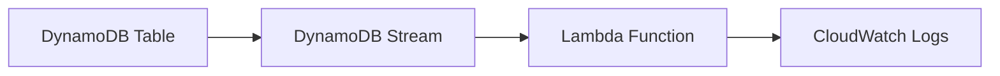

# 324. DynamoDB Streams - Hands On

## 🎯 Giới thiệu
- Bài học này hướng dẫn cách **enable DynamoDB Streams** cho một table và dùng **Lambda** để xử lý các thay đổi dữ liệu.
- Mục tiêu là quan sát các sự kiện **update**, **insert/create**, và **delete** được ghi lại trong **CloudWatch logs**.
- Đây là ví dụ thực hành về integration giữa **DynamoDB Streams** và **Lambda**.

## 1. Enable DynamoDB Stream
- Vào **exports and streams** trong DynamoDB.
- Bật **DynamoDB stream details**.
- Chọn kiểu view của stream:
  - `KEYS_ONLY`
  - `NEW_IMAGE`
  - `OLD_IMAGE`
  - `NEW_AND_OLD_IMAGES`
- Trong bài giảng, chọn **all images / new and old images** để lấy nhiều thông tin nhất.

## 2. Tạo Lambda trigger cho Stream
- Tạo một **Lambda function** mới từ **blueprint**:
  - Tìm blueprint **DynamoDB process stream Python**.
  - Blueprint này dùng để log các update của table.
- Đặt tên function: **Lambda demo, DynamoDB stream**.
- Tạo **new role with basic Lambda permissions**.
- Sau đó cần chỉnh **execution role** để thêm quyền đọc từ **DynamoDB**.

### Cấu hình trigger
- Chọn table: **users post**.
- **Batch size = 100**:
  - Số records đọc mỗi lần.
- **Batch window**:
  - Gom records trước khi invoke function để tối ưu hơn.
- **Starting position**:
  - Chọn đọc từ **start** hoặc **end** của stream nếu stream đã tồn tại trước đó.
- Bật trigger để **DynamoDB stream** gọi **Lambda function** mỗi khi stream được cập nhật.

### Xử lý lỗi quyền truy cập
- Ban đầu function không truy cập được stream do thiếu thông tin **IAM**.
- Vào **Configuration > Permissions > execution role**.
- Attach policy phù hợp để đọc từ DynamoDB, ví dụ:
  - **DynamoDB read only access**
  - Có thể có policy dành cho Lambda đọc DynamoDB
- Sau khi gắn quyền, refresh và trigger sẽ hoạt động.

## 3. Kiểm tra hoạt động và xem log
- Vào table và chọn **View items**.
- Thực hiện 3 thao tác:
  - **Update** một item
  - **Create/Duplicate** một item mới
  - **Delete** một item
- Lambda sẽ chạy và log các event này.
- Vào **CloudWatch logs** để xem kết quả:
  - Với **modify**:
    - Có **key**
    - Có **new image**
    - Có **old image**
  - Với **insert**:
    - Có **new image**
    - Không có **old image**
  - Với **remove**:
    - Có **old image**
    - Không có **new image**
- Đây là nền tảng để xây dựng các integration dùng **DynamoDB Streams**.

## 📊 Bảng tóm tắt
| Tiêu chí | Mô tả |
|----------|------|
| Thành phần chính | **DynamoDB Streams**, **Lambda**, **CloudWatch logs** |
| Mục đích | Theo dõi và xử lý thay đổi dữ liệu trong table |
| Stream view | **KEYS_ONLY**, **NEW_IMAGE**, **OLD_IMAGE**, **NEW_AND_OLD_IMAGES** |
| Lambda blueprint | **DynamoDB process stream Python** |
| Trigger config | Chọn table, set **batch size**, **batch window**, **starting position** |
| IAM requirement | Cần quyền để Lambda **read from DynamoDB** |
| Kết quả quan sát | Log được **update**, **insert**, **delete** trong CloudWatch |

## 💡 Mẹo ghi nhớ cho kỳ thi AWS
- **DynamoDB Streams** dùng để bắt các thay đổi của table và có thể kích hoạt **Lambda**.
- Nhớ rằng **batch size** là số record đọc mỗi lần.
- Nếu Lambda không đọc được stream, hãy kiểm tra **IAM role / execution role**.
- Trong log:
  - **Update** thường có cả **new image** và **old image**
  - **Insert** chỉ có **new image**
  - **Delete** chỉ có **old image**
- Khi học DVA-C02, hãy nhớ mối liên hệ: **DynamoDB Streams -> Lambda -> CloudWatch logs**.

## ✅ Kết luận
- Bài thực hành cho thấy cách bật **DynamoDB Streams**, gắn **Lambda trigger**, và kiểm tra kết quả qua **CloudWatch logs**.
- Trọng tâm cần nhớ là cấu hình stream, cấp quyền **IAM** đúng, và hiểu dữ liệu trả về theo từng loại thay đổi.
