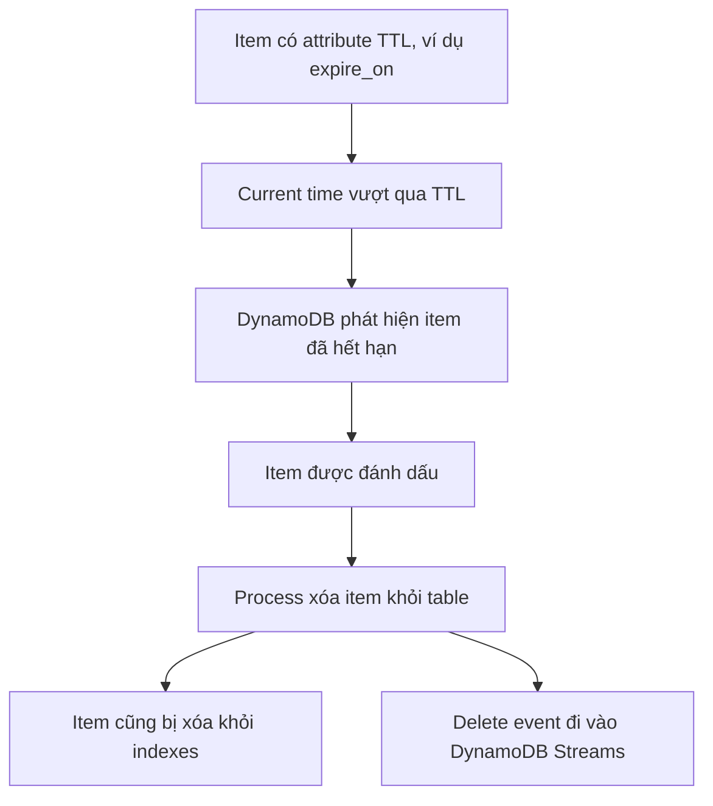

# 325. DynamoDB TTL

## 🎯 Giới thiệu
**DynamoDB TTL (Time To Live)** là cơ chế cho phép **tự động xóa item** khi **timestamp hết hạn** đã được chỉ định bị vượt qua.

- TTL dùng một **attribute** do bạn tự định nghĩa, ví dụ: `expire_on`
- Giá trị TTL phải là **number** theo **Unix Epoch timestamp**
- Item bị xóa bởi TTL **không tiêu tốn WCU**, nên **không phát sinh thêm cost**
- Item hết hạn sẽ được xóa **trong vòng vài ngày sau khi hết hạn**, và trong bài giảng có nhắc có thể cần chờ **tối đa 40 giờ** để thấy bị xóa
- TTL rất phù hợp cho dữ liệu như **session data**

## 1. Cách DynamoDB TTL hoạt động
TTL không xóa item ngay lập tức tại đúng thời điểm hết hạn. Thay vào đó, DynamoDB sẽ:

- Kiểm tra thời gian hiện tại
- Xác định item nào có `TTL epoch time < current time`
- Đánh dấu và sau đó xóa các item đó khỏi table

### Lưu ý quan trọng
- Item đã hết hạn nhưng **chưa bị xóa** vẫn có thể xuất hiện trong:
  - `reads`
  - `query`
  - `scan`
- Nếu không muốn thấy các item này, cần làm **client-side filtering**
- Khi item bị xóa, nó cũng bị xóa khỏi:
  - `local secondary indexes`
  - `global secondary indexes`
- Mỗi delete do TTL tạo ra sẽ đi vào **DynamoDB Streams**, nên có thể **recover** nếu cần

## 2. Ví dụ cấu hình TTL trong bài giảng
Trong ví dụ:

- Table tên `DemoTTL`
- Partition key là `user_id`
- Không dùng sort key
- Tắt `provisioned` và `auto scaling`
- Tạo item với:
  - `user_id = john_123`
  - `name = John`
  - `expire_on = epoch timestamp`
- Tạo item khác:
  - `user_id = alice_456`
  - `name = Alice`
  - `expire_on = epoch timestamp` khác

Sau đó:

- Vào **Additional Settings**
- Tìm **Time To Live**
- Chọn **Enable**
- Nhập tên attribute TTL là `expire_on`

### Preview TTL
Có thể dùng **preview** để kiểm tra:

- Nếu thời gian hiện tại chưa vượt `expire_on` thì không có item nào bị xóa
- Nếu thời gian preview tiến lên một mốc nào đó, DynamoDB sẽ cho biết item nào sẽ hết hạn
- Có thể nhập:
  - một **epoch value**
  - hoặc chọn mốc thời gian custom
  - hoặc mô phỏng trong `60 minutes`, `24 hours`, `7 days`

## 3. Use cases và ghi nhớ thi AWS
TTL thường dùng để:

- Giảm lượng dữ liệu lưu trữ bằng cách chỉ giữ các item hiện tại
- Đáp ứng các yêu cầu **regulatory obligations**
- Quản lý **session data** rất hiệu quả

### Điểm thi dễ hỏi
- TTL dùng **Unix Epoch number**
- TTL **không tốn WCU**
- Item hết hạn **không bị xóa ngay lập tức**
- Item vẫn có thể xuất hiện trong `query`/`scan` trước khi bị xóa
- Delete do TTL cũng xuất hiện trong **DynamoDB Streams**
- Item bị xóa khỏi **indexes** luôn

## 📊 Bảng tóm tắt
| Tiêu chí | Mô tả |
|----------|------|
| Mục đích | Tự động xóa item khi hết hạn |
| Attribute TTL | Do bạn tự đặt, ví dụ `expire_on` |
| Kiểu dữ liệu | `number` theo **Unix Epoch timestamp** |
| Chi phí | Không tiêu tốn `WCU` khi xóa do TTL |
| Thời gian xóa | Không ngay lập tức, có thể mất vài ngày, bài giảng nhắc tới tối đa 40 giờ |
| Ảnh hưởng truy vấn | Item hết hạn nhưng chưa xóa vẫn có thể xuất hiện trong `reads`, `query`, `scan` |
| Indexes | Item cũng bị xóa khỏi `LSI` và `GSI` |
| Streams | Delete event đi vào `DynamoDB Streams` |
| Use case | `session data`, giảm dữ liệu lưu trữ, tuân thủ quy định |

## 💡 Mẹo ghi nhớ cho kỳ thi AWS
- **TTL = tự động xóa sau khi hết hạn**
- Nhớ cụm: **"Epoch number, no WCU, delayed delete"**
- Nếu đề bài nói về **session data** hoặc dữ liệu chỉ cần giữ tạm thời, nghĩ ngay đến **DynamoDB TTL**
- Nếu hỏi item đã hết hạn có còn thấy trong query không, đáp án là **có thể còn cho đến khi bị xóa**
- Nếu hỏi dữ liệu xóa bởi TTL có vào **DynamoDB Streams** không, đáp án là **có**

## ✅ Kết luận
DynamoDB TTL là cơ chế rất hữu ích để **tự động dọn dẹp dữ liệu hết hạn** bằng một **Unix Epoch timestamp** trong attribute do bạn chỉ định. Điểm quan trọng là TTL **không tốn WCU**, item bị xóa **không ngay lập tức**, và các delete event vẫn có thể được theo dõi qua **DynamoDB Streams**.
