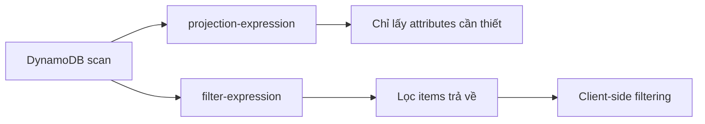

# 326. DynamoDB CLI

## 🎯 Giới thiệu
Bài này nói về các **CLI options** quan trọng của **DynamoDB** thường có thể xuất hiện trong kỳ thi AWS. Trọng tâm là cách kiểm soát dữ liệu trả về khi `scan`, cách lọc kết quả, và cách xử lý **pagination** để tránh timeout.

## 1. Projection-expression và Filter-expression
- **projection-expression**: chỉ định một hoặc nhiều attributes cần lấy về.
- Mục đích là **không retrieve toàn bộ columns/attributes**, mà chỉ lấy phần cần thiết.
- Trong ví dụ, table có 3 attributes:
  - `user_id`
  - `post timestamp`
  - `content`
- Khi dùng `projection-expression` với `user_id` và `content`, kết quả **không có `post timestamp`**.

- **filter-expression**: dùng để **lọc items trả về**.
- Việc filtering này được mô tả là **client-side**.
- Ví dụ lọc `user_id = john123`:
  - chỉ nhận các rows có `john123`
  - `Count = 2`
  - chỉ thấy `content` của các item phù hợp
- Nếu muốn làm **server-side** và `user_id` là **primary key**, thì có thể dùng `query` để hiệu quả hơn, nhưng transcript chỉ nhấn mạnh đây là sức mạnh của `filter-expression`.

## 2. Pagination options: page-size, max-items, NextToken
- **page-size**:
  - vẫn muốn retrieve **toàn bộ dataset**
  - nhưng chia thành nhiều sub-API calls nhỏ hơn
  - mục tiêu là **tránh timeout**
  - ví dụ table 10,000 items:
    - nếu gọi một lần quá lớn có thể timeout
    - nếu đặt `page-size 100` thì AWS sẽ thực hiện nhiều API calls nhỏ phía sau
  - đây là một **optimization** để API call hoàn tất an toàn hơn

- **max-items**:
  - giới hạn số items hiển thị khi CLI trả kết quả
  - không phải là lấy toàn bộ dữ liệu theo từng sub-call như `page-size`
  - dùng để chỉ trả về một số lượng item nhất định

- **NextToken / starting-token**:
  - dùng cùng với `max-items`
  - khi đã nhận một phần kết quả, token này cho phép lấy **phần tiếp theo**
  - ví dụ:
    - `max-items 1` trả về 1 item
    - sau đó dùng `starting-token` để lấy item tiếp theo
    - tiếp tục đến khi không còn `NextToken`

## 3. Demo hành vi trên table
- Thực hiện `scan` trên `UserPosts` table.
- Dùng `projection-expression` cho `user_id` và `content`:
  - kết quả chỉ có 2 attributes này
  - không có `post timestamp`
- Dùng `filter-expression` với `user_id = john123`:
  - chỉ trả về các item có `john123`
  - `Count = 2`
  - filtering diễn ra client-side
- Dùng `page-size 1`:
  - vẫn nhận đủ 3 items trong một command
  - nhưng phía sau có **3 API calls** nhỏ
- Dùng `max-items 1`:
  - chỉ nhận 1 item
  - CLI trả về `NextToken`
- Dùng `starting-token` từ `NextToken`:
  - lấy được item tiếp theo
  - lặp lại đến item cuối cùng
- Khi không còn `NextToken`, nghĩa là đã đi hết dữ liệu có thể scan từ table.

## 📊 Bảng tóm tắt
| Tiêu chí | Mô tả |
|----------|------|
| `projection-expression` | Chỉ lấy các attributes được chỉ định, không lấy toàn bộ dữ liệu |
| `filter-expression` | Lọc items trả về; transcript mô tả là client-side |
| `page-size` | Chia request thành nhiều sub-API calls nhỏ hơn để tránh timeout |
| `max-items` | Giới hạn số items trả về trong kết quả CLI |
| `NextToken` / `starting-token` | Dùng để lấy phần kết quả tiếp theo sau khi đã nhận một phần dữ liệu |
| Điểm thi AWS | Phân biệt rõ `page-size` với `max-items`, và hiểu vai trò của `NextToken` |

## 💡 Mẹo ghi nhớ cho kỳ thi AWS
- **`projection-expression` = chọn cột cần lấy**
- **`filter-expression` = lọc item trả về**
- **`page-size` = chia nhỏ API calls để tránh timeout**
- **`max-items` = giới hạn số item hiển thị**
- **`NextToken` = đi tiếp sang trang sau**
- Nếu thấy `user_id` là **primary key** và muốn hiệu quả hơn, hãy nhớ transcript nhắc tới **query** thay vì chỉ dựa vào `filter-expression`.

## ✅ Kết luận
Các lệnh CLI của **DynamoDB** giúp kiểm soát cách dữ liệu được lấy ra:
- chọn đúng attributes với `projection-expression`
- lọc kết quả với `filter-expression`
- tối ưu truy vấn lớn với `page-size`
- phân trang rõ ràng với `max-items` và `NextToken`

Đây là nhóm kiến thức rất dễ xuất hiện trong phần ôn thi AWS vì nó kiểm tra khả năng phân biệt **retrieve**, **filter**, và **pagination** trong **DynamoDB CLI**.
