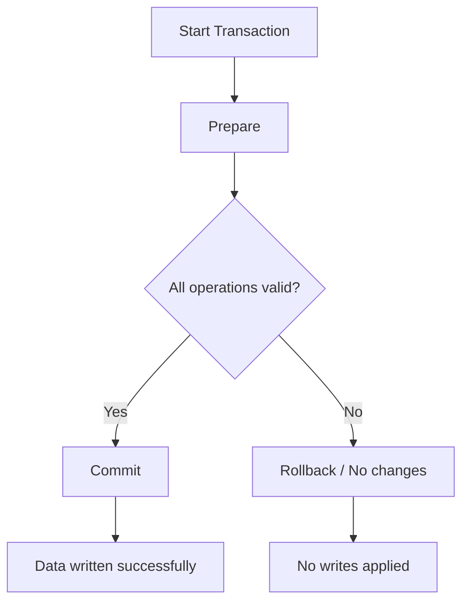
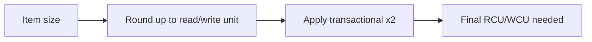

# 327. DynamoDB Transactions

## 🎯 Giới thiệu
DynamoDB Transactions cho phép thực hiện **all-or-nothing** trên **multiple items** và có thể trải rộng trên **one or more tables**.  
Nếu tất cả thao tác thành công thì commit, còn nếu một phần thất bại thì **không có thay đổi nào được áp dụng**.

Điểm quan trọng cho AWS exam:
- DynamoDB Transactions mang lại tính chất **ACID**
- Có thể áp dụng cho:
  - **read modes**
  - **write modes**
- Khi dùng transaction, DynamoDB sẽ tốn **gấp đôi** chi phí đọc/ghi vì phía sau có **prepare** và **commit**

## 1. Khái niệm cốt lõi của DynamoDB Transactions
- Transaction trong DynamoDB là một thao tác:
  - áp dụng cho **multiple items**
  - trên **one or more tables**
  - đảm bảo **all-or-nothing**
- Đây là cơ sở của **ACID**:
  - **Atomicity**
  - **Consistency**
  - **Isolation**
  - **Durability**

### Read modes trong transaction
DynamoDB có 3 kiểu read mode được nhắc đến:
- **eventual consistency**
- **strong consistency**
- **transactional consistency**

Ý nghĩa của **transactional consistency**:
- đọc dữ liệu từ nhiều tables cùng lúc
- nhận được một **consistent view** trên toàn bộ dữ liệu đó

### Write modes trong transaction
- **standard**
  - nhiều writes trên nhiều tables
  - có thể một số write fail
- **transactional**
  - либо tất cả writes thành công
  - hoặc không có write nào thành công

## 2. API và flow của transaction
Hai API quan trọng cần nhớ:

- **TransactGetItems**
  - thực hiện **one or more GetItem operations**
  - nằm trong transaction

- **TransactWriteItems**
  - thực hiện **one or more PutItem, UpdateItem, DeleteItem operations**
  - nằm trong một transaction

### Flow thực tế trong ví dụ ngân hàng
Transcript đưa ví dụ:
- bảng **AccountBalance**
  - chứa account ID, balance, last transaction time
- bảng **BankTransactions**
  - chứa transaction ID, transaction timestamp, From Accounts, To Accounts, amount

Mục tiêu:
- vừa **UpdateItem** trên `AccountBalance`
- vừa **PutItem** vào `BankTransactions`

Kết quả:
- hoặc cả hai bảng đều được cập nhật cùng lúc
- hoặc không có thay đổi nào được ghi

### Use cases phù hợp
DynamoDB Transactions phù hợp cho các tình huống cần **ACID**, ví dụ:
- **financial transactions**
- **managing orders**
- **multiplayer games**
- mọi nơi cần **consistency**

## 3. Capacity computation cho transactions
Đây là phần rất quan trọng cho exam.

### Transactional writes
Công thức trong transcript:
- **3 transactional writes per second**
- item size = **5 KB**
- tính WCU:
  - `3 × 5 / 1 × 2 = 30 WCUs`

Lý do:
- **1 WCU = 1 KB**
- transaction làm chi phí **x2**

### Transactional reads
Công thức trong transcript:
- **5 transactional reads per second**
- item size = **5 KB**
- tính RCU:
  - `5 × 8 / 4 × 2 = 20 RCUs`

Giải thích theo transcript:
- `5 KB` được làm tròn lên **8 KB**
- transaction cũng làm chi phí **x2**
- vì transaction đắt hơn **strongly consistent read**

### Mermaid flow cho cơ chế tính chi phí

## 📊 Bảng tóm tắt
| Tiêu chí | Mô tả |
|----------|------|
| Bản chất | **All-or-nothing** trên multiple items và one or more tables |
| Tính chất | Cung cấp **ACID** |
| Read modes | **eventual consistency**, **strong consistency**, **transactional consistency** |
| Write modes | **standard** và **transactional** |
| API chính | **TransactGetItems**, **TransactWriteItems** |
| Chi phí | Transaction tốn **gấp đôi** read/write capacity |
| Use cases | **financial transactions**, **orders**, **multiplayer games** |
| Điểm thi | Nhớ cách tính **WCU/RCU** cho transactional operations |

## 💡 Mẹo ghi nhớ cho kỳ thi AWS
- Nhớ câu: **transaction = all or nothing**
- **TransactGetItems** gắn với **GetItem**
- **TransactWriteItems** gắn với **PutItem, UpdateItem, DeleteItem**
- Transaction trong DynamoDB luôn **đắt hơn 2 lần**
- Nếu đề bài nói đến **consistency across multiple tables**, nghĩ ngay đến **transactional consistency**
- Khi tính capacity:
  - đọc/ghi transactional đều phải nhân **2**

## ✅ Kết luận
DynamoDB Transactions dùng khi cần **ACID** và đảm bảo thay đổi xảy ra theo kiểu **all-or-nothing** trên nhiều items hoặc nhiều tables.  
Hai API quan trọng là **TransactGetItems** và **TransactWriteItems**, và điểm thi cần nhớ nhất là **transaction làm chi phí capacity tăng gấp đôi**.
