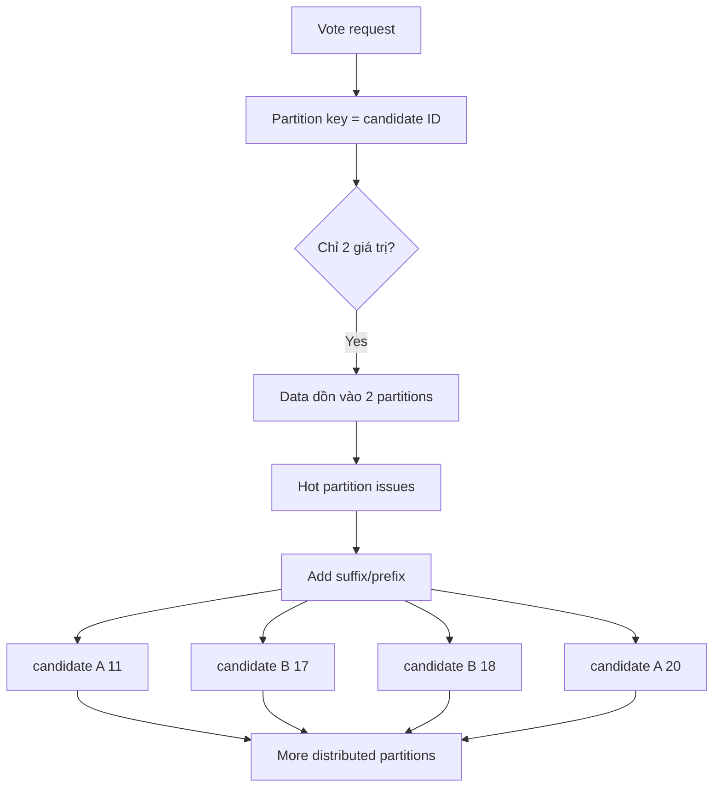

# 329. DynamoDB Partitioning Strategies

## 🎯 Giới thiệu
Bài giảng này nói về **DynamoDB Write Sharding** để tránh **hot partition** khi dữ liệu bị dồn vào quá ít partition. Ý chính là làm cho **partition key** có nhiều giá trị hơn và phân tán đều hơn trên các partition. 📌

## 1. Vấn đề khi dùng `candidate ID` làm partition key
- Trong ví dụ ứng dụng voting:
  - Có 2 candidate: `candidate A` và `candidate B`.
- Nếu dùng `candidate ID` làm **partition key**:
  - Toàn bộ dữ liệu chỉ rơi vào **2 partition**.
  - Gây ra vấn đề cho cả **writes** và **reads**.
  - Dẫn đến **hot partition issues**.

## 2. Giải pháp: thêm suffix hoặc prefix vào partition key
- Cách giải quyết là **distribute candidate ID better across partitions**.
- Ta thêm:
  - **suffix** hoặc
  - **prefix**
  vào giá trị của partition key.
- Ví dụ:
  - `candidate A 11`
  - `candidate B 17`
  - `candidate B 18`
  - `candidate A 20`
- Kết quả:
  - Partition key có **nhiều giá trị unique hơn**.
  - Dữ liệu được phân tán tốt hơn.
  - Table DynamoDB sẽ **write/read distributed** hơn. 🚀

## 3. Hai cách tạo suffix/prefix
- **Random suffix**
  - Thêm ngẫu nhiên vào partition key.
- **Hashing algorithm**
  - Tính suffix/prefix bằng thuật toán hash.
- Cả hai cách đều phù hợp.
- Mục tiêu chung:
  - Tạo ra partition key **rất distributed**.

## 📊 Bảng tóm tắt
| Tiêu chí | Mô tả |
|----------|------|
| Vấn đề | Dùng `candidate ID` làm partition key khiến dữ liệu chỉ vào 2 partition |
| Hệ quả | Gây **hot partition** cho cả reads và writes |
| Giải pháp | Thêm **suffix** hoặc **prefix** vào partition key |
| Ví dụ | `candidate A 11`, `candidate B 17`, `candidate B 18`, `candidate A 20` |
| Cách tạo | **Random suffix** hoặc **hashing algorithm** |
| Mục tiêu | Phân tán dữ liệu đều hơn trên DynamoDB partitions |

## 💡 Mẹo ghi nhớ cho kỳ thi AWS
- Khi thấy dữ liệu bị dồn vào ít giá trị partition key, hãy nghĩ ngay đến **hot partition**.
- Cách xử lý trong bài này là **Write Sharding** bằng cách thêm **suffix/prefix**.
- Nhớ 2 cách tạo giá trị phân tán:
  - **Random**
  - **Hashing**
- Từ khóa cần nhớ: **DynamoDB Write Sharding**, **hot partition**, **partition key distribution**. 🧠

## ✅ Kết luận
Chiến lược trong bài là làm cho partition key của DynamoDB **phân tán hơn** bằng cách thêm **suffix** hoặc **prefix** vào `candidate ID`. Mục tiêu là tránh **hot partition** và cải thiện khả năng **write/read** của bảng DynamoDB.
