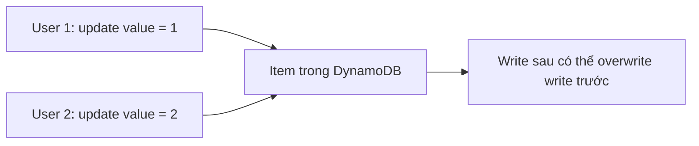
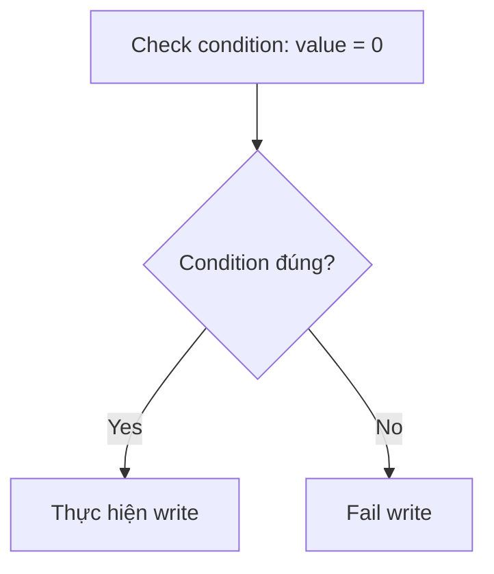

# 330. DynamoDB Conditional Writes, Concurrent Writes & Atomic Writes

## 🎯 Giới thiệu
Bài này giải thích các kiểu write trong DynamoDB để hiểu rõ hành vi khi nhiều người cùng thao tác lên cùng một item. Trọng tâm là:
- `concurrent writes`
- `conditional writes`
- `atomic writes`
- `batch writes`

Mục tiêu là nắm cách DynamoDB xử lý ghi dữ liệu để tránh nhầm lẫn khi làm bài thi AWS.

## 1. Concurrent Writes
- Xảy ra khi **nhiều user cùng update một item** gần như cùng lúc.
- Cả hai write đều có thể **succeed**.
- Nhưng kết quả cuối cùng chỉ giữ được **một giá trị**, vì write sau có thể **overwrite** write trước.
- Đây là hành vi **không mong muốn** vì nhìn bề ngoài thì cả hai request đều thành công, nhưng thực tế chỉ một thay đổi còn hiệu lực.

## 2. Conditional Writes
- Là cách xử lý xung đột khi ghi dữ liệu.
- Write chỉ được thực hiện **nếu điều kiện đúng**.
- Ví dụ trong transcript:
  - User 1 muốn update item thành `1` **chỉ nếu** giá trị hiện tại là `0`.
  - User 2 cũng muốn update thành `2` **chỉ nếu** giá trị hiện tại là `0`.
- Khi user 1 ghi trước:
  - giá trị trở thành `1`
  - user 2 sẽ **fail** vì condition `value = 0` không còn đúng
- Đây là cách giải quyết vấn đề concurrency bằng **optimistic locking**.

## 3. Atomic Writes
- Là kiểu write mà các phép cập nhật được cộng dồn một cách an toàn.
- Ví dụ:
  - user 1 tăng giá trị lên `1`
  - user 2 tăng giá trị lên `2`
- Cả hai write đều succeed
- Tổng giá trị cuối cùng tăng lên `3`
- Điểm chính: các thao tác được xử lý theo cách đảm bảo kết quả cuối cùng phản ánh tổng thay đổi.

## 4. Batch Writes
- Là khi user **write hoặc update nhiều items cùng lúc**.
- Đây là một nhóm thao tác ghi theo lô, **không liên quan trực tiếp đến concurrency** như các loại trên.
- Transcript chỉ nêu đây là một kiểu write khác trong DynamoDB.

## 📊 Bảng tóm tắt
| Tiêu chí | Mô tả |
|----------|------|
| `concurrent writes` | Nhiều write lên cùng item cùng lúc; cả hai có thể succeed nhưng một write có thể overwrite write còn lại |
| `conditional writes` | Write chỉ xảy ra nếu điều kiện hiện tại đúng; dùng để xử lý concurrency |
| `optimistic locking` | Cách giải quyết xung đột bằng điều kiện trước khi ghi |
| `atomic writes` | Nhiều thao tác tăng giá trị được cộng dồn, ví dụ `1 + 2 = 3` |
| `batch writes` | Ghi hoặc update nhiều items cùng lúc |

## 💡 Mẹo ghi nhớ cho kỳ thi AWS
- `Concurrent writes` = **cùng ghi một item**, dễ bị overwrite.
- `Conditional writes` = **ghi có điều kiện**, dùng để tránh xung đột.
- `Optimistic locking` = từ khóa gắn với `conditional writes`.
- `Atomic writes` = nhiều phép tăng được cộng dồn an toàn.
- `Batch writes` = nhiều items trong một lần ghi, khác với vấn đề concurrency.

## ✅ Kết luận
DynamoDB có nhiều kiểu write khác nhau, và điểm quan trọng nhất của bài này là:
- `concurrent writes` có thể gây overwrite
- `conditional writes` giúp kiểm soát xung đột
- `atomic writes` cho phép cộng dồn thay đổi
- `batch writes` là ghi nhiều items cùng lúc

Nắm chắc các khái niệm này sẽ giúp bạn tránh nhầm lẫn trong phần thi AWS.
