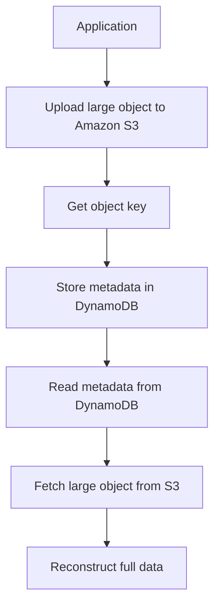

# 331. DynamoDB Patterns with S3

## 🎯 Giới thiệu
- Bài này nói về 2 pattern phổ biến khi kết hợp **DynamoDB** với **Amazon S3**.
- Mục tiêu chính:
  - Lưu **large objects** ở nơi phù hợp.
  - Dùng **DynamoDB** để lưu hoặc index **metadata** nhằm truy vấn dễ hơn.
- Ý chính để ôn thi: **S3** phù hợp với dữ liệu lớn, còn **DynamoDB** phù hợp với dữ liệu nhỏ, có thể index theo attribute.

## 1. Lưu large objects trong S3, lưu metadata trong DynamoDB
- **DynamoDB** chỉ lưu tối đa **400 kilobytes** mỗi item.
- Vì vậy, các dữ liệu lớn như:
  - images
  - videos
  - large files
  nên được lưu trong **Amazon S3**.
- Flow:
  - Upload object lên **S3**.
  - Nhận lại **object key**.
  - Lưu metadata vào **DynamoDB**, ví dụ:
    - `product ID`
    - `product name`
    - `image URL` trỏ đến S3
- Khi đọc dữ liệu:
  - Client lấy metadata từ **DynamoDB** trước.
  - Sau đó lấy object từ **S3** để ghép lại thành dữ liệu hoàn chỉnh.

## 2. Dùng DynamoDB để index metadata của S3 objects
- Pattern thứ hai là dùng **DynamoDB** như một lớp **index** cho **S3 objects metadata**.
- Flow:
  - Application upload object vào **Amazon S3**.
  - **S3 notifications** kích hoạt **Lambda function**.
  - **Lambda** ghi metadata vào **DynamoDB**.
- Metadata có thể gồm:
  - `object size`
  - `date`
  - `who created it`
  - các attributes khác của object

## 3. Vì sao pattern này hữu ích
- **S3 bucket** không предназнач để scan như database.
- **DynamoDB** giúp xây dựng query dễ hơn trên metadata.
- Từ **DynamoDB**, có thể tìm:
  - object theo **specific timestamp**
  - tổng storage dùng bởi một customer
  - danh sách object theo attributes
  - object upload trong một **date range**
- Sau khi query **DynamoDB**, ứng dụng dùng kết quả để lấy object tương ứng từ **S3**.

## 📊 Bảng tóm tắt
| Tiêu chí | Mô tả |
|----------|------|
| Giới hạn DynamoDB | Item tối đa **400 KB** |
| Khi nào dùng S3 | Lưu **large objects** như images, videos |
| Khi nào dùng DynamoDB | Lưu **small objects** hoặc **metadata** có thể index |
| Pattern 1 | Lưu large object trong **S3**, metadata trong **DynamoDB** |
| Pattern 2 | Dùng **DynamoDB** để index metadata của **S3 objects** |
| Thành phần trung gian | **Lambda** có thể nhận **S3 notifications** và ghi metadata vào **DynamoDB** |
| Lợi ích chính | Query metadata dễ hơn, kết hợp đúng vai trò của từng service |

## 💡 Mẹo ghi nhớ cho kỳ thi AWS
- Nhớ câu: **S3 for large objects, DynamoDB for indexed metadata**.
- Nếu đề bài nói đến **images/videos/large files**, nghĩ ngay đến **S3**.
- Nếu cần **query theo attributes, timestamp, date range**, nghĩ đến **DynamoDB**.
- Nếu thấy **S3 notification -> Lambda -> DynamoDB**, đây là pattern index metadata rất hay gặp trong exam.
- Đừng quên giới hạn **400 KB** của item trong **DynamoDB**.

## ✅ Kết luận
- Có 2 pattern chính khi kết hợp **DynamoDB** và **S3**:
  - Lưu dữ liệu lớn trong **S3**, lưu metadata nhỏ trong **DynamoDB**.
  - Dùng **DynamoDB** làm index cho metadata của **S3 objects**.
- Cả hai đều tận dụng đúng thế mạnh của từng service và là kiến thức quan trọng cho kỳ thi AWS.
