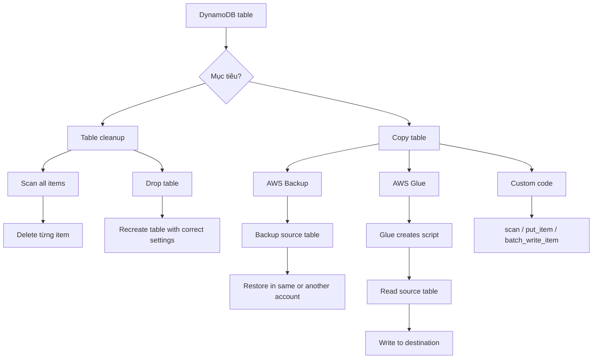

# 332. DynamoDB Operations

## 🎯 Giới thiệu
Bài này nói về **2 DynamoDB operations** dễ được hỏi trong kỳ thi AWS:
- **Table cleanup**
- **Table copy / data migration**

Mục tiêu là chọn cách làm **nhanh hơn, ít tốn chi phí hơn**, và đúng theo tình huống.

## 1. 🧹 Table Cleanup
Khi cần dọn dữ liệu trong DynamoDB table, có **2 cách**:

- **Cách 1: Scan rồi delete từng item**
  - Phải `scan` toàn bộ items trong table
  - Sau đó `delete` từng item một
  - **Rất chậm**
  - Tốn nhiều **RCU** cho `scan`
  - Tốn nhiều **WCU** cho `delete`
  - Vì vậy **đắt**

- **Cách 2: Drop table rồi tạo lại**
  - `drop` table
  - Sau đó **recreate** table
  - **Nhanh, hiệu quả, rẻ**
  - Cần đảm bảo tạo lại với **correct settings** giống table cũ

## 2. 📦 Copy DynamoDB Table
Nếu muốn copy một DynamoDB table, transcript nêu 3 lựa chọn:

- **AWS Backup**
  - Có thể `backup` source table
  - Sau đó `restore`
  - Có thể restore trong **cùng account** hoặc **account khác**

- **AWS Glue**
  - Là ETL service
  - Glue sẽ tạo **script**
  - Script đọc từ **source table**
  - Sau đó ghi dữ liệu đến nơi bạn muốn

- **Tự viết code**
  - Dùng API calls như:
    - `scan`
    - `put_item`
    - `batch_write_item`
  - Cách này được nhắc là **khó hơn** so với dùng AWS services

## 3. 🧠 Điểm Cần Nhớ Khi Ôn Thi
- **Scan rồi delete từng item** là cách **chậm và tốn RCU/WCU**
- **Drop table rồi tạo lại** là cách **nhanh, rẻ, hiệu quả**
- Để **copy table**, nhớ 3 hướng:
  - **AWS Backup**
  - **AWS Glue**
  - **Custom code** với API calls
- Nếu đề bài nói đến **restore sang account khác**, đáp án có thể liên quan đến **AWS Backup**
- Nếu đề bài nói đến **ETL** hoặc **script đọc rồi ghi dữ liệu**, nghĩ đến **AWS Glue**

## 📊 Bảng tóm tắt
| Tiêu chí | Mô tả |
|----------|------|
| Table cleanup | Có thể `scan` rồi `delete` từng item, nhưng chậm và tốn RCU/WCU |
| Table cleanup tối ưu | `Drop` table rồi `recreate` với đúng settings |
| Copy table | Dùng **AWS Backup** để backup/restore source table |
| ETL use case | Dùng **AWS Glue** để tạo script đọc source table và ghi đi nơi khác |
| Custom approach | Tự viết code với `scan`, `put_item`, `batch_write_item` |
| AWS exam focus | Chọn cách **nhanh hơn, rẻ hơn, ít thao tác thủ công hơn** |

## 💡 Mẹo ghi nhớ cho kỳ thi AWS
- **Cleanup = Drop & Recreate** nếu được phép
- **Backup = Restore** khi muốn sao chép table nhanh qua account khác
- **Glue = ETL script**
- **Custom code = scan + put_item/batch_write_item**
- Nhớ rằng **scan + delete** thường là lựa chọn **kém tối ưu nhất**

## ✅ Kết luận
Với **DynamoDB Operations**, trọng tâm của bài là:
- Dọn table thì ưu tiên **drop table rồi tạo lại**
- Copy table thì cân nhắc **AWS Backup**, **AWS Glue**, hoặc **custom code**
- Trong kỳ thi, hãy chú ý tới sự khác nhau giữa **nhanh/rẻ** và **chậm/tốn RCU/WCU**
