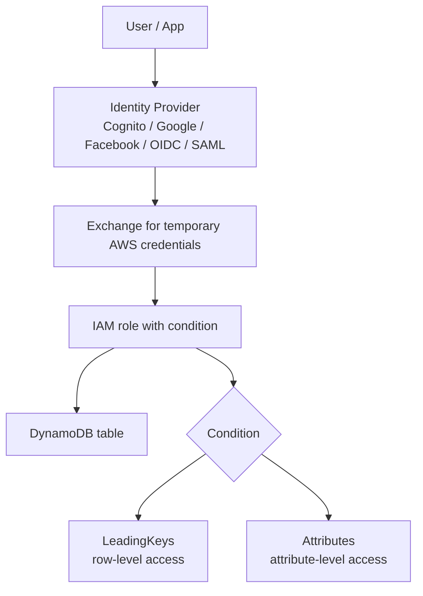

# 333. DynamoDB Security & Other

## 🎯 Giới thiệu
DynamoDB có một số điểm quan trọng về **security** và các tính năng bổ trợ cần nhớ khi ôn thi AWS:
- Truy cập an toàn qua `VPC endpoints`
- Kiểm soát quyền bằng `IAM`
- Mã hóa `at rest` và `in-transit`
- `Backup/restore`, `Global Tables`, `DynamoDB Local`, `DMS`
- `Fine-grained access control` cho ứng dụng web/mobile

## 1. 🔐 Security của DynamoDB
- Có thể dùng `VPC endpoints` để truy cập DynamoDB **không qua public internet**
- Toàn bộ traffic được giữ **trong VPC**
- Truy cập vào DynamoDB được kiểm soát hoàn toàn bởi `IAM`
- Mã hóa:
  - `at rest` bằng `AWS KMS`
  - `in-transit` bằng `SSL` và `TLS`

## 2. 💾 Backup, Restore và Global Tables
- DynamoDB có 2 cách backup/restore:
  - `Point-in-time recovery (PITR)`:
    - giống `RDS`
    - **không ảnh hưởng performance**
  - `Normal backup and restore`
- `Global Tables`:
  - bảng `multi-region`
  - `multi-active`
  - `fully replicated`
  - `high-performance`
- Để bật `Global Tables`, cần **enable `DynamoDB Streams` trước**

## 3. 🧪 DynamoDB Local, Migration và Fine-grained Access
- `DynamoDB local`:
  - là mô phỏng DynamoDB chạy trên máy local
  - dùng để develop và test ứng dụng **không cần dùng DynamoDB web service**
- `AWS Database Migration Service (DMS)`:
  - dùng để migrate dữ liệu **to/from DynamoDB**
  - ví dụ được nhắc đến: `MongoDB -> DynamoDB`, hoặc từ `Oracle`, `MySQL`, `S3`, ...
- `Fine-grained access control`:
  - không cấp trực tiếp `IAM users/roles` cho client/app
  - dùng `identity provider` như:
    - `Amazon Cognito User Pools`
    - `Google login`
    - `Facebook login`
    - `OpenID Connect`
    - `SAML`
  - người dùng đăng nhập qua identity provider rồi đổi lấy `temporary AWS credentials`
  - `IAM role` đi kèm `condition` để giới hạn quyền
  - có thể giới hạn:
    - theo `LeadingKeys` để kiểm soát ở mức `row level`
    - theo `attributes` để kiểm soát ở mức `column/attribute level`

## 📊 Bảng tóm tắt
| Tiêu chí | Mô tả |
|----------|------|
| `VPC endpoints` | Truy cập DynamoDB không qua public internet, traffic chỉ trong VPC |
| `IAM control` | Quyền truy cập DynamoDB được quản lý hoàn toàn bởi `IAM` |
| Encryption | `at rest` dùng `AWS KMS`, `in-transit` dùng `SSL/TLS` |
| `PITR` | Backup point-in-time, giống `RDS`, không ảnh hưởng performance |
| Normal backup/restore | Cách backup và restore thông thường |
| `Global Tables` | Bảng `multi-region`, `multi-active`, `fully replicated`, `high-performance` |
| `DynamoDB Streams` | Cần enable trước khi bật `Global Tables` |
| `DynamoDB local` | Môi trường local để develop/test không cần web service |
| `DMS` | Dùng để migrate dữ liệu đến hoặc từ DynamoDB |
| Fine-grained access | Dùng federated login + `temporary credentials` + `IAM role condition` |
| `LeadingKeys` | Giới hạn quyền ở mức `row level` theo primary key |
| `Attributes` | Giới hạn quyền ở mức `attribute level` |

## 💡 Mẹo ghi nhớ cho kỳ thi AWS
- `VPC endpoints` + `IAM` + `KMS` là 3 ý khóa về security của DynamoDB
- Nhớ `PITR` là backup point-in-time và **không impact performance**
- Muốn dùng `Global Tables` thì phải nghĩ đến `DynamoDB Streams` trước
- `DynamoDB local` là để dev/test trên máy local
- `Fine-grained access`:
  - login qua `identity provider`
  - lấy `temporary credentials`
  - dùng `IAM role` có `condition`
  - `LeadingKeys` = row-level, `attributes` = attribute-level

## ✅ Kết luận
DynamoDB không chỉ mạnh về hiệu năng mà còn có hệ thống security và quản trị khá rõ ràng: truy cập qua `VPC endpoints`, kiểm soát bằng `IAM`, mã hóa bằng `KMS`/`SSL/TLS`, backup với `PITR`, nhân bản với `Global Tables`, và kiểm soát truy cập chi tiết bằng `federated login` kết hợp `IAM condition`.
