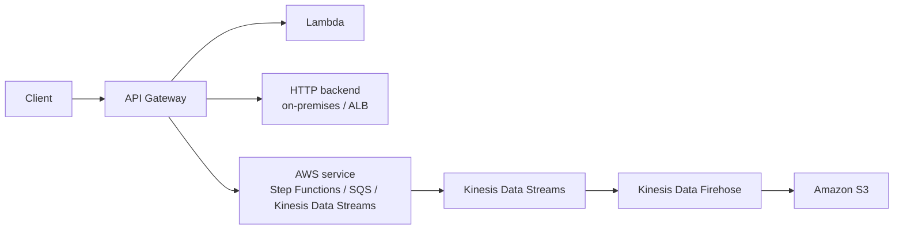

# 335. API Gateway Overview

## 🎯 Giới thiệu
- `API Gateway` là một dịch vụ **serverless** của AWS dùng để tạo **REST API** public cho client.
- Client sẽ gọi `API Gateway`, sau đó `API Gateway` sẽ **proxy request** đến backend như `Lambda`, `HTTP endpoint`, hoặc một số `AWS service`.
- Lợi ích chính:
  - Không cần quản lý infrastructure
  - Có thêm nhiều tính năng ngoài HTTP endpoint đơn thuần
  - Hỗ trợ `authentication`, `usage plans`, `development stages`, `API keys`, `throttling`, `cache`, `request/response transform`, `validation`, `SDK generation`, `API export/import`

## 1. Tích hợp và cách dùng
- Tích hợp phổ biến nhất là `API Gateway + Lambda` để xây dựng **full serverless application**.
- `API Gateway` cũng có thể:
  - Expose các `HTTP endpoint` có sẵn ở backend
  - Expose các `AWS API` thông qua API
- Ví dụ được nêu trong transcript:
  - Gọi `Step Functions`
  - Gửi message đến `SQS`
  - Nhận dữ liệu vào `Kinesis Data Streams` rồi đẩy tiếp sang `Firehose` và lưu vào `S3` dạng `JSON`
- Mục tiêu của các tích hợp này:
  - Thêm `authentication`
  - Public API an toàn hơn
  - `Rate limiting` và `throttling`
  - Không cần cấp AWS credentials trực tiếp cho client

## 2. Các kiểu triển khai endpoint
- `Edge-Optimized`:
  - Mặc định
  - Dành cho client toàn cầu
  - Request được route qua `CloudFront Edge locations` để giảm latency
  - `API Gateway` vẫn chỉ nằm ở một `region`
- `Regional`:
  - Dùng khi user chủ yếu ở cùng `region`
  - Không dùng `CloudFront Edge locations`
- `Private API Gateway`:
  - Không public
  - Chỉ truy cập được từ trong `VPC`
  - Dùng `interface VPC endpoints` cho `ENIs`
  - Phân quyền truy cập bằng `resource policy`

## 3. Bảo mật và custom domain
- Cách xác thực người dùng trên `API Gateway`:
  - `IAM roles`: phù hợp cho internal applications, ví dụ app chạy trên `EC2`
  - `Amazon Cognito`: phù hợp cho external users như mobile/web apps
  - `Custom authorizer`: dùng `Lambda` để tự viết logic xác thực
- Hỗ trợ `HTTPS` với custom domain name thông qua `ACM`
  - Nếu dùng `Edge-Optimized endpoint`, certificate phải ở `us-east-1`
  - Nếu dùng `Regional endpoint`, certificate có thể ở cùng `region` với `API Gateway stage`
- Cần cấu hình `CNAME` hoặc `A-alias record` trong `Route 53` để trỏ domain về `API Gateway`

## 📊 Bảng tóm tắt
| Tiêu chí | Mô tả |
|----------|------|
| Vai trò | Dịch vụ `serverless` để tạo `REST API` public |
| Request path | `Client` gọi `API Gateway`, rồi `API Gateway` proxy đến backend |
| Tích hợp chính | `Lambda`, `HTTP endpoint`, `AWS service` |
| Tính năng nổi bật | `Authentication`, `usage plans`, `API keys`, `throttling`, `cache`, `validation`, `SDK generation` |
| Kiểu endpoint | `Edge-Optimized`, `Regional`, `Private` |
| Bảo mật | `IAM roles`, `Amazon Cognito`, `Custom authorizer` |
| Custom domain | Dùng `ACM` và `Route 53` |

## 💡 Mẹo ghi nhớ cho kỳ thi AWS
- Nhớ nhanh: `API Gateway` không chỉ là “HTTP endpoint”, mà là lớp **API management** cho `serverless` và `AWS service integration`.
- `Edge-Optimized` = dành cho global users, có `CloudFront Edge locations`.
- `Regional` = user chủ yếu trong cùng `region`.
- `Private` = chỉ trong `VPC`, dùng `interface VPC endpoints`.
- Nếu bài thi hỏi cách bảo vệ API:
  - Internal app trên `EC2` thường gợi ý `IAM roles`
  - External users thường gợi ý `Amazon Cognito`
  - Logic riêng thì dùng `Custom authorizer` bằng `Lambda`
- Nếu hỏi custom domain:
  - `Edge-Optimized` cần certificate ở `us-east-1`
  - `Regional` thì certificate ở cùng `region` với `API Gateway stage`

## ✅ Kết luận
- `API Gateway` là lớp trung gian rất quan trọng để công khai và quản lý API trong kiến trúc `serverless`.
- Nó giúp kết nối client với `Lambda`, `HTTP backend`, hoặc `AWS services` một cách an toàn và linh hoạt.
- Ba điểm cần nhớ nhất là:
  - `Integration`
  - `Endpoint types`
  - `Security + custom domain`
