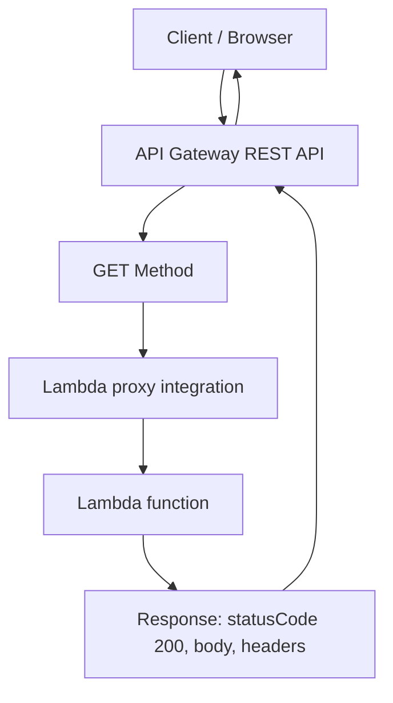

# 336. API Gateway Basics Hands On

## 🎯 Giới thiệu
Bài học này demo cách tạo **API Gateway REST API**, gắn với **Lambda function** bằng **Lambda proxy integration**, rồi test trực tiếp qua **API Gateway console** và **web browser**.  
Trọng tâm là hiểu:
- Các loại **API type** trong API Gateway
- Cách tạo **resource**, **method**, và **integration**
- Cách request đi từ client đến Lambda và quay lại
- Cách **deploy** API ra stage để truy cập bằng URL

## 1. Tạo REST API trong API Gateway
- Mở **API Gateway console** và chọn loại API.
- Có các lựa chọn:
  - **HTTP APIs**
  - **WebSocket API**
  - **REST API**  
- Trong bài này chỉ dùng **REST API**.
- Khi tạo REST API, có các cách:
  - Tạo API mới
  - Import từ **OpenAPI definition file**
  - Clone API hiện có
  - Start from example API
- API được tạo với tên: **MyFirstAPI**
- **API endpoint type** có 3 lựa chọn:
  - **Regional**: triển khai trong một region
  - **Edge-optimized**: triển khai qua nhiều region ở edge
  - **Private**: không public ra web
- Trong bài này chọn **Regional** để đơn giản.

## 2. Gắn Lambda vào method GET
- Tạo method đầu tiên cho API:
  - Method: **GET**
  - Integration type: **Lambda function**
- API Gateway còn hỗ trợ các integration type khác:
  - **HTTP**
  - **Mock**
  - **AWS service**
  - **VPC link**
- Tạo Lambda function tên **api-gateway-route-gets**
- Runtime dùng **Python 3.11**
- Code Lambda rất đơn giản:
  - Trả về `body = "hello from Lambda"`
  - `statusCode = 200`
  - Header `Content-Type: application/json`
- Sau khi deploy Lambda, test bằng event demo và thấy kết quả đúng.

### 🔁 Request flow


- Khi cấu hình integration, chọn **Lambda proxy integration** để thấy đầy đủ request/response đi qua.
- **API Gateway timeout** mặc định là **29 seconds**.
- Dù Lambda có timeout dài hơn, API Gateway vẫn bị giới hạn bởi timeout này.
- Khi tạo method xong, AWS tự động cấp quyền để API Gateway gọi Lambda.
- Trong Lambda **resource-based policy**, có statement cho phép API Gateway invoke Lambda nếu source API đúng API của mình.
- Test từ API Gateway cho thấy:
  - `status 200`
  - `response body: hello from Lambda`
  - `Content-Type: application/json`

## 3. Debug, tạo resource mới và deploy API
- Để xem dữ liệu API Gateway gửi sang Lambda, thêm `print(event)` trong Lambda.
- Kiểm tra **CloudWatch logs**:
  - Thấy `event` được API Gateway gửi vào
  - Có thông tin như:
    - `resource`
    - `path`
    - `method` = `GET`
    - `headers`
    - `query string parameters`
- Điều này cho thấy Lambda có thể dùng dữ liệu request để tạo response.

### 🌐 Tạo resource `/houses`
- Tạo resource mới tên **houses**
- Path mới là **/houses**
- Tạo tiếp method **GET**
- Dùng lại kiểu:
  - **Lambda function**
  - **Lambda proxy integration**
- Tạo Lambda function mới cho resource này
- Đổi message thành kiểu:
  - `hello from my pretty house`
- Test trong console thấy response `200` với đúng message.

### 🚀 Deploy và truy cập bằng browser
- Deploy API sang stage mới tên **dev**
- Sau khi deploy, có **invoke URL**
- Truy cập:
  - `/dev` → trả về `hello from Lambda`
  - `/houses` → trả về `hello from my pretty house`
- Nếu đi sai path như `/wrong`, nhận lỗi kiểu:
  - `missing authentication token`

### 🧭 Deployment flow
```mermaid
flowchart TD
    A[Create REST API] --> B[Create GET method]
    B --> C[Attach Lambda proxy integration]
    C --> D[Create resource /houses]
    D --> E[Create second GET method]
    E --> F[Deploy API to stage dev]
    F --> G[Invoke URL in browser]
    G --> H[/dev -> hello from Lambda]
    G --> I[/houses -> hello from my pretty house]
    G --> J[/wrong -> missing authentication token]
```

## 📊 Bảng tóm tắt
| Tiêu chí | Mô tả |
|----------|------|
| API type | Dùng **REST API** trong API Gateway |
| Endpoint type | **Regional**, **Edge-optimized**, hoặc **Private** |
| Integration | Chủ yếu dùng **Lambda function** |
| Kỹ thuật quan trọng | **Lambda proxy integration** |
| Timeout | API Gateway mặc định **29 seconds** |
| Bảo mật | AWS tự thêm quyền để API Gateway invoke Lambda qua **resource-based policy** |
| Debug | Xem `event` trong Lambda và **CloudWatch logs** |
| Deploy | Deploy ra stage, ví dụ **dev** |
| Kết quả | `/dev` và `/houses` trả về response từ 2 Lambda khác nhau |

## 💡 Mẹo ghi nhớ cho kỳ thi AWS
- **REST API** là trọng tâm của bài này, không phải HTTP API hay WebSocket API.
- **Regional** = một region; **Edge-optimized** = nhiều region ở edge; **Private** = không public.
- **Lambda proxy integration** giúp chuyển đầy đủ request vào Lambda và trả response về API Gateway.
- Nhớ con số **29 seconds** cho timeout mặc định của API Gateway.
- Khi test lỗi path sai, có thể gặp **missing authentication token**.
- Nếu muốn debug request, hãy xem `event` trong Lambda và **CloudWatch logs**.
- Deploy xong mới có **invoke URL** để test bằng browser.

## ✅ Kết luận
Bài lab này cho thấy quy trình cơ bản của **API Gateway + Lambda**:
- Tạo **REST API**
- Tạo **resource** và **GET method**
- Gắn **Lambda proxy integration**
- Kiểm tra quyền invoke Lambda
- Debug bằng **CloudWatch logs**
- **Deploy** API để truy cập qua browser

Đây là nền tảng quan trọng để hiểu cách API Gateway đứng trước Lambda và xử lý request/response trong AWS.
