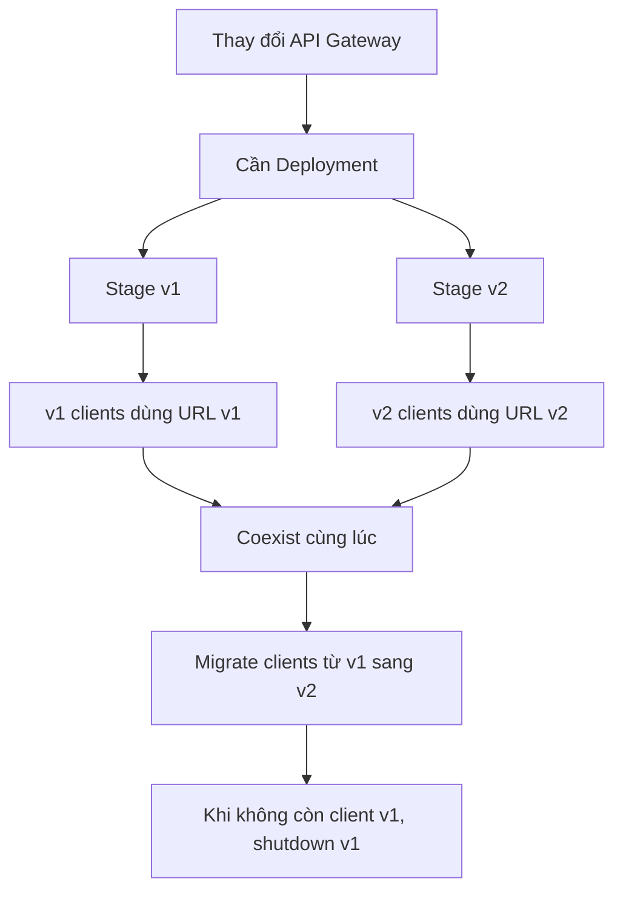
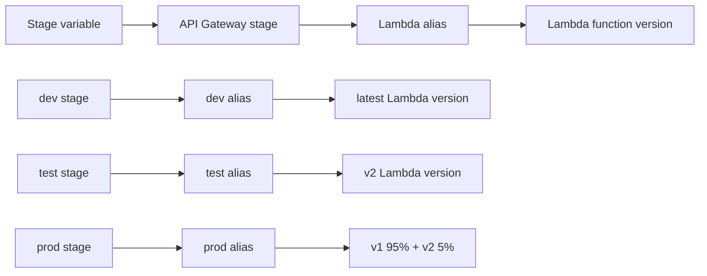

# 337. API Gateway Stages and Deployment

## 🎯 Giới thiệu
- Trong API Gateway, mọi thay đổi đối với API **không có hiệu lực ngay** cho đến khi thực hiện **deployment**.
- Đây là điểm dễ nhầm khi học và thi AWS: sửa API xong nhưng quên deploy thì API vẫn chưa live.
- API được triển khai theo từng **stage**, ví dụ: `dev`, `test`, `prod` hoặc `v1`, `v2`, `v3`.

## 1. API Gateway Stages và Deployment
- **Deployment** là bước đưa thay đổi của API vào trạng thái hoạt động.
- Mỗi **stage** có thể có:
  - tên riêng
  - cấu hình riêng
  - lịch sử deployment riêng
- Nhờ có lịch sử deployment, việc **rollback** có thể thực hiện dễ dàng.

### Mermaid: deployment và stage coexistence

- Ví dụ trong transcript:
  - `v1 stage` invoke `v1 Lambda function`
  - khi có breaking change, tạo thêm `v2 stage`
  - `v2 stage` trỏ sang `v2 Lambda function`
- Cách này giúp:
  - giữ tương thích cho client cũ
  - cho phép client mới chuyển dần sang version mới
  - vận hành `v1` và `v2` song song trong một thời gian

## 2. Stage Variables
- **Stage variables** giống như environment variables, nhưng dùng cho **API Gateway stages**.
- Dùng để thay đổi cấu hình **mà không cần redeploy API**.
- Có thể áp dụng cho:
  - `Lambda function ARN`
  - `HTTP endpoint`
  - `parameter mapping templates`
  - các giá trị cấu hình khác

### Mermaid: stage variable đến Lambda alias

- Cú pháp truy cập stage variable trong API Gateway:
  - `$stageVariables.variableName`
- Stage variables còn có thể được truyền vào `context` object trong Lambda, để Lambda đọc và log giá trị đó.

## 3. Pattern Phổ Biến Với Lambda Alias
- Một pattern rất thường gặp là dùng stage variable để xác định **Lambda alias** mà API Gateway sẽ invoke.
- Mục tiêu:
  - mỗi stage trỏ đúng alias tương ứng
  - API Gateway không cần đổi khi backend thay đổi version

### Ví dụ trong transcript
- `dev stage` -> `dev alias` -> 100% traffic tới latest Lambda version
- `test stage` -> `test alias` -> trỏ tới `v2`
- `prod stage` -> `prod alias` -> `95% v1`, `5% v2`

### Ý nghĩa
- Có thể đổi tỉ lệ traffic giữa các Lambda versions bằng cách cập nhật alias ở backend.
- Không cần cập nhật API Gateway.
- Mỗi stage luôn đi đúng alias phù hợp với môi trường.

## 📊 Bảng tóm tắt
| Tiêu chí | Mô tả |
|----------|------|
| Deployment | Thay đổi API Gateway chỉ có hiệu lực sau khi deploy |
| Stage | Mỗi stage là một phiên bản triển khai riêng, có thể đặt tên tùy ý |
| Rollback | Dễ rollback vì API Gateway giữ lịch sử deployment của stage |
| Stage variables | Giống environment variables, dùng để đổi cấu hình mà không redeploy |
| Cú pháp | `$stageVariables.variableName` |
| Use case phổ biến | Chọn Lambda alias theo stage và điều hướng traffic theo môi trường |
| Lợi ích chính | Giữ tương thích giữa `v1` và `v2`, migrate client an toàn |

## 💡 Mẹo ghi nhớ cho kỳ thi AWS
- Nhớ câu này: **“API Gateway changes need deployment to become live.”**
- **Stage** dùng để tách môi trường hoặc version API.
- **Stage variables** dùng để đổi cấu hình mà **không redeploy**.
- Nếu thấy câu hỏi về:
  - nhiều môi trường `dev/test/prod`
  - versioning `v1/v2`
  - đổi Lambda alias theo stage
  - giữ tương thích khi có breaking change  
  thì nghĩ ngay đến **API Gateway stages + stage variables + deployment**.

## ✅ Kết luận
- API Gateway không tự áp dụng thay đổi ngay; cần **deployment** để có hiệu lực.
- **Stages** cho phép chạy song song nhiều version API và hỗ trợ migration an toàn.
- **Stage variables** giúp thay đổi cấu hình linh hoạt mà không cần redeploy.
- Kết hợp **stage variables + Lambda alias** là pattern rất phổ biến để định tuyến đúng backend theo từng môi trường.
