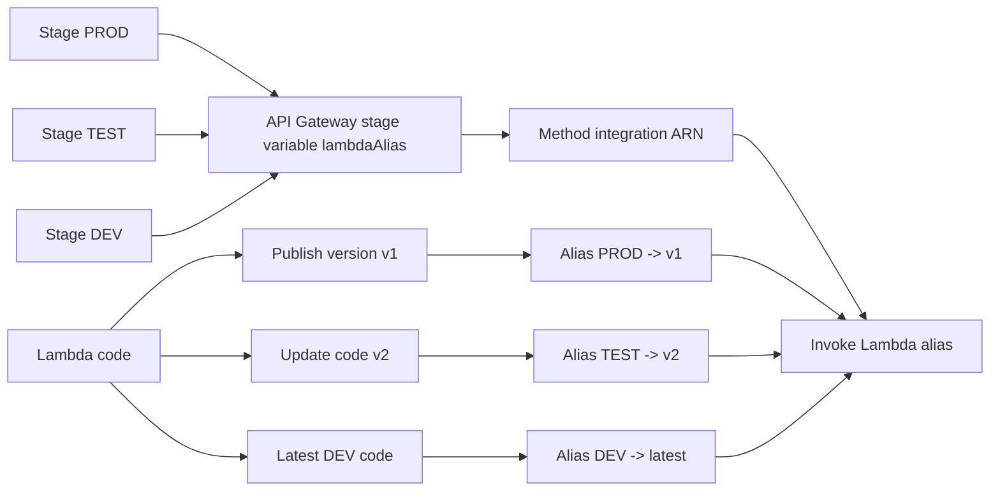

# 338. API Gateway Stages and Deployment Hands On

## 🎯 Giới thiệu
Bài này minh họa cách dùng **stage variables** trong **API Gateway** để ánh xạ từng stage tới một **Lambda alias** khác nhau. Luồng chính là:

- Tạo **Lambda function** với nhiều **versions**
- Tạo **aliases** trỏ tới từng version
- Gắn **stage variable** vào ARN của Lambda trong API Gateway
- Deploy API vào các stage như **DEV**, **TEST**, **PROD**
- Mỗi stage sẽ gọi đúng Lambda alias tương ứng

## 1. Tạo Lambda versions và aliases
- Tạo Lambda function tên `api-gateway-stage-variables-get`, runtime `Python 3.11`.
- Author 3 trạng thái code:
  - `v1` với message: `Hello from Lambda v1`
  - `v2` với message: `Hello from Lambda v2`
  - `DEV` với message: `Hello from Lambda in DEV`
- Với `v1` và `v2`, dùng thao tác **Publish new version** để tạo version chính thức.
- Không publish bản `DEV`, nên đây là **latest**.
- Tạo các **aliases**:
  - `DEV` -> trỏ tới **latest**
  - `TEST` -> trỏ tới **version two**
  - `PROD` -> trỏ tới **version one**

Kết quả kiểm tra:
- Gọi `PROD` sẽ trả về `Hello from Lambda v1`
- Gọi `TEST` sẽ trả về `Hello from Lambda v2`
- Gọi `DEV` sẽ trả về `Hello from Lambda DEV`

## 2. Gắn stage variables vào API Gateway
- Trong API Gateway, tạo method `GET`.
- Chọn Lambda integration ở **proxy mode**.
- Khi khai báo ARN của Lambda, thêm phần:
  - `:${stageVariables.LambdaAlias}`
- Mục đích: API Gateway sẽ thay alias theo giá trị stage variable.

### 🔐 Permission cho Lambda alias
- Cần cấp quyền để API Gateway có thể invoke từng alias.
- Phải thêm permission cho:
  - alias `DEV`
  - alias `TEST`
  - alias `PROD`
- Transcript lưu ý có thể có bug khi ARN bị lặp 2 lần trong command, cần sửa để chỉ còn một ARN.
- Sau khi thêm quyền, trong phần **permissions** của alias sẽ thấy resource-based policy statement cho phép API Gateway invoke alias đó.

## 3. Deploy theo stage và kiểm tra kết quả
- Deploy API vào các stage:
  - `DEV` với stage variable `lambdaAlias = DEV`
  - `TEST` với stage variable `lambdaAlias = TEST`
  - `prod` với stage variable `lambdaAlias = PROD`
- Khi test URL:
  - `/stage-variables` trên `PROD` sẽ trả về `Hello from Lambda v1`
  - `/stage-variables` trên `DEV` sẽ trả về `Hello from Lambda DEV`
  - `/stage-variables` trên `TEST` sẽ trả về `Hello from Lambda v2`
- Điều này chứng minh mỗi stage đang map tới một **LambdaAlias** riêng thông qua **stage variables**.

## 📊 Bảng tóm tắt
| Tiêu chí | Mô tả |
|----------|------|
| Mục tiêu | Dùng `stage variables` để map API Gateway stage tới Lambda alias |
| Lambda setup | Tạo versions `v1`, `v2`, và một bản `latest` cho `DEV` |
| Aliases | `DEV` -> latest, `TEST` -> v2, `PROD` -> v1 |
| API Gateway integration | Thêm `:${stageVariables.LambdaAlias}` vào Lambda ARN |
| Permission | Cấp quyền để API Gateway invoke từng alias |
| Kết quả kiểm tra | Mỗi stage trả về đúng message của alias tương ứng |

## 💡 Mẹo ghi nhớ cho kỳ thi AWS
- **Stage variable** trong API Gateway có thể dùng để đổi **Lambda alias** theo stage.
- **Alias** là lớp trỏ tới một Lambda version cụ thể, giúp tách `DEV`, `TEST`, `PROD`.
- Khi tích hợp Lambda qua API Gateway, nhớ rằng:
  - Stage khác nhau có thể gọi cùng một function nhưng qua **alias khác nhau**
  - Cần **permission** tương ứng cho alias đó
- Nếu thấy `:${stageVariables.LambdaAlias}` trong ARN, hãy nghĩ ngay tới cơ chế “stage quyết định alias”.

## ✅ Kết luận
- Bài học này cho thấy cách kết hợp **Lambda versions**, **Lambda aliases**, và **API Gateway stage variables** để điều hướng request theo môi trường.
- `DEV`, `TEST`, `PROD` có thể dùng chung một API nhưng vẫn gọi đúng phiên bản Lambda khác nhau.
- Đây là một pattern quan trọng khi ôn thi AWS vì nó liên quan trực tiếp đến **deployment flow** và **stage-based routing**.
