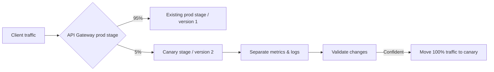

# 340. API Gateway Canary Deployments

## 🎯 Giới thiệu
Canary deployment trong API Gateway là cách triển khai thay đổi bằng cách chỉ đưa **một phần nhỏ traffic** sang phiên bản mới để kiểm tra trước khi chuyển toàn bộ lưu lượng.

Mục tiêu chính:
- Test thay đổi trên **production** với rủi ro thấp
- Theo dõi **metrics** và **logs** của phiên bản mới
- Chỉ mở rộng khi đã xác nhận mọi thứ hoạt động đúng

## 1. Cơ chế hoạt động
- `prod stage` hiện tại trỏ đến **version 1**
- Tạo thêm một `prod stage canary` cho **version 2**
- Chỉ định phần trăm traffic cho canary channel
- Ví dụ trong transcript:
  - **95%** traffic đi vào stage đang hoạt động ổn định
  - **5%** traffic đi vào canary stage

## 2. Lợi ích khi triển khai
- Kiểm tra thay đổi trên **một lượng nhỏ traffic**
- Có thể quan sát:
  - **metrics**
  - **logs**
  - hành vi hệ thống
- Dễ debug và xác minh trước khi rollout rộng hơn
- Khi tự tin, có thể chuyển **100% traffic** sang canary stage

## 3. Điểm cần nhớ cho API Gateway
- Canary deployment thường được dùng trong **production**
- Có thể **override stage variables** cho canary stage
- **Metrics và logs tách riêng** để giám sát tốt hơn
- Cách này được xem là **equivalent of blue/green deployment** với **Lambda và API Gateway**

## 📊 Bảng tóm tắt
| Tiêu chí | Mô tả |
|----------|------|
| Mục đích | Test thay đổi với một phần nhỏ traffic |
| Môi trường | Thường dùng trong production |
| Phân phối traffic | Ví dụ 95% cho stage cũ, 5% cho canary |
| Quan sát | Metrics, logs, debug |
| Tùy biến | Có thể override stage variables |
| Kết quả cuối | Chuyển 100% traffic khi đã xác nhận ổn định |
| So sánh | Tương đương blue/green deployment với Lambda và API Gateway |

## 💡 Mẹo ghi nhớ cho kỳ thi AWS
- Nhớ cụm từ: **“small percentage of traffic”** = canary deployment
- Nếu câu hỏi nói về:
  - test ở production
  - tách metrics/logs
  - rollout dần dần
  - chuyển toàn bộ traffic sau khi kiểm tra
  thì đáp án thường liên quan đến **Canary Deployments**
- Chú ý chi tiết: **stage variables có thể override** cho canary stage

## ✅ Kết luận
Canary deployment trong API Gateway cho phép gửi **một phần traffic nhỏ** sang phiên bản mới để kiểm tra an toàn trong **production**, theo dõi bằng **metrics/logs tách riêng**, rồi mới chuyển toàn bộ traffic khi đã chắc chắn hệ thống hoạt động đúng.
