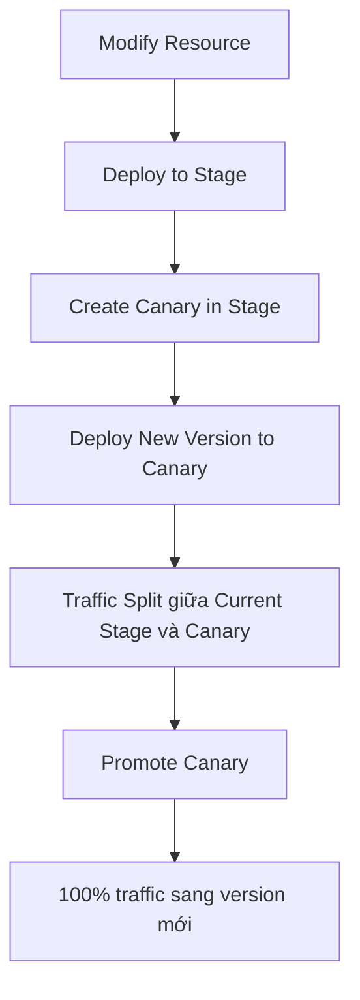

# 341. API Gateway Canary Deployments Hands On

## 🎯 Giới thiệu
Bài này demo cách dùng **Canary deployment** trong **API Gateway** để kiểm tra phiên bản mới của API trước khi đưa toàn bộ traffic sang bản mới.

- Tạo resource mới tên `canary-demo`
- Tạo method **GET** với **Lambda proxy integration**
- Lambda function được dùng có 2 version:
  - `version 1` trả về `Hello from Lambda v1`
  - `version 2` trả về `Hello from Lambda v2`
- Sử dụng **stage variables** để trỏ request đến đúng version của Lambda

## 1. Tạo resource và kiểm tra version 1
- Tạo resource `canary-demo`
- Tạo method **GET**
- Chọn **Lambda function** với **proxy integration**
- Ban đầu cấu hình gọi **version 1** của Lambda bằng cách thêm `:1`
- Test method và nhận kết quả:
  - `Hello from Lambda v1`

## 2. Deploy vào stage và tạo Canary
- Deploy API vào stage mới tên `canary`
- Khi gọi invoke URL của stage này, kết quả vẫn là:
  - `Hello from Lambda v1`
- Tạo **canary** trong stage
- Trong demo này, tỷ lệ phân phối request là:
  - `50%` vào **canary**
  - `50%` vào **current stage**
- Thực tế thường dùng tỷ lệ nhỏ hơn, ví dụ `10%`, nhưng ở đây dùng `50/50` để dễ quan sát

## 3. Cập nhật sang version 2 và promote Canary
- Quay lại method `canary-demo` → `GET`
- Sửa integration request để gọi **version 2** thay vì version 1
- Test method và thấy:
  - `Hello from Lambda v2`
- Deploy API vào **Canary**
- Khi refresh URL, kết quả luân phiên giữa:
  - `Hello from Lambda v1`
  - `Hello from Lambda v2`
- Điều này cho thấy Canary đang chia traffic giữa 2 version
- Khi sẵn sàng, **promote canary** để cập nhật stage cuối cùng
- Sau khi promote, toàn bộ request chỉ còn đi tới:
  - `Hello from Lambda v2`

## 📊 Bảng tóm tắt
| Tiêu chí | Mô tả |
|----------|------|
| Mục tiêu | Kiểm tra API version mới trước khi rollout toàn bộ |
| Dịch vụ chính | API Gateway, Lambda |
| Kỹ thuật dùng | Canary deployment, stage variables |
| Luồng thao tác | Modify resource → tạo canary → deploy version mới → promote |
| Kết quả | Traffic chuyển dần từ version cũ sang version mới |
| Ý nghĩa ôn thi | Hiểu cách API Gateway hỗ trợ rollout an toàn bằng Canary |

## 💡 Mẹo ghi nhớ cho kỳ thi AWS
- **Canary** = triển khai thử một phần traffic trước khi release toàn bộ
- **Stage** là nơi deploy API, còn **Canary** là lớp kiểm thử trong stage đó
- Khi thấy câu hỏi về rollout an toàn trong **API Gateway**, nghĩ ngay đến:
  - **Canary deployment**
  - **percentage traffic split**
  - **promote to 100%**
- Nếu đề bài nhắc tới **Lambda version 1 / version 2**, hãy liên hệ với việc chuyển integration request giữa các version để test dần

## ✅ Kết luận
Canary deployment trong **API Gateway** cho phép kiểm tra phiên bản mới của API bằng cách chia một phần request sang bản mới, theo dõi kết quả, rồi **promote** khi đã ổn định. Đây là cách triển khai an toàn và rất quan trọng khi ôn thi AWS.
