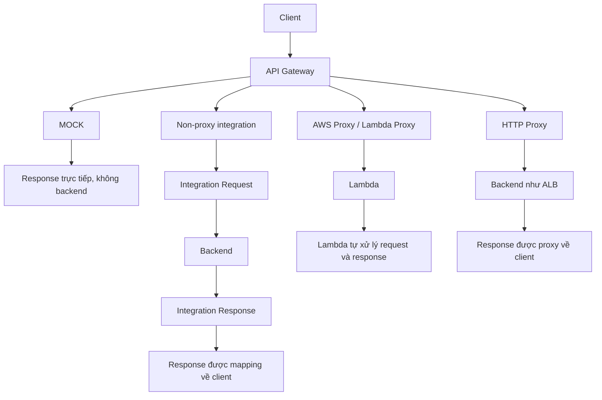

# 342. API Gateway Integration Types & Mappings

## 🎯 Giới thiệu
API Gateway có nhiều cách tích hợp với backend, và điểm khác nhau cốt lõi là: có hay không có **mapping templates**, và API Gateway có **proxy** request/response hay không.

- **MOCK**: trả response ngay, không gửi request tới backend.
- **Non-proxy integration** với **HTTP / AWS Lambda / other services**: API Gateway có thể sửa request và response.
- **Proxy integration**:
  - **AWS Proxy / Lambda Proxy**
  - **HTTP Proxy**
  - Request/response đi qua gần như nguyên trạng, không dùng mapping templates.

## 1. **MOCK Integration**
Đây là kiểu tích hợp chỉ để **return response** mà **không gửi request** đến backend.

- Dùng khi đang cấu hình API Gateway và chưa cần backend.
- Phù hợp cho **development** và **testing**.
- Không phù hợp cho **production**.

## 2. **Non-Proxy Integration và Mapping Templates**
Trong kiểu tích hợp này, API Gateway có thể:
- sửa **request** trước khi gửi đến backend
- sửa **response** trước khi trả về client

### Thành phần chính
- **Integration Request**
- **Integration Response**
- **Mapping templates**

### Khả năng của mapping templates
- Rename hoặc modify **query string parameters**
- Modify **body content**
- Add hoặc modify **headers**
- Có thể remove một số kết quả khỏi response

### Công cụ dùng để viết mapping templates
- **VTL (Velocity Template Language)**
- Hỗ trợ logic như `for loops`, `if`, ...

### Điều kiện Content-Type
Muốn set mapping templates thì Content-Type phải là:
- `application/json`
- `application/xml`

## 3. **Proxy Integration**
### AWS Proxy / Lambda Proxy
Đây là kiểu mà API Gateway chỉ đóng vai trò **proxy**.

- Request từ client được đưa thẳng vào Lambda.
- Không dùng mapping templates.
- Không sửa headers, query string parameters hay body trước khi vào Lambda.
- Lambda tự chịu trách nhiệm xử lý logic request/response.
- Lambda trả response gồm:
  - `status code`
  - `headers`
  - `body`

### HTTP Proxy
Tương tự proxy:
- Request được forward trực tiếp đến backend.
- Response từ backend được proxy ngược về client.
- Có thể thêm **HTTP headers** nếu cần, ví dụ **API key** giữa API Gateway và backend.
- Client không cần biết API key bí mật đó.

## 4. **Các tình huống điển hình trong transcript**
### Tích hợp SOAP API
Transcript nêu ví dụ:
- Client dùng **JSON** với API Gateway
- Backend là **SOAP API** dùng **XML**
- API Gateway dùng **mapping template** để:
  - lấy dữ liệu từ request
  - xây SOAP message phù hợp
  - gọi SOAP service
  - nhận XML response
  - chuyển lại thành format mong muốn cho user

### Đổi tên query string parameters
Ví dụ request có:
- `name=foo`
- `other=bar`

API Gateway có thể dùng mapping template để đổi thành biến khác trước khi đưa vào Lambda, ví dụ:
- `foo`
- `bar`

## 📊 Bảng tóm tắt
| Tiêu chí | Mô tả |
|----------|------|
| MOCK | Trả response trực tiếp, không gọi backend |
| Non-proxy integration | API Gateway có thể sửa request và response |
| Mapping templates | Dùng để transform request/response bằng **VTL** |
| Proxy integration | Request đi qua gần như nguyên trạng, không mapping templates |
| Lambda Proxy | Lambda nhận toàn bộ request và tự tạo response |
| HTTP Proxy | API Gateway proxy request/response đến backend như ALB |
| SOAP example | Dùng mapping template để đổi **JSON ↔ XML** |
| Content-Type | Mapping templates cần `application/json` hoặc `application/xml` |

## 💡 Mẹo ghi nhớ cho kỳ thi AWS
- **MOCK** = “không backend, chỉ giả lập response”.
- **Non-proxy** = “API Gateway có thể chỉnh request/response”.
- **Proxy** = “đẩy thẳng xuống backend, backend tự xử lý”.
- Nếu thấy **mapping templates**, hãy nghĩ ngay đến:
  - **non-proxy integration**
  - **VTL**
  - **request/response transformation**
- Nếu thấy **Lambda Proxy**, nhớ:
  - không mapping templates
  - Lambda nhận event đầy đủ
- Nếu thấy **SOAP API**, nhớ:
  - cần chuyển đổi **JSON ↔ XML** qua mapping template

## ✅ Kết luận
API Gateway có 3 nhóm tích hợp quan trọng trong transcript:
- **MOCK** để trả response nhanh khi chưa có backend
- **Non-proxy integration** để dùng **mapping templates** và **VTL** chỉnh request/response
- **Proxy integration** để chuyển request trực tiếp tới backend, đặc biệt là **Lambda Proxy** và **HTTP Proxy**

Điểm cần nhớ khi ôn thi là phân biệt rõ: **có mapping templates hay không**, và **API Gateway có làm trung gian biến đổi dữ liệu hay chỉ proxy**.
