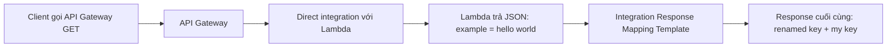

# 343. API Gateway Mapping Templates Hands On

## 🎯 Giới thiệu
Bài học này minh hoạ cách dùng **mapping templates** trong **API Gateway** để biến đổi dữ liệu **request/response** khi tích hợp trực tiếp với **Lambda**.

Điểm chính:
- Tạo resource `mapping`
- Tạo method `GET`
- Kết nối với **Lambda function** mà **không bật Lambda proxy integration**
- Dùng **integration response mapping template** để đổi cấu trúc response trả về

## 1. Direct integration với Lambda
- Tạo một **Lambda function** tên `API gateway mapping get`
- Chọn runtime **Python 3.11**
- Dùng **Lambda function ARN** để tích hợp vào API Gateway
- Quan trọng: **không enable Lambda proxy integration**
- Khi test Lambda, function chỉ trả về một JSON đơn giản:
  - `example`
  - `hello world`

Kết quả kiểm tra:
- API Gateway trả về **status 200**
- **response body** là nội dung Lambda trả về, vì không dùng proxy integration
- Không cần tự tạo `status` và `body` trong Lambda như kiểu proxy integration

## 2. Mapping template trên Integration Response
- Vào **integration response**
- Mở phần **mapping templates**
- Tạo template cho **content type**: `application/json`
- Mục tiêu: biến đổi output trước khi trả về client
- Có thể:
  - thêm key mới vào response
  - đổi tên key cũ thành key mới
  - thay đổi giá trị trả về theo ý muốn

Ví dụ trong bài:
- Tạo response mới có:
  - `my key`: `my value`
- Đồng thời đổi:
  - `example` -> `renamed key`
  - giá trị của nó là `"hello world"`

Ý nghĩa:
- Output từ Lambda sẽ đi qua **mapping template**
- Template tạo ra **final response body** mới cho API

## 3. Ý nghĩa trong ôn thi AWS
- **Mapping templates** là công cụ để **transform input và output**
- Có thể dùng trên:
  - **integration request**
  - **integration response**
- Áp dụng cho một số kiểu integration
- Đây là cách để API Gateway “map” dữ liệu từ integration sang đúng format mà API cần

## 📊 Bảng tóm tắt
| Tiêu chí | Mô tả |
|----------|------|
| Mục tiêu | Biến đổi request/response trong API Gateway |
| Kiểu tích hợp | Direct integration với Lambda |
| Proxy integration | Không bật |
| Nơi cấu hình | Integration response > Mapping templates |
| Content type | `application/json` |
| Kết quả | Response được đổi key/giá trị trước khi trả về client |
| Ý nghĩa thi cử | Biết mapping templates tồn tại và dùng để transform input/output |

## 💡 Mẹo ghi nhớ cho kỳ thi AWS
- Nhớ rằng **không bật Lambda proxy integration** thì API Gateway có thể trả về theo cách bạn map
- **Integration response mapping template** dùng để chỉnh **output**
- **Integration request mapping template** dùng để chỉnh **input**
- Nếu thấy câu hỏi về:
  - đổi format response
  - rename key
  - thêm dữ liệu vào output  
  thì nghĩ ngay đến **mapping templates**
- Trong bài này, Lambda trả JSON đơn giản, còn API Gateway dùng template để tạo response cuối cùng

## ✅ Kết luận
Bài học cho thấy **API Gateway Mapping Templates** cho phép biến đổi dữ liệu giữa API và backend integration. Khi dùng **direct integration** với Lambda, bạn có thể giữ Lambda đơn giản và để **integration response mapping template** xử lý việc định dạng lại response cho phù hợp với API.
