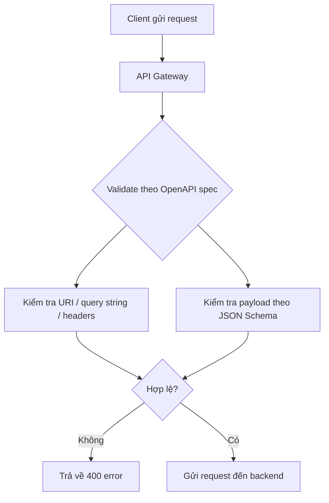

# 344. API Gateway Open API

## 🎯 Giới thiệu
API Gateway có tích hợp chặt chẽ với **OpenAPI specification**. Ý chính của bài này là:

- **OpenAPI** là một cách rất phổ biến để định nghĩa **REST APIs**
- API definition được xem như **code**
- Bạn có thể:
  - **Import** OpenAPI spec vào **API Gateway**
  - **Export** API đang có trong **API Gateway** ra thành OpenAPI spec
- OpenAPI spec cũng hỗ trợ:
  - **Generate client code / client SDKs**
  - **Request validation** ngay trong API Gateway

## 1. OpenAPI và API Gateway mapping
OpenAPI 3.0 cho phép mô tả gần như trực tiếp các thành phần của API Gateway:

- **Methods**
- **Method request**
- **Integration request**
- **Method response**
- Các **AWS extensions** của API Gateway

Điểm quan trọng là:

- Có thể cấu hình các option của extensions ngay trong API spec
- Có sự **one-to-one mapping** giữa **API Gateway** và **OpenAPI spec**

## 2. Import và Export API
Có 2 hướng làm việc với OpenAPI:

- **Import OpenAPI spec vào API Gateway**
- **Export API Gateway hiện có ra OpenAPI spec**

OpenAPI spec có thể được viết bằng:

- **YAML**
- **JSON**

Lợi ích chính được nhắc đến trong transcript:

- Dùng spec để **generate client code**
- Quản lý API theo cách định nghĩa bằng code

## 3. Request Validation trong API Gateway
OpenAPI spec có thể được dùng để **validate request** trước khi gửi đến backend.

### Cách hoạt động
Thay vì gửi payload thẳng vào backend, API Gateway có thể kiểm tra:

- Request parameters trong:
  - **URI**
  - **query string**
- **Headers**
  - Có tồn tại hay không
  - Có rỗng hay không
- **Payload**
  - Có khớp với **JSON Schema** được định nghĩa cho method hay không

Nếu request không hợp lệ:

- Caller sẽ nhận ngay **400 error**
- Giảm các call không cần thiết xuống backend
- Tránh lỗi khi backend parse hoặc xử lý payload

### Cấu hình validation
Trong OpenAPI definitions file, dùng:

- `x-amazon-apigateway-request-validator`

Bạn có thể chọn kiểu validation:

- **params-only** cho tất cả API methods
- **all validators** cho một method cụ thể, ví dụ `POST /validation`
- Hoặc bất kỳ method nào bạn muốn

### Mermaid: Flow validation

## 📊 Bảng tóm tắt
| Tiêu chí | Mô tả |
|----------|------|
| Mục tiêu | Dùng **OpenAPI** để định nghĩa và quản lý **API Gateway** |
| Định dạng | **YAML** hoặc **JSON** |
| Hướng sử dụng | **Import** spec vào API Gateway hoặc **Export** API ra spec |
| Nội dung mô tả | Methods, method request, integration request, method response, AWS extensions |
| Lợi ích | Generate **client SDKs** và chuẩn hóa API definition |
| Validation | Kiểm tra URI, query string, headers, payload theo **JSON Schema** |
| Kết quả khi sai | Trả về **400 error** trước khi gọi backend |
| Cấu hình chính | `x-amazon-apigateway-request-validator` |

## 💡 Mẹo ghi nhớ cho kỳ thi AWS
- Nhớ rằng **OpenAPI + API Gateway** là cặp tích hợp rất chặt.
- **API definition is code**: có thể import/export và quản lý như một tài liệu kỹ thuật.
- Khi thấy từ khóa **request validation**, nghĩ ngay đến:
  - URI
  - query string
  - headers
  - JSON Schema body
- Nếu request không hợp lệ, **API Gateway trả 400** ngay, không đẩy xuống backend.
- Từ khóa cần nhớ: **`x-amazon-apigateway-request-validator`**.

## ✅ Kết luận
OpenAPI giúp **API Gateway** có cách định nghĩa API rõ ràng, có thể **import/export**, sinh **client SDKs**, và đặc biệt là **validate request** ngay tại lớp API Gateway để giảm lỗi và giảm call không cần thiết xuống backend.
