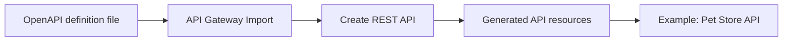
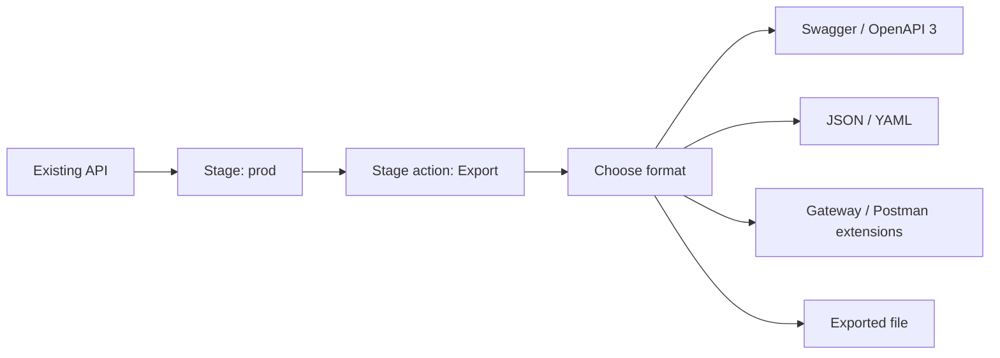

# 345. API Gateway Open API - Hands On

## 🎯 Giới thiệu
Bài này hướng dẫn cách làm việc với `OpenAPI` trong `API Gateway` theo 2 chiều:
- **Import** một `OpenAPI definition` để tạo API nhanh
- **Export** API hiện có ra `OpenAPI` để tái sử dụng ở nơi khác

Điểm chính cần nhớ cho ôn thi AWS:
- `API Gateway` có thể nhận file mô tả API ở định dạng `OpenAPI`
- Từ `OpenAPI`, bạn có thể tạo ra cấu trúc `resources` phù hợp trong API
- Từ API đã có, bạn có thể export ra file để dùng lại hoặc tích hợp công cụ khác
- `OpenAPI` còn hỗ trợ tự động sinh `SDK` cho nhiều ngôn ngữ

## 1. Import `OpenAPI definition` vào `API Gateway`
- Tạo một **new API**
- Chọn loại **REST API**
- Vào mục **import**
- Cần có một file định nghĩa API theo chuẩn `OpenAPI`
- Có thể chọn **Example API**
- Khi click **Create API**, hệ thống tạo một API mới như `Pet Store`
- API được sinh ra kèm theo các `resources` đúng như mô tả trong file

✅ Ý nghĩa:
- Cách này rất tiện vì không cần dựng API thủ công từ đầu
- Toàn bộ cấu trúc được tạo từ `OpenAPI definition file`

### Mermaid

## 2. Export API hiện có ra `OpenAPI`
- Chọn lại API đang có
- Vào một `stage`, ví dụ `prod`
- Trong `stage action`, chọn **export**
- Khi export, có thể cấu hình:
  - `swagger` hoặc `OpenAPI 3`
  - `JSON` hoặc `YAML`
  - Có dùng `extensions` cho `OpenAPI gateway` và `Postman` hay không
- Kết quả là một file được tạo ra để:
  - import sang nơi khác
  - chia sẻ
  - tái sử dụng

### Mermaid

## 3. Tự động sinh `SDK` từ `OpenAPI`
- Vì API dùng chuẩn `OpenAPI`, bạn có thể **generate SDK** tự động
- Các ngôn ngữ được nhắc đến:
  - `Android`
  - `JavaScript`
  - `iOS`
  - `Java`
  - `Ruby`
- Ứng dụng có thể giao tiếp với API dễ hơn thông qua `SDK`

✅ Ý nghĩa thực hành:
- Giảm công sức viết client thủ công
- Tăng tính nhất quán khi tích hợp API
- Tận dụng `OpenAPI` như một chuẩn mô tả API trung tâm

## 📊 Bảng tóm tắt
| Tiêu chí | Mô tả |
|----------|------|
| Mục tiêu | Làm việc với `OpenAPI` trong `API Gateway` |
| Import | Dùng file `OpenAPI definition` để tạo API mới |
| Export | Xuất API hiện có ra `swagger` hoặc `OpenAPI 3` |
| Định dạng xuất | `JSON` hoặc `YAML` |
| Mở rộng | Có thể dùng extensions cho `API Gateway` và `Postman` |
| Lợi ích | Có thể generate `SDK` cho nhiều ngôn ngữ |
| Giá trị ôn thi | Hiểu luồng import/export và vai trò của `OpenAPI` trong `API Gateway` |

## 💡 Mẹo ghi nhớ cho kỳ thi AWS
- `OpenAPI` trong `API Gateway` = **mô tả API bằng file**
- **Import** = từ file vào `API Gateway`
- **Export** = từ `API Gateway` ra file
- Nhớ các lựa chọn khi export:
  - `swagger` / `OpenAPI 3`
  - `JSON` / `YAML`
- Điểm quan trọng hay hỏi thi: `OpenAPI` giúp **generate SDK** cho nhiều nền tảng

## ✅ Kết luận
`API Gateway Open API` cho phép bạn:
- tạo API nhanh bằng cách **import** `OpenAPI definition`
- **export** API hiện có ra file để tái sử dụng
- **generate SDK** để ứng dụng tích hợp API dễ dàng hơn

Đây là một phần rất hữu ích để hiểu cách `API Gateway` làm việc với chuẩn mô tả API hiện đại trong AWS.
