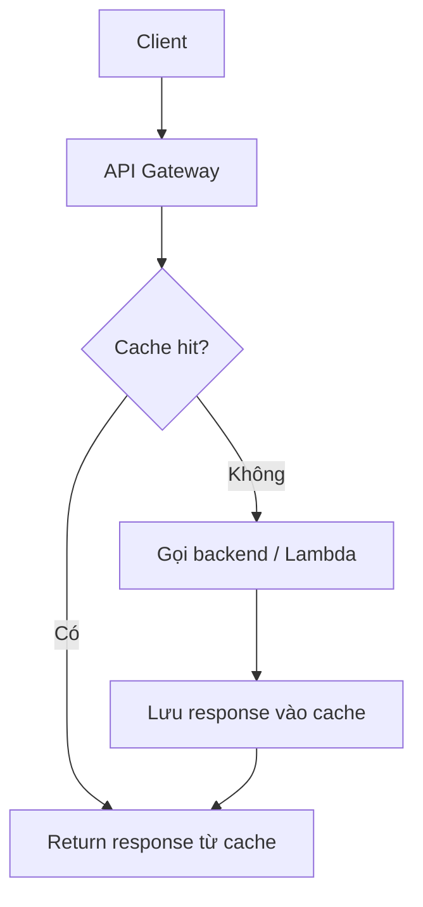
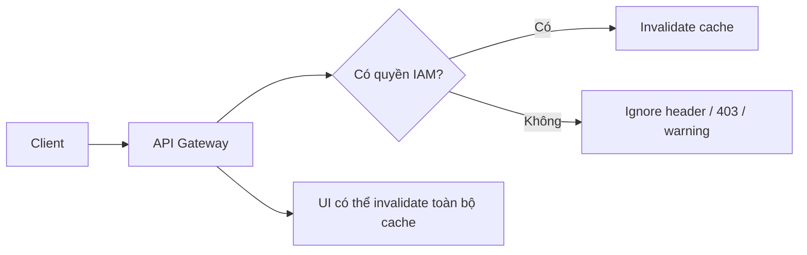

# 346. API Gateway Caching

## 🎯 Giới thiệu
API Gateway Caching dùng để **giảm số lượng request đi vào backend** bằng cách lưu response vào cache.

Luồng cơ bản:
- Client gọi API Gateway
- API Gateway kiểm tra cache trước
- Nếu **cache hit**: trả kết quả ngay từ cache
- Nếu **cache miss**: gọi backend để lấy response rồi lưu lại

## 1. Cách hoạt động của Cache
- Mục tiêu chính là **giảm pressure lên backend**
- Cache giúp các request lặp lại với cùng route và cùng arguments không phải gọi backend mỗi lần
- Khi người dùng refresh hoặc gọi lại cùng request:
  - API Gateway có thể trả kết quả từ cache thay vì gọi lại Lambda/backend

## 2. Cấu hình Cache trong API Gateway
- Cache được định nghĩa ở **stage level**
- Mỗi stage có **one cache**
- Có thể **override per method**
  - Ví dụ: một GET method có thể cấu hình TTL riêng
  - Một method có thể không dùng cache
- Các tuỳ chọn cấu hình được nhắc đến:
  - **Cache capacity**
  - **Encrypt cache data**
  - **Cache TTL**
  - **Per-key cache invalidation**
  - Hành vi khi invalidate không hợp lệ: ignore, trả `403`, hoặc warning

### Thông số quan trọng
| Tham số | Giá trị trong transcript |
|----------|--------------------------|
| Default TTL | `300 seconds` = 5 phút |
| TTL nhỏ nhất | `0` = không caching |
| TTL lớn nhất | `1 hour` = `3600 seconds` |
| Cache size | từ `0.5 GB` đến `237 GB` |

- Cache là tính năng **đắt tiền**
- Nên dùng chủ yếu trong:
  - **production**
  - **pre-production**
- Có thể không phù hợp trong:
  - development
  - test environment

## 3. Invalidate Cache và IAM Authorization
- Cache có thể được **invalidate toàn bộ ngay từ UI**
- Client cũng có thể invalidate cache bằng header/query:
  - `Cache-Control: max-age=0`
- Để client làm được điều này, cần **proper IAM authorization**
- Transcript nhấn mạnh:
  - Có thể dùng **IAM policy** để cho phép invalidate cache trên một resource cụ thể
  - Nếu không cấu hình **InvalidateCache policy** hoặc không yêu cầu authorization trong console, **bất kỳ client nào cũng có thể invalidate cache**
  - Điều này có thể gây ra rủi ro rất lớn

## 📊 Bảng tóm tắt
| Tiêu chí | Mô tả |
|----------|------|
| Mục đích | Giảm số lần gọi backend |
| Cơ chế | Cache hit thì trả ngay, cache miss thì gọi backend |
| Phạm vi | Cấu hình ở stage, có thể override theo method |
| TTL mặc định | `300 seconds` |
| TTL hợp lệ | `0` đến `3600 seconds` |
| Kích thước cache | `0.5 GB` đến `237 GB` |
| Bảo mật | Có thể encrypt cache, cần IAM cho invalidate |
| Use case phù hợp | Production, pre-production |
| Rủi ro | Nếu không giới hạn quyền, client có thể invalidate cache tùy ý |

## 💡 Mẹo ghi nhớ cho kỳ thi AWS
- `Stage-level cache`, nhớ là cache gắn với **stage** trước, rồi mới **override per method**
- `300 seconds = 5 minutes`, đây là **default TTL**
- `Cache-Control: max-age=0` dùng để yêu cầu invalidate cache
- Muốn client invalidate cache an toàn thì cần **IAM authorization**
- Cache của API Gateway phù hợp nhất khi request **lặp lại nhiều** và backend cần giảm tải
- Nếu đề thi nói về **cost** và **dev/test**, nhớ rằng cache **không phải lúc nào cũng nên bật**

## ✅ Kết luận
API Gateway Caching giúp tăng hiệu năng bằng cách trả response từ cache thay vì gọi backend liên tục. Điểm cần nhớ khi ôn thi là: cache nằm ở **stage**, có thể chỉnh theo **method**, TTL mặc định là **300 seconds**, và việc invalidate cache cần được kiểm soát bằng **IAM authorization** để tránh rủi ro bảo mật.
