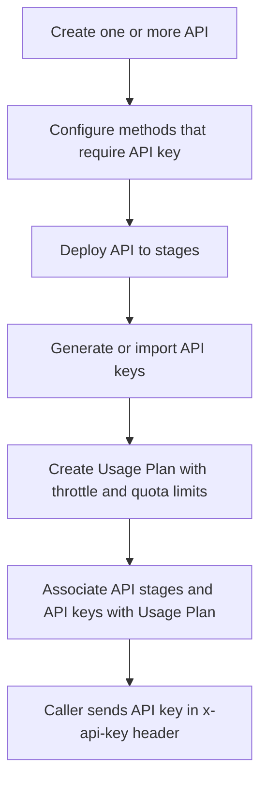

# 347. API Gateway Usage Plans & API Keys

## 🎯 Giới thiệu
- Khi muốn **mở API cho customer** và có thể **charge tiền**, ta dùng **Usage Plans** và **API Keys** trong **API Gateway**.
- Mục tiêu chính:
  - kiểm soát **ai** được truy cập,
  - kiểm soát **bao nhiêu** request,
  - kiểm soát **nhanh thế nào** họ có thể gọi API,
  - và **meter** việc sử dụng theo từng client.

## 1. Usage Plans là gì? 📈
- **Usage plan** dùng để định nghĩa:
  - API **stages** và **methods** nào được phép truy cập,
  - mức **throttling**,
  - mức **quota**.
- Có thể gắn **one or more API stages and method** vào một usage plan.
- **Throttling limits**:
  - giới hạn tốc độ gọi API,
  - nếu bật throttling thì nó được áp dụng ở **API key level**.
- **Quota limits**:
  - giới hạn tổng số request,
  - ví dụ: **10,000 requests/month** trước khi phải trả thêm.

## 2. API Keys là gì? 🔑
- **API keys** là các **string** được phân phối cho customer/application developers.
- Chúng giúp client:
  - **securely use** API Gateway,
  - **authenticate their requests**.
- API key được dùng **kết hợp với usage plan** để:
  - kiểm soát truy cập,
  - theo dõi mức sử dụng,
  - gắn client vào đúng hạn mức.

## 3. Trình tự cấu hình và cách gọi API ⚙️
- Thứ tự cần nhớ:
  1. Tạo **one or more API**.
  2. Cấu hình các **methods** cần **API key**.
  3. **Deploy** API lên các **stages**.
  4. Generate hoặc import **API keys** để phân phối cho application developers.
  5. Tạo **usage plan** với các **throttle** và **quota limits** mong muốn.
  6. Associate **API stages** và **API keys** với **usage plan**.
- Nếu quên bước associate cuối cùng thì **sẽ không hoạt động**.
- Caller của API phải gửi API key trong header:
  - `x-api-key`

## 📊 Bảng tóm tắt
| Tiêu chí | Mô tả |
|----------|------|
| Mục đích | Mở API cho customer và kiểm soát sử dụng |
| Usage Plan | Định nghĩa stages/methods, throttling, quota |
| API Key | Chuỗi string để phân phối cho client |
| Throttling | Giới hạn tốc độ gọi API, áp dụng ở API key level |
| Quota | Giới hạn tổng số request, ví dụ theo tháng |
| Header bắt buộc | `x-api-key` |
| Điểm dễ quên | Phải associate API stages và API keys với usage plan |

## 💡 Mẹo ghi nhớ cho kỳ thi AWS
- **Usage Plan = giới hạn truy cập và usage**.
- **API Key = định danh client**.
- Nhớ 2 loại limit:
  - **Throttling** = tốc độ,
  - **Quota** = tổng số request.
- Nếu đề bài nói customer phải gửi key trong request, hãy nghĩ ngay tới **`x-api-key`**.
- Trình tự cấu hình rất hay bị hỏi:
  - tạo API,
  - deploy stage,
  - tạo key,
  - tạo usage plan,
  - associate tất cả lại với nhau.

## ✅ Kết luận
- **Usage Plans** và **API Keys** là cơ chế trong **API Gateway** để kiểm soát, đo lường và giới hạn truy cập API cho customer.
- **Throttling** kiểm soát tốc độ, **Quota** kiểm soát tổng số request, và client phải gửi **`x-api-key`** để truy cập.
