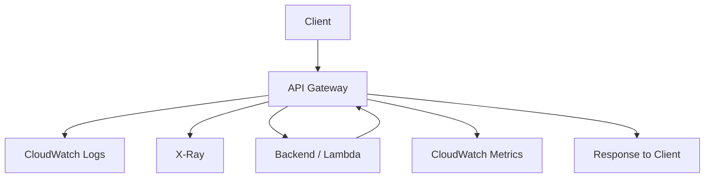

# 348. API Gateway Monitoring, Logging and Tracing

## 🎯 Giới thiệu
API Gateway có 3 mảng quan trọng để theo dõi và chẩn đoán khi ôn thi AWS:
- `Logging` với `CloudWatch Logs`
- `Tracing` với `X-Ray`
- `Monitoring` với `CloudWatch Metrics`

Mục tiêu là quan sát request/response, đo độ trễ, phát hiện lỗi, và hiểu khi nào API bị throttling hoặc timeout.

## 1. CloudWatch Logs cho API Gateway
- Khi bật `CloudWatch Logs integration`, API Gateway sẽ ghi lại thông tin của:
  - `request body`
  - `response body`
- Có thể bật ở `Stage Level`.
- Có thể chọn `Log Level`:
  - `ERROR`
  - `INFO`
  - `DEBUG`
- `DEBUG` cung cấp nhiều thông tin nhất.
- Có thể override cấu hình này theo từng `API`.

### Luồng hoạt động
- User gửi request vào API Gateway.
- Request được log vào `CloudWatch Logs`.
- API Gateway chuyển request đến backend.
- Backend trả response về API Gateway.
- Response tiếp tục được log vào `CloudWatch Logs` rồi mới trả về cho user.

### Lưu ý thi AWS
- Rất hữu ích để thấy cả request và response.
- Nhưng nếu bật logging, có thể ghi nhiều `sensitive information` vào `CloudWatch Logs`.

## 2. X-Ray và CloudWatch Metrics
### X-Ray
- Dùng để lấy `tracing information` cho các request đi qua API Gateway.
- Nếu bật `X-Ray` cho cả `API Gateway` và `Lambda` thì có được bức tranh đầy đủ hơn của API.

### CloudWatch Metrics
- API Gateway có thể được giám sát bằng `CloudWatch Metrics`.
- Metrics có thể là `per stage`.
- Có thể bật `detailed metrics`.

### Các metrics quan trọng
- `CacheHitCount`
  - Số lần cache hoạt động hiệu quả.
  - Hit càng cao thì cache càng tốt.
- `CacheMissCount`
  - Số lần cache không có dữ liệu.
  - Miss cao cho thấy cache kém hiệu quả.
- `IntegrationLatency`
  - Thời gian API Gateway gửi request tới backend và chờ backend trả response.
  - Cho biết backend mất bao lâu để phản hồi.
- `Latency`
  - Thời gian từ lúc API Gateway nhận request từ client đến khi trả response cho client.
  - Bao gồm `IntegrationLatency` và cả các xử lý khác của API Gateway như:
    - authentication
    - authorization
    - cache check
    - mapping templates
- `Latency` luôn cao hơn hoặc bằng `IntegrationLatency`.

### Giới hạn thời gian
- API Gateway chỉ có thể xử lý request tối đa `29 seconds`.
- Nếu `Latency` hoặc `IntegrationLatency` vượt quá `29 seconds`, sẽ bị `timeout`.

## 3. Throttling và Errors
### Throttling
- API Gateway có thể bị throttling bởi:
  - `usage plans`
  - `account limits`
  - `stage limits`
  - `method limits`
- Mặc định, API Gateway throttle ở mức `10,000 requests per second` trên toàn bộ APIs.
- Đây là `soft limit` và có thể tăng theo yêu cầu.
- Nếu một API dùng quá nhiều, các API khác cũng có thể bị ảnh hưởng vì dùng chung quota.

### Khi gặp throttling
- Error thường thấy: `429 Too Many Requests`
- Đây là `client-side error`
- Có thể retry, nhưng nên dùng `exponential back off`.

### Các loại lỗi
| Nhóm lỗi | Ý nghĩa | Ví dụ |
|---|---|---|
| `4XX` | `Client errors` | `400 Bad Request`, `403 Access Denied`, `429 Too Many Requests` |
| `5XX` | `Server errors` | `502`, `503`, `504` |

### Ý nghĩa các lỗi 5XX
- `502`
  - Ví dụ: `Lambda proxy integration` không phản hồi đúng.
- `503`
  - Backend không khả dụng.
- `504`
  - `Integration Failure`
  - Có thể xảy ra khi API Gateway chờ quá `29 seconds` mà backend không trả lời.

## 📊 Bảng tóm tắt
| Tiêu chí | Mô tả |
|----------|------|
| `CloudWatch Logs` | Ghi lại `request` và `response` của API Gateway |
| `Log Level` | `ERROR`, `INFO`, `DEBUG`; có thể override theo từng `API` |
| `X-Ray` | Cung cấp `tracing` cho request đi qua API Gateway |
| `CloudWatch Metrics` | Theo dõi `per stage`, có thể bật `detailed metrics` |
| `CacheHitCount` / `CacheMissCount` | Đánh giá hiệu quả cache |
| `IntegrationLatency` | Thời gian backend phản hồi |
| `Latency` | Tổng thời gian từ client đến client, bao gồm xử lý của API Gateway |
| Giới hạn thời gian | Tối đa `29 seconds` |
| Throttling | Mặc định `10,000 requests per second` toàn account |
| `429 Too Many Requests` | Lỗi throttling phía client, nên retry với `exponential back off` |
| `4XX` | Lỗi client như `400`, `403`, `429` |
| `5XX` | Lỗi server như `502`, `503`, `504` |

## 💡 Mẹo ghi nhớ cho kỳ thi AWS
- `Logs` = xem `request/response`
- `X-Ray` = xem `tracing`
- `Metrics` = xem `performance/error/throttling`
- Nhớ `Latency >= IntegrationLatency`
- Nhớ giới hạn `29 seconds`
- `429` là `Too Many Requests`, thuộc `4XX`
- `502/503/504` là `5XX`, liên quan backend hoặc integration failure
- Bật `CloudWatch Logs` cẩn thận vì có thể lộ `sensitive information`

## ✅ Kết luận
API Gateway được giám sát chủ yếu qua `CloudWatch Logs`, `X-Ray`, và `CloudWatch Metrics`. Khi ôn thi, cần nắm chắc các metric quan trọng như `Latency`, `IntegrationLatency`, `CacheHitCount`, `CacheMissCount`, cùng ý nghĩa của `4XX`, `5XX`, và `429 Too Many Requests`.
