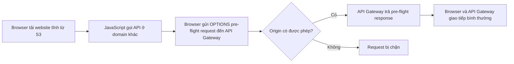

# 349. API Gateway CORS

## 🎯 Giới thiệu
- **CORS (Cross-Origin Resource Sharing)** là cơ chế bảo mật của browser.
- Muốn browser nhận và gọi API từ **domain khác**, thì **CORS phải được bật**.
- Trong bài này, trọng tâm là cách **API Gateway** xử lý CORS bằng **OPTIONS pre-flight request** và các CORS headers.

## 1. CORS hoạt động như thế nào
- Web browser tải **static website** từ **S3 bucket** trên một domain, ví dụ `example.com` hoặc `www.example.com`.
- JavaScript từ website đó muốn gọi API ở domain khác, ví dụ `api.example.com`.
- Vì đây là **cross-origin request**, browser sẽ tự động gửi một **OPTIONS pre-flight request** đến **API Gateway**.
- Nếu origin được phép, API Gateway trả về **pre-flight response**.
- Khi kiểm tra thành công, browser và API Gateway mới có thể giao tiếp với nhau.

## 2. CORS headers trong pre-flight response
- OPTIONS pre-flight response sẽ chứa các **CORS headers** quan trọng:
  - `Access-Control-Allow-Methods`
  - `Access-Control-Allow-Headers`
  - `Access-Control-Allow-Origin`
- Các method này có thể được cấu hình từ **console**.
- Ý nghĩa chính:
  - Cho biết method nào được phép
  - Header nào được phép
  - Origin nào được phép truy cập

## 3. Ý chính cần nhớ cho kỳ thi
- Nếu bài toán có **cross-origin requests**, cần nghĩ đến **CORS**.
- Với **API Gateway**, CORS có thể được **enable** để hỗ trợ browser gọi API từ domain khác.
- Điểm mấu chốt trong flow là:
  - browser gửi **OPTIONS pre-flight**
  - API Gateway trả về **CORS headers**
  - nếu hợp lệ thì request chính mới được tiếp tục

## 📊 Bảng tóm tắt
| Tiêu chí | Mô tả |
|----------|------|
| Mục đích | Cho phép browser gọi API từ **domain khác** |
| Cơ chế chính | **OPTIONS pre-flight request** |
| Thành phần liên quan | **Browser**, **S3**, **API Gateway** |
| Headers quan trọng | `Access-Control-Allow-Methods`, `Access-Control-Allow-Headers`, `Access-Control-Allow-Origin` |
| Kết quả khi hợp lệ | Browser và API Gateway giao tiếp bình thường |
| Ý nghĩa thi AWS | Chỉ cần nhớ **CORS có thể enable trên API Gateway** cho cross-origin requests |

## 💡 Mẹo ghi nhớ cho kỳ thi AWS
- Nhớ chuỗi: **Browser -> OPTIONS pre-flight -> API Gateway -> CORS headers -> request thật**
- Nếu đề bài nhắc đến **different domain**, **browser security**, hoặc **JavaScript from S3 calling API**, hãy nghĩ ngay đến **CORS**.
- Từ khóa thi quan trọng: **API Gateway CORS**, **OPTIONS**, **pre-flight request**, **Allow-Origin**.

## ✅ Kết luận
- **CORS** là cơ chế của browser để kiểm soát truy cập **cross-origin**.
- Với **API Gateway**, bạn bật CORS để browser có thể gọi API từ domain khác.
- Luồng chính luôn xoay quanh **OPTIONS pre-flight request** và các **CORS headers** trong phản hồi.
